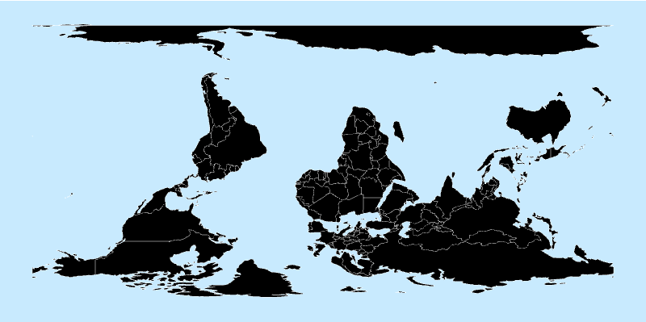
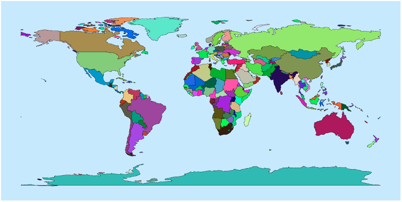

<link href="https://fonts.googleapis.com/css2?family=Source+Serif+4:ital,wght@0,400;0,700;1,400;1,700&display=swap" rel="stylesheet">
<link href="./css/fonts.css" rel="stylesheet">
<link href="./css/styles.css" rel="stylesheet">

# Creating a World Map with D3 and SVG Polygons

This tutorial shows how to read a standard public-domain JSON data source containing geographic coordinates to draw a world map using D3. You will learn how to draw the shapes of all countries using scaled latitude and longitude coordinates from a data file as vertices of SVG polygons, and color the shapes using random colors.

The [GeoJSON](https://geojson.org/) file was previously used in the Canvas map example from *Chapter 2* (see [Chapter02/Canvas/2-canvas-map.html](../../Chapter02/Canvas/2-canvas-map.html)), but this time we draw the map with D3 and SVG.

**NOTE:** In this tutorial, we won’t use any methods from the *d3-geo* module (covered in *Chapters 19* and *20*). The goal is to use only familiar D3 and SVG features.

<!-- TOC -->
## Table of Contents

The following sections are included in this tutorial:

* [Step 1: Inspecting the data](#step-1-inspecting-the-data)
* [Step 2: Listing the countries](#step-2-listing-the-countries)
* [Step 3: Drawing the map](#step-3-drawing-the-map)
* [Step 4: Adjusting the viewport](#step-4-adjusting-the-viewport)
* [Step 5: Flipping the coordinates](#step-5-flipping-the-coordinates)
* [Step 6: Adding colors](#step-6-adding-colors)
* [Exercise: Using an alternative scale](#exercise-using-an-alternative-scale)
<!-- TOC -->

The data visualization developed in this tutorial is also available as an [Observable notebook](https://observablehq.com/d/4733ef9186e84229) and as [CodePen examples](https://codepen.io/collection/VvYqOJ,{target="_blank"}) for each step.

## Step 1: Inspecting the data

The data file is [data/world-lowres.geojson](../data/world-lowres.geojson), available from the repository for this chapter. It is in standard [GeoJSON](https://geojson.org/) format with the following general structure:
```js
{  
 "features": [  
  {  
    "id":"COD",  
    "properties":{"name":"Country name"},  
    "geometry": {
      "type": "Polygon",
      "coordinates": [
        [[lon,lat], [lon,lat]], /* ... */
      ]
  },{  
    "id":"COD",  
    "properties":{"name":"Country name"},  
    "geometry":{  
    "type":"MultiPolygon",  
    "coordinates":[[[[lon,lat], [lon,lat]]], [[[lon,lat], [lon,lat]]]]
  },{ /* ... */ },  
 /* ... */  
}
```

The file contains a single object with a `features` property, which is an array of objects containing data for individual countries. That means that if you load and parse the file, and store it in a variable called `data`, you can access this array using `data.features` or `data['features']`. You can inspect the parsed array after loading this file in [WorldMap/1-load-data.html](../WorldMap/1-load-data.html).

Each individual `feature` object in this file contains the following properties:

*   `type`, which is always `Feature` in this case.
*   `id`, an optional property which, in this file, contains a unique three-letter code for a country.
*   `properties`, an object containing properties for the object. In this file it contains a single property `name` which includes the name of the country in English.
*   `geometry`, an object containing two properties: `type` and `coordinates`. The `type` property (in this file) can either be `Polygon` (a single closed shape) or `MultiPolygon` (an array of closed shapes – e.g. a country with islands). The coordinates are arrays of 2-element arrays containing the longitude and latitude (in this order) of each point. If the shape is a `MultiPolygon`, its coordinates are nested one array level deeper.

Knowing the structure of the file, we can extract data from it and use it to draw a map in a cylindrical projection, using the latitudes as vertical coordinates, and the longitudes as horizontal coordinates. But first, let’s list some of its data.

## Step 2: Listing the countries

A good way to explore a data file is loading it and listing some of its properties. In this step, we will list the countries and their codes, using properties.name and id. First, copy the data file to the same directory as your code (you can find it in [/data/world-lowres.geojson](../data/world-lowres.geojson) and assign its URL to a constant in your code:

```
const url = "world-lowres.geojson";
```

Load the file and create a new `countries` array with the data. Extract `properties.name` and `id` from each `feature` object to get the names and three-letter codes of the countries. The following code creates a new `countries` array with objects containing `name` and `id` properties, and then calls a `draw()` function:

```javascript
d3.json(url)
    .then(function (data) {
        const countries = data.features.map(obj => {
            return {
                name: obj.properties.name,
                id: obj.id
            };
        });
        drawFeatures(countries);
    });
```

The `draw()` function selects the page’s `<body>`, adds an `<ol>` ordered list block, and appends an `<li>` list item containing each country’s name and ID:

```javascript
function draw(countries) {  
    d3.select("body").append("ol")  
      .selectAll("li")  
        .data(countries)  
        .join("li")   
        .text(d => d.name + " (" + d.id + ")");  
}
```

The result is a numbered list of all the countries in the file. Inspect the source code to view the generated HTML. You can also run the code from [WorldMap/2-map-list-data.html](../WorldMap/2-map-list-data.html). Note, however, that it loads the file using the following relative URL:

```javascript
const url = "../data/world-lowres.geojson";
```

With the data successfully loaded and some information retrieved, let's learn to get geographic coordinates and draw the map.

## Step 3: Drawing the map

The map will be rendered as an SVG, so place an `<svg>` element in your page’s `<body>`:

```html
<svg id="world-map" width="800" height="400"></svg>
```

One way to draw the map is using SVG polygons (see *Chapter 3*). Let’s set some styles for the map and for all polygons (a light blue background for the oceans and a white border for each country):

```html
<style>  
    svg {  
        background-color: #cceaff;  
    }  
    polygon {  
        stroke: white;  
        stroke-width: .2px;  
    }  
</style>
```

To draw the map, get the geographic coordinates for each country (or feature). Let’s do this in a `drawMap()` function that receives the array of countries from the features array:

```javascript
d3.json(url)  
  .then(function(data) {  
     drawMap(data.features);  
});
```

In *Chapter 3* you learned that the vertices of an SVG `<polygon>` are defined by a sequence of (_x_, _y_) pairs in the points attribute. These pairs can be separated by spaces or commas.

Each object from the `data.features` array has a `geometry.coordinates` property that contains latitudes and longitudes, but they are nested in a complex array structure. This array, however, can be easily flattened by converting it to *String* format. For example, if you have an array like:

```javascript
[[[1,2],[3,4]],[5,6]]
```

Converting it to *String* will result in:

```javascript
1,2,3,4,5,6
```

The result is compatible with the data expected by the `points` attribute in `<polygon>`. This conversion occurs automatically when you assign the array to an attribute using `.attr()`.

But first we need to create a data binding for a selection of countries. We will bind data to `<g>` elements, so each `<g>` will be a feature, that is, a country. Recall that the `drawMap()` function takes an array of _GeoJSON_ features:

```javascript
function drawMap(countries) {  
    const shapes = d3.select("#world-map")  
                     .selectAll(".country")  
                     .data(countries)   
                     .join("g")  
                     .attr("class", "country");  
 /* ... */  
}
```

This code will generate a `<g>` object for each country and save the selection in the `shapes` constant. The data context for each shape is now a feature object (yes, do inspect it in your browser!).

In this context, `data()` receives the `geometry.coordinates` property of each feature, which is an array of points, and binds it to `<polygon>` objects. After joining, the `points` attribute of each `<polygon>` receives the longitude/latitude pairs, automatically flattened as a string:

 ```javascript
 function drawMap(countries) {  
    /* ... */  
    shapes.selectAll("polygon")  
          .data(f => f.geometry.coordinates)  
          .join("polygon")  
          .attr("points", d => d);
 }
 ```

The code above performs all the magic. Running it will display part of the world on your screen, as shown in *Figure 1*. We must now adjust our coordinate system to display it correctly.


_Figure 1 – A first attempt in rendering a world map with GeoJSON data. Code: [WorldMap/3-polygon-map.html](../WorldMap/3-polygon-map.html)_

Besides displaying a small map, the SVG viewport shows just one quarter of the globe, flipped horizontally and upside-down (according to the standard). Most of the map is generated offscreen due to incompatibilities between different coordinate systems, since we are treating longitudes as *x* coordinates, and latitudes as *y* coordinates without any configuration. We can fix this with two SVG attributes.

## Step 4: Adjusting the viewport

SVG coordinates begin at the top-left, grow right and down, and only use positive values. Geographic coordinates include negative values and expand in all directions. To align SVG with geographic standards, adjust the viewport using the SVG `viewBox` attribute, as explained in *Chapter 3*. The default `viewBox` matches the chart's height and width, starting at 0,0:

```html
<svg id="world-map" width="800" height="400" viewBox="0 0 800 400"\>\</svg\>
```

Change it to `0 0 400 200` to make each pixel count as 2 pixels. This scales the map, making it occupy twice the space, but still hides quadrants with negative values. Using `-200 100 400 200` applies the same scale, but shifts the origin to the center, rendering the result in *Figure 2*:



_Figure 2 – Adjusting the viewport to fit the entire map. Code: [WorldMap/4-polygon-map-viewbox.html](../WorldMap/4-polygon-map-viewbox.html)_

The map is now completely visible, but the continents are inverted. We need to flip it horizontally (and vertically, if you wish to display it in a standard position).

## Step 5: Flipping the coordinates

You can flip the map horizontally and vertically with a transform SVG attribute. The following transform will invert latitudes and longitudes while keeping the scale:

```html
<svg ... viewBox="-200 -100 400 200" transform="scale(1, -1)"></svg>
```

Reload your page now and see the results.

## Step 6: Adding colors

Let’s add random colors for each country. A simple uniform random function can be created with the `d3.randomUniform()` generator (more about this in *Chapter 7*). The following code creates a function that generates random numbers from 0 to 255:

```javascript
const rand = d3.randomUniform(256);
```

You can use it to generate colors with the CSS `rgb()` function, as follows:

```javascript
shapes.style("fill", () => `rgb(${rand()},${rand()},${rand()})`);
```

The result is shown in *Figure 3*. The colors may vary, as they are generated randomly:



_Figure 3 – A world map rendered with SVG polygons and public domain GeoJSON data. Code: [WorldMap/6-polygon-map-colors.html](../WorldMap/6-polygon-map-colors.html)_

Another way to adjust the viewport to fit geographical coordinates is using two `d3.scaleLinear()` functions and a simple SVG tag (without any `viewBox` configuration). You will learn this in *Chapter 9* but can also try it as an exercise.

Geographical maps are a very important topic in data visualization, and D3 provides specific tools to create and interact efficiently with maps using different projections and spherical geometry in the *d3-geo* modules. This will be covered in detail in *Chapters 19* and *20*.

## Exercise: Using an alternative scale

Use a simple `<svg>` without `viewBox` or `transform` and adjust the map using `d3.scaleLinear()` functions so that it looks the same as the example from this section.

This is an optional exercise to explore other ways of scaling the data. A commented template that you can use to start your code and the solution can be found in the `WorldMap/Exercise` folder.
