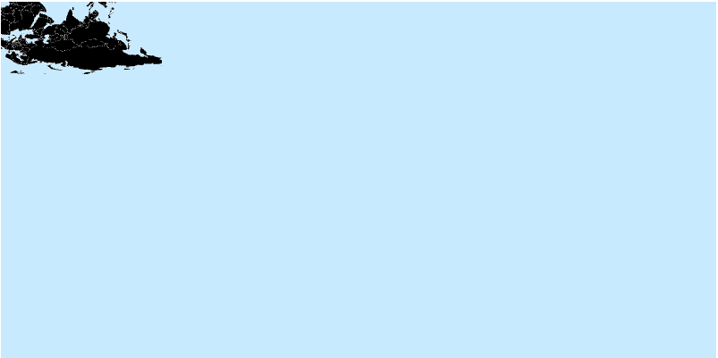
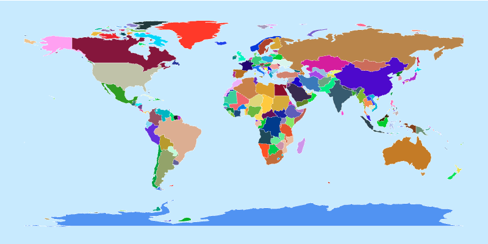
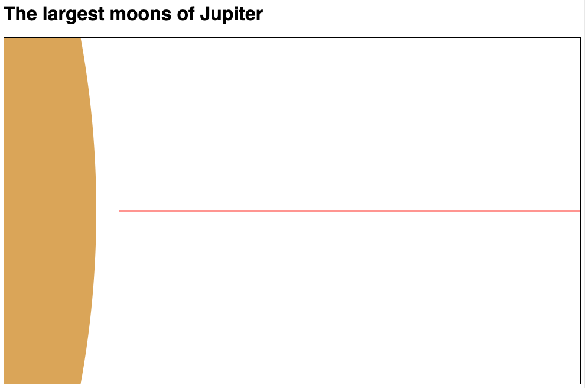
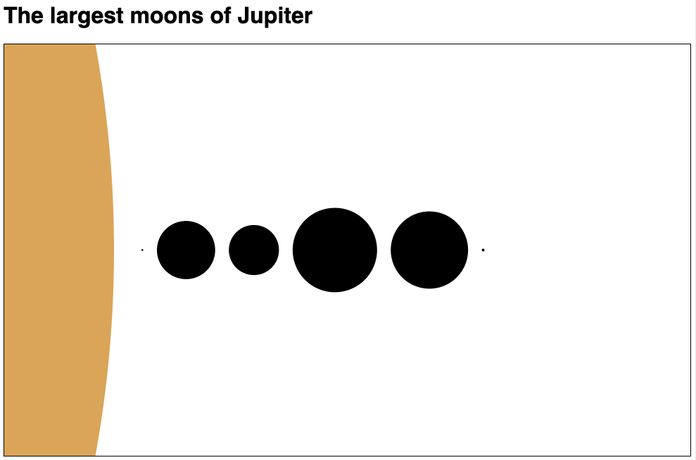
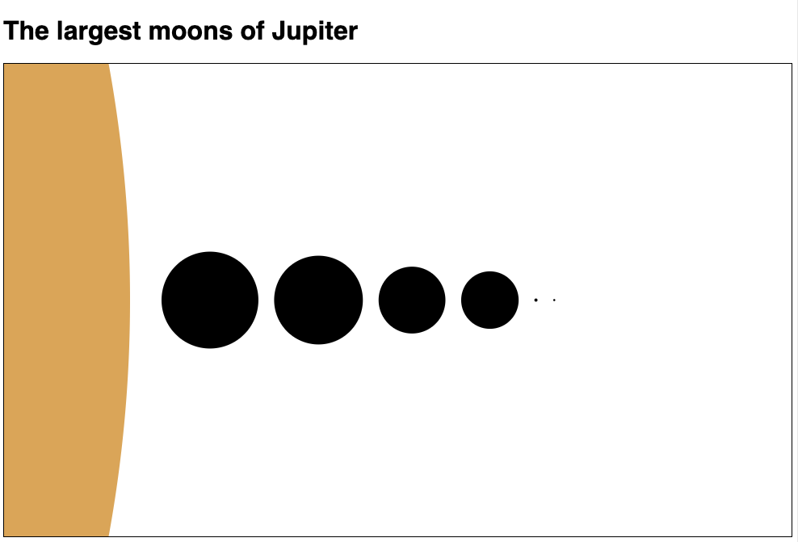
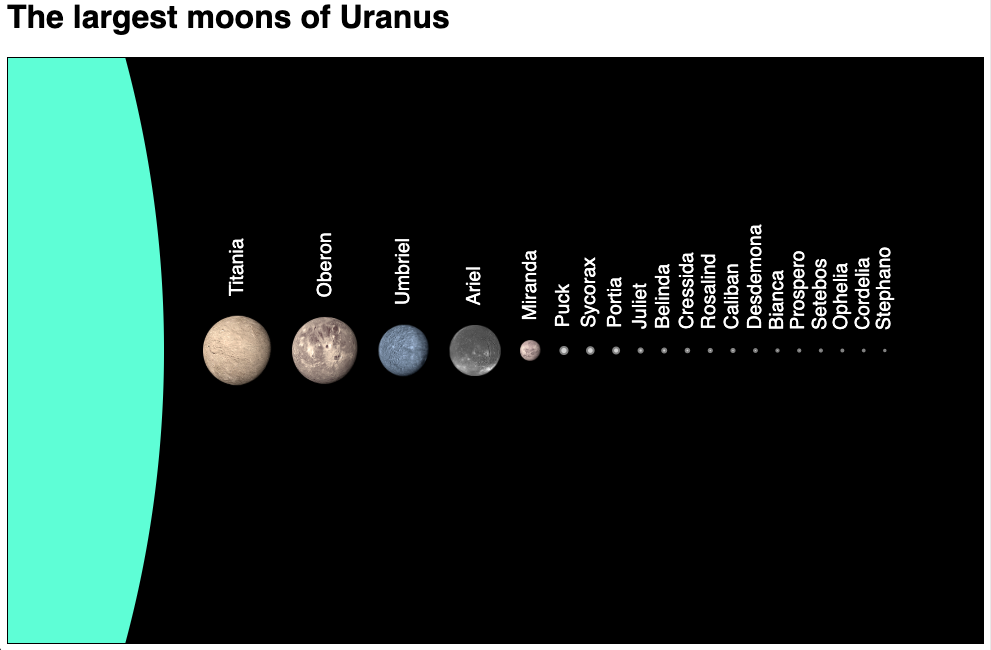

<link href="https://fonts.googleapis.com/css2?family=Source+Serif+4:ital,wght@0,400;0,700;1,400;1,700&display=swap" rel="stylesheet">
<link href="./css/fonts.css" rel="stylesheet">
<link href="./css/styles.css" rel="stylesheet">

# Creating an interactive data-driven visualization - part 1

The goal of this tutorial is to guide you through the process of designing and developing a complete interactive data visualization with D3 using other shapes and images. With D3 you can create visualizations with all the resources you have available in HTML and SVG, so we don’t have to stick to conventional bar, line, and pie charts. 

It’s a larger and more complex example than the bar chart created in _Chapter 4_, but the concepts are the same. It reviews all the features that were covered in the last two chapters and introduces a bit of what we will see ahead, detailing important steps you will encounter in any data visualization, such as creating scripts, importing modules, analyzing the structure of a data file, loading, parsing it, and selecting the data to be used, designing views, and configuring scales.

This tutorial is divided in two parts. In _Part 1_ (this document), we will develop a static chart in 9 steps. In [Part 2](../Chapter06/Tutorial/README.md), the application will be modified to support more data, automatic updates, and interactive features. Each step is described with code examples, and you can code along, or run the full code available in the [StepByStep/](../StepByStep) folder. Exercises are suggested in some sections. Their templates and solutions are available in the [Chapter05/Exercises/](../Exercises/) folder.

This tutorial is also publicly available as an interactive _Observable_ notebook (see link in [Chapter5/README.md](../README.md)), where you can run and modify its code and see the results immediately.

## Table of contents

This tutorial includes the following sections:

- [What are we going to create?](#what-are-we-going-to-create)
- [Step 1: Setting up the page, scripts, stylesheet](#step-1---setting-up-the-page-scripts-stylesheet)
- [Step 2: Loading the data](#step-2---loading-the-data)
- [Exercises: filter out unncessary data](#exercises-filter-out-unncessary-data)
- [Step 3: Configuring scales and filtering data](#step-3---configuring-scales-and-filtering-data)
- [Step 4: Drawing the planet](#step-4---drawing-the-planet)
- [Step 5: Calculating the position of each moon](#step-5---calculating-the-position-of-each-moon)
- [Step 6: Drawing the moons](#step-6---drawing-the-moons)
- [Step 7: Sorting the moons by size](#step-7---sorting-the-moons-by-size)
- [Step 8: Adding text labels](#step-8---adding-text-labels)
- [Step 9: Adding images](#step-9---adding-images)
- [Final application: A static chart](#final-application-a-static-chart)

## What are we going to create?
We will code a visualization that shows and compares the diameters of the largest natural satellites (moons) of planets in the Solar System using circles and images. In each view, the circumference of the planet will be partially visible, and its largest moons will be lined up and sorted by their diameters. In the first part of the tutorial, we will create the static visualization shown in _Figure 1_.


_Figure 1 — The visualization we will generate in Part 1 of this tutorial._

Although static, you will be able to choose which planet to display by changing the value of a single constant in the code. In the second part of the tutorial, a control panel will be added so the user can switch views and display different planets and moons.

We will use data from the [`data/sol_2019.json`](../data/sol_2019.json) file – a compilation of planetary data obtained from open databases (mostly from the [NASA Open Data portal](https://data.nasa.gov/)). This same file was used in _Chapter 4_ to create a bar chart comparing average orbit distances. This time we will extract data from other parts of this file.

_Figure 2_ shows a sketch of the visualization we plan to create. It contains all the coordinates, spacing and margins we will have to consider when drawing the shapes.

Sizes and margins will be stored in a globally accessible dimensions object called `dim`. To place and scale SVG circles in each view, we will need to compute their radii (`r`) and horizontal coordinates (`cx`), as well as determine margins and spaces so that the objects fit nicely in the chart.


_Figure 2 — Sketch of the visualization that will be created._

The chart is a view that shows the relative sizes of the largest moons compared to their planet. The view is driven by data, so it can be used to compare the moons of any planet. For _Part 1_, you can edit the code to choose a planet, such as Jupiter or Saturn, for display. In _Part 2_, we will stack multiple views in a single app so the user can interactively select which planet to display.

Each step in this tutorial is a folder that contains all the code necessary to run the application in that step, except for the data file, which is stored in `Chapter05/data`, and the `d3.js` library, which is loaded via CDN. Unlike the short examples in this book, where all the code is in a single HTML file, here it is organized like a typical web application, consisting of a root folder containing the main page, `index.html`, and two subfolders `js/` and `css/`, where scripts (modules) and stylesheets will be stored. Script files that are modified in different steps will have a version number postfixed to the file name, incremented every time the file changes.

Let’s begin.

## Step 1: Setting up the page, scripts, stylesheet
If you want to code along, start with the contents of the [`StepByStep/1-page-setup`](../StepByStep/1-page-setup) folder. It contains a simple page with some boilerplate code ([`index.html`](../StepByStep/1-page-setup/index.html)), a minimal CSS style sheet ([`css/main.css`](../StepByStep/1-page-setup/css/main-1.0.css)), and a script file ([`js/common.js`](../StepByStep/1-page-setup/js/common-1.0.js)) where we will declare the global objects used in the application. This section will describe all of them.

**Note**: in the code for each step, module files and stylesheets are versioned (e.g., `css/main-1.0.css`, `js/view-1.1.js`) so that you can keep track of the changes made in each step. However, here we will refer to them without the version number for simplicity. You can also do the same in your code.

This is the `index.html` file:

```html
<!DOCTYPE html>
<html lang="en">
<head>
    <title>Moons: Step 1 - Page setup</title>
    <link rel="stylesheet" href="css/main.css">
</head>
<body>

<h1>The largest moons</h1>
<div id="container" width="500" height="300">
    <svg height="100%" width="100%" id="moons"></svg>
</div>
<form></form>

<script type="module"> /* ... */ </script>

</body>
</html>
```

The HTML body also includes static elements that will be referenced from the code, for example, the contents of the `<h1>` block that will change depending on the view, and the `<form>` block that will later contain a control panel (buttons) so the user can switch between views (in _Part 2_). All the graphics will be rendered as SVG inside the `<svg>` block.

Some minimal code will be kept in the `index.html` file. This includes imports, two view-related constants, and functions that will start the application. This code will be placed in the `<script type="module">` block. 

The `js/common.js` file stores objects and functions we will use in the application. The `dim` object contains dimensions and margins. Its values are based on the sketch from _Figure 2_:

```js
export const dim = {
    width: 500,
    height: 300,
    margin: {
        left: 20,
        right: 20,
        top: 50,
        bottom: 50
    }
};
dim.margin.moon = 10;    // horizontal space between moons
dim.margin.planet = 100; // horizontal space reserved for the planet
```

The `app` object contains properties used by the application. The `app.planets` array will contain the data used by the application (extracted from the external source after it is loaded, parsed and filtered). The `app.colors` array contains a six-color palette to color the planets, and the `app.scale` function points to the scale function used in all views. The `app.current` object represents the currently displayed planet. When displaying different planets it will be updated. 

```js
export const app = {
    planets: [],
    colors: ['#4169e1', /*...*/ ,'#1e90ff'],
    scale: d3.scaleLinear(),
    current: {
        id: null,           // key to select current object
        planet: {},         // the object used in the current view
        color: "black",     // color of the planet
        moons: []           // the moons to be displayed
    }
}
```

The `app.current.id` key is used to select the planet that will be displayed. This id is a number from 3 to 8 prefixed with the letter `'p'` used in the data file to identify a planet. We will start with `'p5'`, which represents the planet Jupiter:

```js:
app.current.id = "p5";
```

The `<script>` block in `index.html` imports the modular D3 library and the `js/common.js` module. It also configures the SVG container with a `viewBox` so that it will scale when the user resizes the browser window. The `plane` object is the guideline where the center coordinates for all circles will be placed. It is configured with a `translate()` transform that places it horizontally in the middle of the viewport and starting 100 pixels from the left:

```js
<script type="module">
  import * as d3 from "https://cdn.skypack.dev/d3@7";
  import { dim } from "./js/common.js";

  const svg = d3.select("#moons")
                .attr("viewBox", `0 0 ${dim.width} ${dim.height}`);

  const plane = svg.append("g")
                   .attr("transform", `translate(${[dim.margin.planet, 
                                                    dim.height/2]})`);
</script>
```

If you load the page in your browser, you should see the header **The largest moons** followed by the SVG viewport (which has a border, added in CSS). This is where the chart will be rendered.

This was the initial step. Use the full code in [`StepByStep/1-page-setup`](../StepByStep/1-page-setup) as a starting point if you wish to code as you read.

Now let’s load some data.

## Step 2: Loading the data

The data is the most important part of your visualization. Textual data is typically provided in a response to an asynchronous HTTP request to a server endpoint via a URL, as we have seen in this chapter. Before using your data, you must have good knowledge of its structure and how to navigate the raw file and the parsed object or array to find exactly the information you need.

The data file for this example ([`data/sol_2019.json`](../data/sol_2019.json)) is a JSON object that contains entries for several bodies that orbit the sun. It has the following structure:

```js
{
    "star":{...},
    "planets":[...], // we only need the data from this array!
    "asteroids":[...],
    "tnos":[...],
    "centaurs":[...],
    "comets":[...]
}
```

After parsing this JSON file, a JavaScript object with the same structure will be generated. Understanding the file structure will allow you to navigate the parsed object via its object properties and array indexes to extract the data you need.

For this project, we are only interested in the objects inside the planets array that have an `id` property with one of the following values: `p3`, `p4`, `p5`, `p6`, `p7`, `p8`. We will also filter out dwarf planets and planets that don’t have any moons. Each object (`planet`) from the array has several properties, but we only need four of them:
*	**`id`**: a code that identifies the planet (e.g. `"p5"`)
*	**`name`**: the common name of the planet (e.g. `"Jupiter"`)
*	**`diameterKm`**: the diameter of the planet in kilometers.
*	**`satellites`**: an array that contains an array of objects, which are the planet’s natural satellites, or "moons".

Each element in the `satellites` array is an object, and it also contains a large list of properties. We only need two:
*	**`name`**: the name (or code) of the satellite.
*	**`diameterKm`**: the diameter of the satellite in kilometers.

With this information, you can load the file, parse it and filter the `planets` array so that it only includes the objects that are going to be used. It should then be stored in the `app.planets` array.

Start creating a new script file: `js/data.js`. It requires the _d3-fetch_ module (since we will use `d3.json()`) and the `js/common.js` (since we will populate the `app.planets` array). To keep things simple, at this stage, we will import the entire D3 library, since we might use other functions later. Add the following two lines to `js/data.js`:

```js
import * as d3 from "https://cdn.skypack.dev/d3@7";
import {app} from "./common.js";
```

We also need a path to the data file, which is stored in the [`data/`](../data) folder, located at the root folder for this chapter. You can copy the file into the app’s folder or use a relative path. The path used in the following code assumes you are coding in a folder inside `StepByStep/` and did not move the data file:

```js
const dataFolder = "../../data";
const dataFile = dataFolder + "/sol_2019.json";
```

Note that this file is also available online. See the `README.md` file for this chapter for instructions on how to use it.

Now we can write the `load()` function, which fetches the file and returns a parsed JavaScript object when the promise is fulfilled:

```js
export async function load() {
    return await d3.json(dataFile)
}
```

Now back to `index.html`, first import the module:

```js
import { load } from "./js/data.js";
```
Then call the `load()` function and handle the promise. For now, print the result to the console so we can inspect it:

```js
load().then(data => {
    console.log(data); // check if the data was loaded correctly
});
```

Loading the page in your browser should list the file’s contents in the console (you will see the top-level properties: `asteroids`, `comets`, `planets`, etc.). If instead you receive an error, first make sure you are accessing the file via a Web server, and then check if the path is correct (you will get a _404 Not Found_ error if the path is incorrect). You might need to move the file or edit the path so that your page will find the file. You may also have authorization or data issues if you are using an external URL. Make sure you fix these issues before proceeding.

Now let’s add a bit more code to the `load()` function so that it populates the `app.planets` object with the data we need, which is stored in `data.planets`. There are only six planets with moons, so before copying the array, filter it so only these six are included. This should be done in the `load()` function, as follows:

```js
export async function load() {
    const data = await d3.json(dataFile);
    app.planets = data.planets
       .filter(p => +p.id.substring(1) >= 3
                 && +p.id.substring(1) <= 8);
}
```

Now we can print the `app.planets` object to the console and inspect it. First add the `app` object to the `js/common.js` import in `index.html`:

```js
import { app, dim } from "./js/common.js";
```

Then print the object to the console after loading the file:

```js
load().then(() => {
    console.log(app.planets);
});
```

As before, the app still displays only the title and an empty SVG graphics context, but since we logged `app.planets` to the console, you can open it to inspect its structure (which lists the six planets), as shown in _Figure 3_.


_Figure 3 — Printing the loaded data in the console. Code: [`StepByStep/2-load-data`](../StepByStep/2-load-data)._

Expand the array and its contents to inspect all the properties of each planet and its satellites. Try retrieving selected information for some planets and natural satellites. For example, you can use the following object path to obtain the diameter of Saturn, which is the fourth element in the array:

```js
app.planets[3].diameterKm
```

The dataset contains many properties that won’t be used in this project. You might prefer to previously filter them out so that the `app.planets` array contains only the data you will effectively use. This is optional and will be left as an exercise!

Our next step is to configure the view and fit the data we loaded in the space we have available.

## Exercises: filter out unncessary data

This section is optional and you can safely skip it if you wish. It contains two exercises to practice filtering data. It applies some changes on the code developed in step 2. These changes will be incorporated only to the final step. 

Templates (based on `StepByStep/2-load-data`) with tips (comments) and solutions can be found in the [`StepByStep/Exercise1`](../StepByStep/Exercise1) and [`StepByStep/Exercise2`](../StepByStep/Exercise2) folders.

* **Exercise 1**: Remove unnecessary properties so that the resulting dataset (`app.planets`) only contains the data that will effectively be used in the app: each planet should contain just the `id`, `name`, `diameterKm` and `satellites` properties. The relevant code is in `js/data.js`. _Hint_: Use the JavaScript `map()` function to replace each object from the `app.planets` array with a new one containing just the required properties.

* **Exercise 2**: Add a filter for the `satellites` array of each planet so that each satellite contains only the data that will be used in the app: each satellite should contain just `name` and `diameterKm` of each satellite. The relevant code is in `js/data.js`. _Hint_: use the JavaScript `map()` function to replace each object from the `satellites` array with a new one containing just the required properties.

## Step 3 - configuring scales and filtering data

Our final application will contain a user interface where the user can press a button and select a different planet. This will render a new view that requires updating the data bound to SVG elements, recalculating horizontal positions and scales (range and domain), since the diameter and number of moons will change.

After the data is loaded and every time a view is selected, the application should:
1)	Set the current planet, storing its data in the `app.current.planet` object and its color in `app.current.color`.
2)	Select the moons of the current planet that will be displayed, limiting them by diameter, and store their data in the `app.current.moons` object.
3)	Recompute the chart’s margins, and use that data to reconfigure the scale (via `app.scale`), updating its range and domain.

Although the application is not interactive yet, we will implement these features now, since they can be triggered by simply changing the value of `app.current.id`. This is done in the `js/config.js` file. It requires the following imports:

```js
import * as d3 from "https://cdn.skypack.dev/d3@7";
import {app, dim} from "./common.js";
```
      
The object that contains the data for the current planet is selected from the `app.planets` array using its `id` property (e.g. `"p5"`), which should match `app.current.id`. Let’s create a function to set the current planet:
      
```js
function setPlanet() {
    app.current.planet = app.planets.filter(p => p.id === app.current.id)[0];
}
```
      
To select which moons to show for the current planet, get the object in its `satellites` array that contains the largest value for `diameterKm`, then use this value to store an array in `app.current.moons` containing just the moons that have a diameter of at least 1/50 of this value. We will also implement this in a function:

```js
function setMoons() {
    const maxDiameter = d3.max(app.current.planet.satellites, d => d.diameterKm);
    app.current.moons = app.current.planet.satellites
                           .filter(s => s.diameterKm > maxDiameter/50);
}
```
      
Now we can configure the scale for the view. The function is already declared in `app.scale`, but its domain and range will need to be recomputed every time the view is updated.
      
The maximum value for the domain is obtained by adding the diameters of all current moons. The vertical and horizontal spaces occupied by the circles (including margins for the planet and space between moons) are used to compute the range. The minimum value is used to set the upper limit for the range. This is implemented below:

```js
function configScale() {
    // a) add diameters (they will be drawn side by side)
    const sumDiameters = d3.sum(app.current.moons, d => d.diameterKm);

    // b) calculate space occupied by the circles
    const horizSpace = 
            dim.width - (dim.margin.planet + dim.margin.left*2
                       + app.current.moons.length * dim.margin.moon);
    const vertSpace  = dim.height - dim.margin.top*2;

    // c) configure the scale’s range and domain
    app.scale.range([0, d3.min([vertSpace, horizSpace])])
             .domain([0, sumDiameters]);
}
```

Finally, call these functions in a `configure()` function that is exported by the module. Since we didn’t render anything yet, let's print the data in the console so it can be inspected:

```js
export function configure() {
    setPlanet();
    console.log("Planet:", app.current.planet);

    setMoons();
    console.log("Moons:", app.current.moons);

    configScale();
    console.log("Scale:", app.scale);
}
```
The `configure()` function is then imported into `index.html`:

```js
import { configure } from "./js/config.js";
```
And called after the data is loaded:

```js
load().then(() => {
    configure();
});
```

Open the console and check if the `app.current` object was configured correctly. You will find the full code for this step in [`StepByStep/3-config-scales`](../StepByStep/3-config-scales).

Since we have now calculated all the necessary values, we can start rendering the chart.

## Step 4 - drawing the planet

Let’s create a new module `js/view.js` for the code that renders the shapes. It will contain a `draw()` function to draw the circles for planet and moons. We will need the `dim` constants to place the objects, the `app` constant to obtain the data, and tools from the D3 library, so `js/view.js` should include the following imports:

```js
import * as d3 from "https://cdn.skypack.dev/d3@7";
import {app, dim} from "./common.js";
```
The `draw()` function will be called from the main page after `configure()`, so it needs to be imported in `index.html`:

```js
import { draw } from "./js/view.js";
```

According to the sketch in _Figure 2_, circles are placed on their orbital plane, which appears in the chart as a horizontal guideline dividing the chart in half. The `plane` object (a `<g>` element) is already defined in `index.html`, but we need to pass its reference to `js/view.js`, which can be done when calling `draw()`:

```js
load().then(() => {
    configure();
    draw(plane);
});
```
The `draw()` function (in `js/view.js`) is a good place to display the guideline, so we can be sure it is in the right place (we will remove it later):

```js
export function draw(plane) {
    plane.append("line")
         .attr("x1", 0)
         .attr("x2", dim.width)
         .style("stroke", "red");
}
```

This code appends an SVG `<line>` with `y1` = `y2` = `0` (resulting in a horizontal line) occupying the total width of the view (from `0` to `dim.width`). Since the line was appended to plane which starts at `x = dim.margin.planet`, `y = dim.height/2` (in `index.html`), it will start 100 pixels from the left. Any circle with a `cy` attribute equal to zero will be placed on that line and centered vertically.

Now let’s draw the planet.

The scale was calculated so that all the circles that represent moons could be placed side-by-side and fit in the viewport, but the planet was not included in that calculation. Its scaled radius won’t fit in the viewport, however, the visible curvature should still be displayed in the same scale as the moons. Using a scaled negative radius as `cx`, the planet will be mostly drawn offscreen, but a small part of it should still be visible on the left side of the chart since the center is offset by `dim.margin.planet`.

Let’s create a function in `js/view.js` to draw the circle on the plane representing the planet:

```js
function drawPlanet(plane) {
    plane.append("circle").attr("class", "planet")
         .datum(app.current.planet)
         .attr("r", d => app.scale(d.diameterKm)/2)
         .attr("cx", d => -(dim.margin.left + app.scale(d.diameterKm)/2))
         .style("fill", app.current.color);
}
```

This code appends an SVG `<circle>` with a `class="planet"` attribute to the orbital plane, and binds it (using `datum()`) to the object in `app.current.planet`, from where the diameter is obtained via the `diameterKm` property. The radius of the circle is a scaled version of the planet’s radius. The radius is also used to set a negative value for the planet’s `cx` coordinate, moving it to the left of the plane’s origin, which allows a small part (`dim.margin.planet`) of the planet to be displayed. An additional margin (`dim.margin.left`) is added to include some space between the planet and the first moon. If you open the page in a browser now, you should see a slightly curved black margin on the left, which is the visible part of the planet.

The function also sets the planet’s color to `app.current.color`, which is currently `'black'`, but we will change this in another function.

Since the page will show a specific planet, the page’s title should display its name, which is obtained from the data file. Edit the `<h1>` header in `index.html` as shown below and add a `<span>` placeholder element with a corresponding ID in the HTML:

```html
<h1>The largest moons of <span id="planetName"></span></h1>
```

In `js/config.js`, we added a new function to update page elements called `updatePageView()`. It will be used to update any page elements after a view update. In this step, we will use it to update the page’s title, selecting the `<span>` element by its ID and setting the current planet’s name (obtained from `app.current.planet`), and to set the planet’s color (in `app.current.color`):

```js
function updatePageView() {
    d3.select('#planetName').text( () => app.current.planet.name );
    app.current.color = app.colors[(+app.current.id.substring(1) - 3)];
}
```

The color is selected from the `app.colors` array, obtaining the index from the planet's ID, starting with Earth (`app.current.id = "p3"`).

To finish this step, call the `updatePageView()` function from `configure()` (in `js/config.js`), and we are done:

```js
export function configure() {
    // ...
    updatePageView();
}
```

This will produce the result shown in _Figure 4_. You can check the full code so far in [`StepByStep/4-draw-planet`](../StepByStep/4-draw-planet). 


_Figure 4 — Positioning the planet and the guideline for the orbital plane where the moons will be placed.
Code: [`StepByStep/4-draw-planet`](../StepByStep/4-draw-planet)._

The next step is to draw the moons, but first we must compute their positions.

## Step 5 - calculating the position of each moon

The position of each moon depends on where the center of each corresponding SVG circle is placed, that is, the values of the `cx` and `cy` attributes. Appending the circles to the `plane` object will place them in the vertical middle and only requires computing the values for `cx`. The `cy` attribute can be omitted, since zero is the default.

The `cx` coordinate for the first moon is its radius, or half its diameter. The `cx` attribute for the next circle should be the diameter of the previous circle, plus spacing (`dim.margin.moon`), plus the radius of the current circle. We can compute the `cx` attributes for each moon and store them in a property of the moon’s data object, so it can be retrieved later when drawing the circle. Let’s do this with a function in `js/config.js`:

```js
function computeCenterCoordinates() {
    app.current.moons.forEach(function(moon, i) {
        let space = 0;
        if(i > 0) {
            let previous = app.current.moons[i-1];
            space = previous.cx + app.scale(previous.diameterKm)/2
                                + dim.margin.moon;
        }
        moon.cx = space + app.scale(moon.diameterKm)/2;
    });
}
```

In `computeCenterCoordinates()`, we loop through all the moons of the current planet (`app.current.moons`) and set a property (we called it `cx`) for each moon object (`moon.cx`). The space to be added to the moon’s radius is calculated for all moons except the first one.

Now add the function to the `configure()` function, to compute the values every time the user selects a new planet and the `app.current.moons` array changes:

```js
export function configure() {
    // ...
    computeCenterCoordinates();
}
```

The first `moon.cx` is simply half of its diameter plus space, which is initially zero. The other moons use the `cx` value of the previous moon, its diameter, and the accumulated space between moons to compute a new value for space, which is used to compute the `cx` for the next moon, and so on.

You can inspect the results in the JavaScript console, and check if they fit in the available space. The code should print the following _x_ pixel values for the centers of each circle:

```
Amalthea 0.6427486268552063
Io 32.49620193993222
Europa 81.94928129017178
Ganymede 140.93841299520858
Callisto 209.84924623115575
Himalia 249.00666121304192
```

You can view and run the code so far in [`StepByStep/5-compute-moon-positions`](../StepByStep/5-compute-moon-positions). Before continuing, try assigning a value to your `app.current.id` variable (any value from `"p1"` to (`"p8"`) and see which moons of other planets are selected.

Now we have enough information to bind to SVG circles and finally draw the moons.

## Step 6 - drawing the moons

An SVG `<circle>` requires a radius (the `r` attribute) and center coordinates (the `cx` and `cy` attributes) to determine its position, if not at `(0,0)`.  The `r` attribute for each circle is obtained scaling the moon’s `diameterKm` property and dividing it by two. Since `cy` is zero, it’s the default and doesn’t need to be set. The `cx` attribute uses the property we calculated in the previous section, which is already scaled.

Since no circles of class `'moon'` yet exist in the plane, the initial selection will create the same number of circles as the length of the `app.current.moons` array. The code should be placed in a function in the `js/view.js` module:

```js
function drawMoons(plane) {
    plane.selectAll("circle.moon")
         .data(app.current.moons)
            .join("circle")
                .attr("class", "moon")
                .attr("cx", d => d.cx)
                .attr("r", d => app.scale(d.diameterKm)/2);
}
```

Then add the function to the `draw()` function:

```js
export function draw(plane) {
    // ...
    drawMoons(plane);
}
```

If you comment out or remove the code that draws the red guideline in `draw()`, you should finally see a representation of the planet and its largest moons in scale, as shown in _Figure 5_.


_Figure 5 — The moons of Jupiter in scale, sorted by relative position. Code: [`StepByStep/6-draw-moons.`](../StepByStep/6-draw-moons)_.

These circles were ordered according to their data array indexes, which were sorted by the ascending average distance of each satellite to its planet. Since the goal of our chart is to compare sizes of the planet’s largest natural satellites, we aren’t interested in that distance. So, let’s follow the sketch (_Figure 2_) and order the moons by their size.

## Step 7 - sorting the moons by size

The moons will be reordered if you sort the array before calculating `cx`.

Add the following function to `js/config.js` to sort the moons array in descending order (from largest to smallest):

```js
function sortMoons() {
    app.current.moons.sort((a,b) => d3.descending(a.diameterKm, b.diameterKm));
}
```
The function should be called in `configure()` after the moons array is filtered, but before the `cx` attributes are calculated:

```js
export function configure() {
    // ...
    updatePageView();
    sortMoons();
    computeCenterCoordinates();
}
```

Load the page and you should now see the circles displayed from largest to smallest, as in _Figure 6_. 


_Figure 6 — The moons in scale, sorted by diameter. Code: [`StepByStep/5-sort-moons`](../StepByStep/7-sort-moons)_.

The full code for this step is in [`StepByStep/7-sort-moons`](../StepByStep/7-sort-moons).

Now let’s add some labels so the user knows what the circles represent.

## Step 8 - adding text labels

A user interested in the largest moons of Jupiter will probably be curious to know which circles correspond to each moon. This information is available in the dataset, but it needs to be placed near each circle so that the user can relate it to the corresponding moon.

In SVG you can’t append text to a circle, but you can append a circle and a text element to a `<g>` container. Before adding text labels we need to refactor our `drawMoons()` code (in `js/view.js`) so that each moon is bound to an SVG `<g>` container, instead of a `<circle>`. This will also make it easier to later replace circles for images of the satellites.

The refactored code is shown below. The computed `cx` property (from the current datum) is now used to translate the `<g>` container and the circle is placed at the origin of the container (since `cx` and `cy` were not set and are zero by default). Only the `r` attribute needs to be set:

```js
function drawMoons(plane) {
    plane.selectAll("g.moon")
         .data(app.current.moons)
            .join("g")
                .attr("class", "moon")
                .attr("transform", d => `translate(${[d.cx,0]})`)
                .each(function() {
                    const moon = d3.select(this); // current <g class="moon">
                    moon.append("circle")
                        .attr("r", d => app.scale(d.diameterKm)/2);
                    // TODO: append a text label to the <g> container
                 });
}
```

The selection now binds the `app.current.moons` array to `<g>` elements labelled with the class `'moon'`. Compare this to the previous version of this code, from _Step 6_, which bound `<circle>` elements to this array.

If you load the page now, you will notice that the visual result is the same, but now we can append a text label to the `<g>` container. A good fit is to rotate it ninety degrees counterclockwise and place it in a central position a few pixels from the edges of each circle. This is done below with a transform applied to the `<text>` element:

```js
.each(function() {
    // ...
    moon.append("text")
        .text(d => d.name)
        .attr("transform", d => {
            const x = app.scale(d.diameterKm/2) + dim.margin.moon;
            return `rotate(-90) translate(${[x,0]})`;
        })
        .style("alignment-baseline", "middle");
});
```

Note that the `<text>` element’s position is determined solely by its `transform` attribute, which is relative to the `<g>` container’s coordinate system. The `alignment-baseline` style is important so that the label is centered vertically to the circle.

The result is shown in _Figure 7_.


_Figure 7 — Moons sorted by size and labeled. Code: [`StepByStep/8-text-labels`](../StepByStep/8-text-labels)._

Before ending this step, let’s move the code from the `each()` method in `drawMoons()` to a separate function we will call `appendObjects()`. This will make it easier to refactor the code later:

```js
.each(function() {
    appendObjects(d3.select(this));
});
```

The function receives a selection containing the `<g>` containers, and uses it to append the circle and the text:

```js
function appendObjects(moon) {
    moon.append("circle") // ... more code ...
    moon.append("text")   // ... more code ...
}
```

You can see the full code in [`StepByStep/8-text-labels`](../StepByStep/8-text-labels).

## Step 9 – using images

We already have a good visualization that will display any planet and its largest moons. In _Part 2_ we will create a control panel to switch planets automatically. For now, you can see the result with different planets changing the value of `app.current.id` (in `js/common.js`). For example, to display the moons for Saturn, just change it to:

```js
app.current.id = "p6";
```

We can, however, improve the visual result by using images instead of circles for the larger moons. So let's make some visual improvements in this last step, so that the images are displayed in a more appealing way.

First, configure the CSS to display the images and text over a dark background. This is done in `css/main.css`:

```css
svg {
    background: black;
}
text {
    fill: white;
}
````

Several public domain images with photos of the nearest or largest satellites from our Solar System are available in the `data/images` folder. Before using them, they need to be pre-loaded. This is done in the `load()` function in `js/data.js`, adding this code at the end of the function:

```js
// Pre-load images
const promises = [];
app.planets.forEach(planet => {
    planet.satellites.forEach(moon => {
        promises.push(
            d3.image(imageFile(planet, moon))
                .then(img => moon.image = img.src, () => {}));
    });
});
return Promise.all(promises);
```

The `imageFile()` function (also in `js/data.js`) constructs the path to each image file, appending the path to the `data/images` folder, the name of the planet, the name of the moon, followed by the `.png` extension:

```js
function imageFile(planet, moon) {
    return `${dataFolder}/images/${planet.name}/${moon.name}.png`;
}
```

The code will attempt to load an image for each moon of each planet. If the image is found, its URL is stored in a new property called `image` of the corresponding moon object. If the image is not found, the promise is rejected, but the error is ignored (the second argument to `then()` is an empty function). This way, if an image is not available, the corresponding `moon` object will simply not have an `image` property.

**Note**: You may notice that the console displays several 404 errors when loading some images. This is expected, since not all moons have an image. The code, however, is designed to ignore these errors. Unfortunately, there is currently no way to turn off these warnings.

Now we update the `js/view.js` module to use images instead of circles if the image exists. In the `appendObjects()` function, if an image exists, make the radius of the circle zero, otherwise, draw the circle as before. We also changed the color, so that it contrasts with the dark background:

```js
moon.append("circle")
    .attr("r", d => !d.image ? app.scale(d.diameterKm) / 2 : 0) // if no image, draw circle
    .style("fill", "lightgray")
    .style("stroke", "gray");
```

Finally, add the following code to `appendObjects()`, before appending the text labels, to render the images in the same scale as the circles:

```js
moon.filter(d => d.image)
    .append("image")
        .attr("href", d => d.image)
        .attr("x", d => -app.scale(d.diameterKm) / 2)
        .attr("y", d => -app.scale(d.diameterKm) / 2)
        .attr("height", d => app.scale(d.diameterKm))
        .attr("width", d => app.scale(d.diameterKm));
```

Try changing the planet to see which moons have images available. If you choose `'p7'` as `app.current.planet` your chart should look like _Figure 8_.


_Figure 8 — Using images instead of circles for the larger moons.
Code: [`StepByStep/9-images`](../StepByStep/9-images)._

The code for this step can be found in [`StepByStep/9-images`](../StepByStep/9-images).

## Final application: A static chart

We finished the view for a single planet, but our app is prepared to display data for several other planets as well. To allow the viewer to switch planets, you will need to manage multiple views and joins, covered in _Chapter 6_. 

After _Chapter 6_, you can continue with _Part 2_ of this tutorial. It starts with the code in `StepByStep/static-chart`, which incorporates the suggestions from the exercises and includes some other improvements:
* The `load()` function in `js/data.js` filters out properties that are not used (from planets and satellites).
* The moons are no longer filtered in `js/config.js`; this is now also done in `js/data.js`, so the dataset contains only the moons that will be used.
* The title was improved to treat Mars (two moons) and Earth (one moon) differently, since it doesn't make sense to use "the largest moons" in these cases. This is done in the `updatePageView()` function in `js/config.js` and by adding a `<span id="titleNumber"></span>` field in the page's `<h1>` title.
