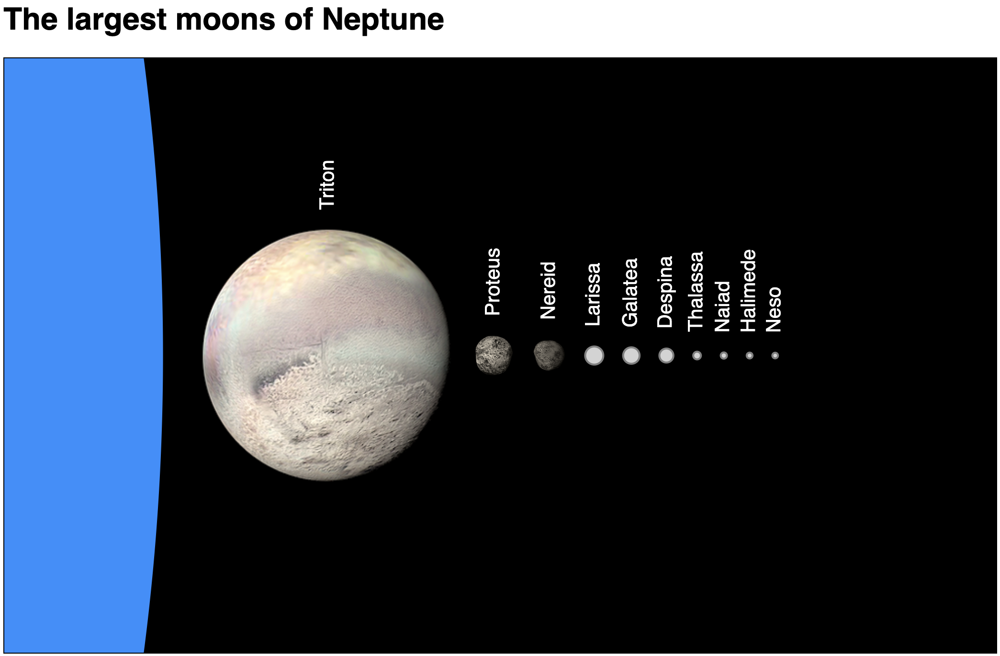
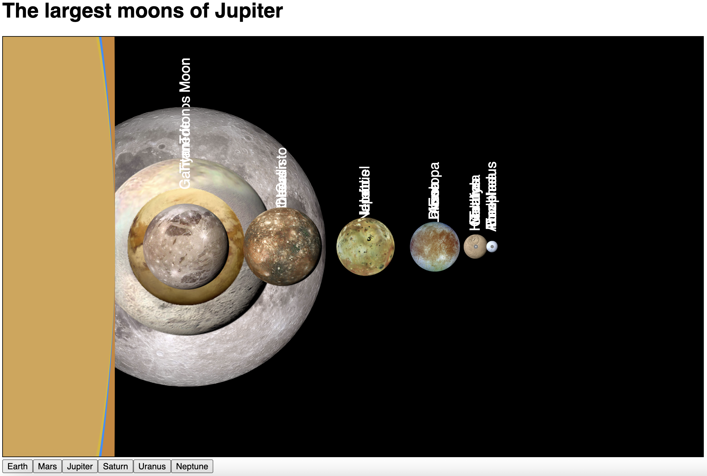
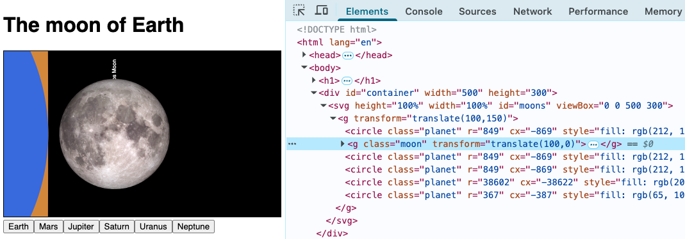
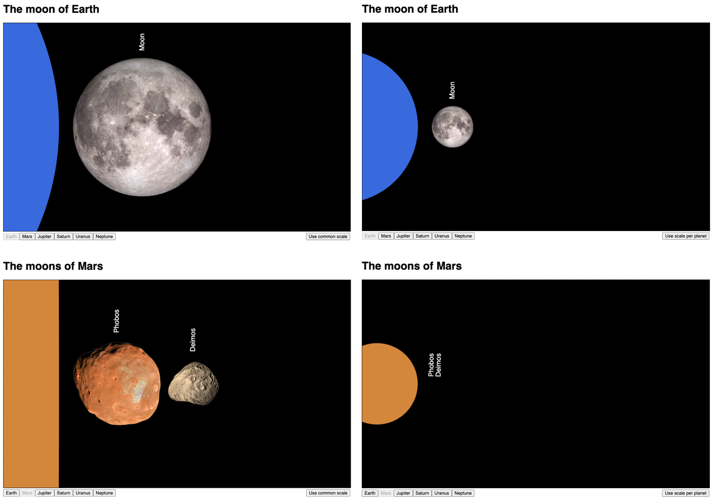
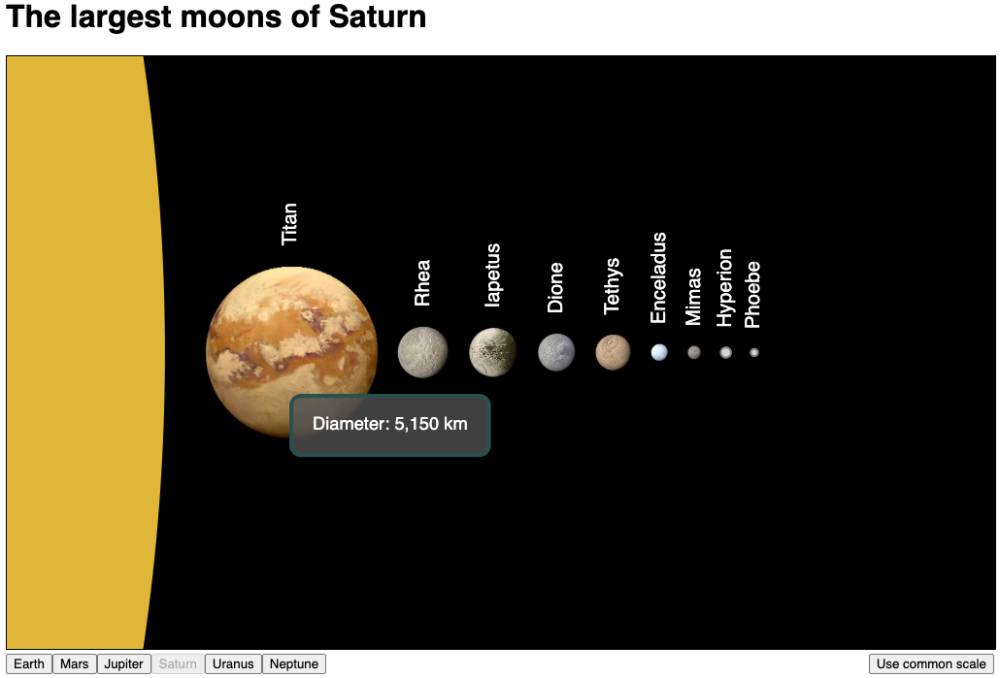

<link href="https://fonts.googleapis.com/css2?family=Source+Serif+4:ital,wght@0,400;0,700;1,400;1,700&display=swap" rel="stylesheet">
<link href="./css/fonts.css" rel="stylesheet">
<link href="./css/styles.css" rel="stylesheet">

# Creating an interactive data-driven visualization - Part 2

In the first part of this tutorial, we created the static chart shown in `Figure 1`. Although static, you could display a different planet editing the code and assigning a different `app.current.id`.


_Figure 1 – The static visualization created in Part 1, showing the natural satellites of Neptune (`app.current.id = "p8"`)._

In this second part, we will allow the viewer to select the planet they want to see via a control panel. Although this might seem trivial, it involves advanced concepts about joining and reusing graphical elements in a view that we covered in _Chapter 6_.

As before, each step is described with code examples, and you can code along, or run the full code available in the [`StepByStep/`](../StepByStep) folder. Some additional exercises are suggested at the end. Their commented templates and solutions are available in the [`Exercises/`](../Exercises/) folder. The final visualization incorporates all changes from the exercises. You can run it from the [`StepByStep/final`](../StepByStep/final) folder.

Start with the project you created in `part 1`, or use the files in [`StepByStep/9-static-chart`](../StepByStep/9-static-chart), which contains all the changes made in part 1.

This tutorial is also publicly available as an interactive _Observable_ notebook (see link in [`Chapter06/README.md`](../README.md)), where you can run and modify its code and see the results immediately.

## Table of contents

This tutorial includes the following sections:
- [Step 10 - changing views](#step-10---changing-views)
- [Step 11 - updating views](#step-10---updating-views)
- [Step 12 - fixing the data join](#step-11---fixing-the-data-join)
- [Exercise - use a common scale](#exercise---use-a-common-scale)
- [Exercise - add tooltips](#exercise---add-tooltips)
- [Final application](#final-application)

## Step 10 - changing views

Now that we successfully displayed one complete view, we can demonstrate the power of D3 by automatically updating the view with new datasets. For that, we need a user interface to trigger the changes, such as a panel with buttons where the viewer can select a view. We will set them up inside a new module called `js/page.js`, which will also set up the page. 

Create the `js/page.js` file and declare your imports as follows:

```js
import * as d3 from "https://cdn.skypack.dev/d3@7";
import {app} from "./common.js";
import {configure} from "./config.js";
import {draw} from "./view.js";
```

Now declare an `init()` function to set up the initial view:

```js
export function init(plane) {
   configure();
   draw(plane);
   // ...
}
```

The orbital `plane` is the `<g>` container where we place planets and moons, declared in `index.html`. The `init()` function will replace the calls to `configure()` and `draw()` in `index.html`. Add `js/page.js` to the imports in the `<script>` block:

```js
import { init } from "./js/page.js";
```

Then call `init()` after the data is loaded:

```js
load().then(() => init(plane));
```

You can remove the imports for `configure` and `draw`, since they are no longer used in `index.html`. The code should continue working as before. 

Now let’s create the control panel.

A data join can be used to create and append a button for each object in the `app.planets` array, using the `name` property as the label and the planet’s `id` for the button’s `id` attribute. The buttons are appended to the HTML `<form>` already declared in `index.html`. Add the following code to the beginning of the `init()` function in `js/page.js` (before calling `configure()` and `draw()`):

```js
export function init(plane) {
    const buttons = d3.select("form")
                      .selectAll("button")
                        .data(app.planets)
                          .join("button")
                            .attr("type", "button")
                            .attr("id", d => d.id)
                            .text(d => d.name);
    // ...
}
```

The `<button>` element must have the `type="button"` attribute, otherwise it will reload the page (the default event for buttons is to submit the form). If you load the page now, you should see six buttons below the SVG, with the names of the planets.

Now attach an event listener to each button for the `'click'` event. It will use the button’s `id` to set the new value for `app.current.id`, and then call `configure()` and `draw()` to render the chart with the new data:

```js
export function init(plane) {
    const buttons = // ...
    buttons.on("click", (event, d) => {
        app.current.id = d.id;
        configure();
        draw(plane);
    });
    
    // ... 
}
```

Now you can click on the buttons and change views. Although the page's title changes as expected, moons and labels are overlapping. It also seems that the planets are also overlapping. After a few clicks, your chart might look like `Figure 2`.


_Figure 2 — Multiple views, but not updating correctly (moons and planets are overlapping). Code: `StepByStep/10-change-views`._

Reload the page and click on different planets. Try clicking on **Saturn**. You will notice that some new moons were added, but the old ones are still there. Click on **Mars**. There are only two moons, but there are some overlapped labels. If you click on **Earth**, the Moon appears by itself but Mars is still there, behind the Earth. And now, if you change to other views, other satellites are displayed, but the Moon never disappears. Can you guess what is going on here?

Let’s use the element inspector. It will give us a clue. Expand the `<div>`, the `<svg>` and the `<g>` plane, then click on one of the buttons a few times.


_Figure 3 – Inspector shows five `<circle class="planet">` elements after clicking twice the current button (**Jupiter**), and then on two different buttons (**Mars** and **Earth**). Code: `StepByStep/10-change-views`._

Look at that! After clicking twice on Jupiter, you have not one, but three identical `<circle class="planet">` elements! Click on other buttons, and more planet circles are added, but never removed. Moons are sometimes removed or not. We have several problems to fix. Let’s start with the duplicate planets.

## Step 11 - updating views

First, let’s eliminate the possibility of clicking many times on the same button. This is easy. We can set the `disabled` attribute to false in all buttons, and then set it to true only when the button’s ID is equal to `app.current.id`. A good place for this code is in the `updatePageView()` function (in the `js/config.js` module):

```js
function updatePageView() {
    // ...
    d3.selectAll("button").property("disabled", false);
    d3.select(`button#${app.current.id}`).property("disabled", true);
}
```

Now let’s try to fix the overlapping planets. The element inspector showed us that after each click, a new `<circle class="planet">` element was appended. This happens because the `draw()` function, where the circle is appended, is called for every click. We can fix this by moving the code that appends the planet to `index.html`, right after the plane is created and before calling `init()`:

```html
<script type="module">
    // ...
    const plane = svg.append("g") // ...;
    
    plane.append("circle").attr("class", "planet");

    load().then(() => init(plane));
</script>
```

Here you just append the circle and set its class, so that it can be selected later. No data binding, dimensions, position or color are declared.

Now let’s go to the `js/view.js` module and edit the `drawPlanet()` function to _select_ the planet (that was previously appended) by its class name, like this:

```js
function drawPlanet(plane) {
    plane.select(".planet")  // planet already was appended to plane
         .datum(app.current.planet)
           .attr("r", d => app.scale(d.diameterKm)/2)
           .attr("cx", d => -(dim.margin.left + app.scale(d.diameterKm)/2))
           .style("fill", app.current.color);
}
```

The `datum()` and methods that set the circle’s attributes should be placed in the `drawPlanet()` function because they need to be updated when the data changes. But the planet circle is only appended once, in `index.html`.

Click on the buttons. You should now see the curvature change for each planet, as expected. You will also notice, if you inspect the code with your browser’s tools, that a single `<circle class="planet">` is generated, no matter how many times you click any button.

You can view the full code for this step in `StepByStep/11-update-views`.

We fixed the duplicating planets problem, but we still have overlapping moons. Let's fix them.

## Step 11 - fixing the data join

The moons are still not being updated correctly. Let’s use the element inspector again to view the generated code. Note that the number of moons is correct. There is one for Earth. There are two for Mars. There are six for Jupiter. But there are many more images on the screen. What is wrong?

Note that each time you click on a button, some `<g>` elements are briefly highlighted in the Inspector. Reload the page, expand the `<div>`, `<svg>`, and `<g>` plane again, but now also expand one of the `<g class="moon">` elements. Click on a button. What happened?


_Figure 4 – Inspector showing generated `<circle>`, `<image>` and `<text>` elements in the first `<g class="moon">` after (a) loading the page (**Jupiter**), then (b) clicking **Saturn**, and (c) clicking **Mars**. Code: `StepByStep/11-update-views.html`_

_Figure 4_ _(a)_ shows the SVG elements inside the first `<g class="moon">` generated after loading the page. In _(b)_, after clicking **Saturn**, the planet circle was updated, more moons were added, but in the first `<g class="moon">` element second group of `<circle>`, `<image>`, `<text>` elements appeared. These elements are displayed  on top of the others. Then, in `(c)`, after clicking **Mars**, there are only two `<g class="moon">` elements, which is correct. The first `<g class="moon">` was updated, but it now contains _three_ sets of `<circle>`, `<image>` and `<text>` elements!

We are still creating and appending new elements every time. Not new `<g>` elements, since these are automatically appended, updated and removed by the `join()` method, but new `<circle>`, `<image>` and `<text>` child elements added to each `<g class="moon">` element, after every view change.

So, let’s take a look at the code. After every view change, the `drawMoons()` function (`js/view.js`) is called. Its `join()` method automatically appends, removes and reuses the `<g>` elements, which contain the circles and text labels. This works as expected:

```js
function drawMoons(plane) {
    plane.selectAll("g.moon")
         .data(app.current.moons)
            .join("g")
                .attr("class", "moon")
                .attr("transform", d => `translate(${[d.cx,0]})`)
                .each(function() {
                    appendObjects(d3.select(this));
                });
}
```

But note the `each()` method! It calls `appendObjects()`:

```js
function appendObjects(moon) {
    moon.append("circle")
        .attr("r", d => app.scale(d.diameterKm)/2);

    moon.filter(d => d.image)
        .append("image")
            .attr("href", d => d.image)
            .attr("x", d => -app.scale(d.diameterKm) / 2)
            .attr("y", d => -app.scale(d.diameterKm) / 2)
            .attr("height", d => app.scale(d.diameterKm))
            .attr("width", d => app.scale(d.diameterKm));

    moon.append("text")
        .text(d => d.name)
        .attr("transform", d => {
            const x = app.scale(d.diameterKm/2) + dim.margin.moon;
            return `rotate(-90) translate(${[x,0]})`;
        })
        .style("alignment-baseline", "middle");
}
```

We are appending new `<circle>`, `<image>`, and `<text>` elements to each `<g class="moon">` element every time the view is redrawn. This is why we see many overlapping circles, images and labels.

These elements aren’t removed automatically because they are appended explicitly, with `append()`, outside of the join. We should only create and append new circles, images, and text when a new `<g class="moon">` is appended to the `plane`. For example, when moving from Earth (one moon) to Mars (two moons). When there are sufficient `<g class="moon">` elements, for example, when moving from Mars to Earth, the `<circle>`, `<image>` and `<text>` objects of the first `<g class="moon">` element should be reused and updated with new data. To fix this, we will need to configure the separate _enter_, _update_ and _exit_ stages of the joining process (see the section _Advanced Data Joins_ in _Chapter 6_).

Let’s edit the `join()` method in `drawMoons()` and configure its _enter_ stage. It should append the entire object tree when a new `<g class="moon">` is created. Since we remove the entire `<g class="moon">` element when changing to a view with less moons, we don’t have to configure the `update` or the `exit` stages, so only the first argument (the _enter_ function) is passed to `join()`:

```js
// ...
.join(enter => enter.append("g")
                    .attr("class", "moon")
                    .each(function() {
                       const moon = d3.select(this);
                       moon.append("circle");
                       moon.append("image");
                       moon.append("text");
                    }));
```

To make the code easier to read, move this code to a function that receives the `enter` selection as a parameter:

```js
function createMoons(enter) {
    return enter.append("g")
                .attr("class", "moon")
                .each(function() {
                    const moon = d3.select(this);
                    moon.append("circle");
                    moon.append("image");
                    moon.append("text");
                });
}
```

Then we can call it from the join, like this:

```js
.join(enter => createMoons(enter))
```

Note that this code just appends `<circle>`, `<image>` and `<text>` elements to the `<g class="moon">` object but doesn’t set any attributes. This needs to be done after the new elements are merged with the existing elements and updated.

Let's return to the `appendObjects()` function (in `js/view.js`). It is called after the join to update the merged entered and existing elements selection. Because of our `join()`, we can be sure that all and just the necessary moons and labels were appended, so all we need to do now is select them and update their attributes with the new data. The following code replaces each `moon.append` with `moon.select`:

```js
function updateObjects(moon) {	// renamed from appendObjects()
    moon.select("circle")
        .attr("r", d => app.scale(d.diameterKm)/2);
    moon.select("image")
        .attr("href", d => d.image)
        .attr("x", d => -app.scale(d.diameterKm) / 2)
        .attr("y", d => -app.scale(d.diameterKm) / 2)
        .attr("height", d => app.scale(d.diameterKm))
        .attr("width", d => app.scale(d.diameterKm));
    moon.select("text")
        .text(d => d.name)
        .attr("transform", d => {
            const x = app.scale(d.diameterKm/2) + dim.margin.moon;
            return `rotate(-90) translate(${[x,0]})`;
        })
        .style("alignment-baseline", "middle");
}
```

We also renamed the function to `updateObjects()`, since it no longer appends anything. Now the refactored `drawMoons()` function, shown below, automatically appends and removes objects as necessary:

```js
function drawMoons(plane) {
    plane.selectAll("g.moon")
        .data(app.current.moons)
            .join(enter => createMoons(enter))
                .attr("transform", d => `translate(${[d.cx,0]})`)
                .each(function() {
                    updateObjects(d3.select(this));
                });
}
```

That’s it! The new code automatically reuses existing elements if they are available, creates any necessary elements and removes the ones that are not needed. Try it out. The transitions should now work perfectly. `Figure 5` shows what the chart looks like after selecting **Neptune**:


_Figure 5 — Multiple views updated correctly. Code: `StepByStep/12-join`._

You can run the full code in `StepByStep/12-join`.

We are done, but there are always small improvements you can make in this chart to improve the user’s experience. Here are some examples:
* Each view shows a planet in scale with its satellites, but perhaps it would be interesting to have all the views in the same scale, to compare satellites of different planets.
* The data source contains a lot of interesting information about planets and moons, such as their diameters. It could be provided to the viewer using tooltips.
* 
These ideas are left as exercises, described in the following sections, but you can see the full solution in `StepByStep/final`, which incorporates all these changes.

Templates and solutions for all exercises in _Chapter 6_ are available in the chapter's `Exercises/` folder. The numbering of the exercises continues from _Chapter 6_.

## Exercise 6.9 - Use a common scale

Add a button to allow the viewer to toggle the scale used in the views:  either a separate scale for each planet (as it is currently) or a common scale for all views, that will allow satellites to be compared (_Figure 6_). 


_Figure 6 - Using a common scale for all views (right) allows the viewer to compare diameters of satellites that orbit different planets, but makes small moons harder to see. Code: `Exercises/solutions/Exercise-6.9`._

To implement this:

1. Add a Boolean variable to the `app` object in `js/common-1.0.js` to keep track of the current option; 

2. Add a button, checkbox or other control in `js/page.js` to allow the user to change the state, redrawing the chart after each change, and 

3. Refactor the `configScale()` function in `js/config.js` to configure the common scale to be used in all views when the user sets the variable to use it, rendering the planets and moons in scale for the entire application. 

You can start with the template, which is the same as `StepByStep/12-join` but contains comments and hints.

## Exercise 6.10 - Add tooltips

When the user hovers above a moon or planet, they should see a tooltip containing its diameter in km (_Figure 7_). 


_Figure 7 - Tooltip showing the diameter of a moon when hovering above it. Code: `Exercises/solutions/Exercise-6.10`._

This exercise involves several topics we didn’t cover yet, but you can try starting with the template file (which is based on the previous exercise) and follow the comments in each file. It will require modifications in `index.html` and `js/view.js` and two new files: `css/tooltips.css` and `js/tooltips.js`.

## Final application

The final application, which incorporates all changes from the exercises, is available in `StepByStep/final`.

