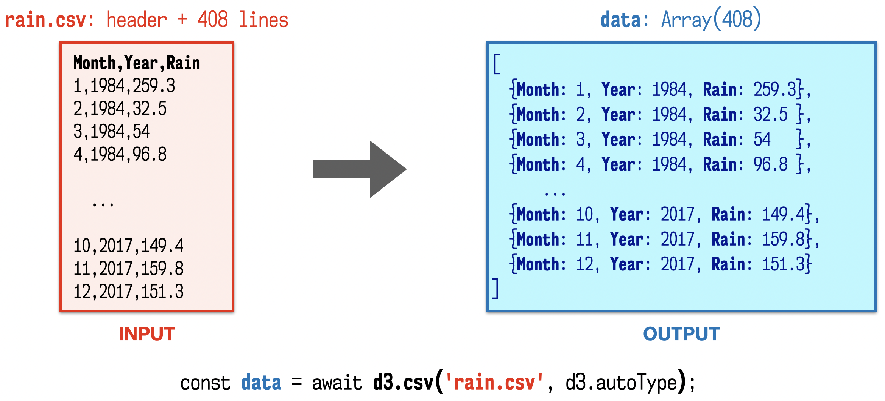
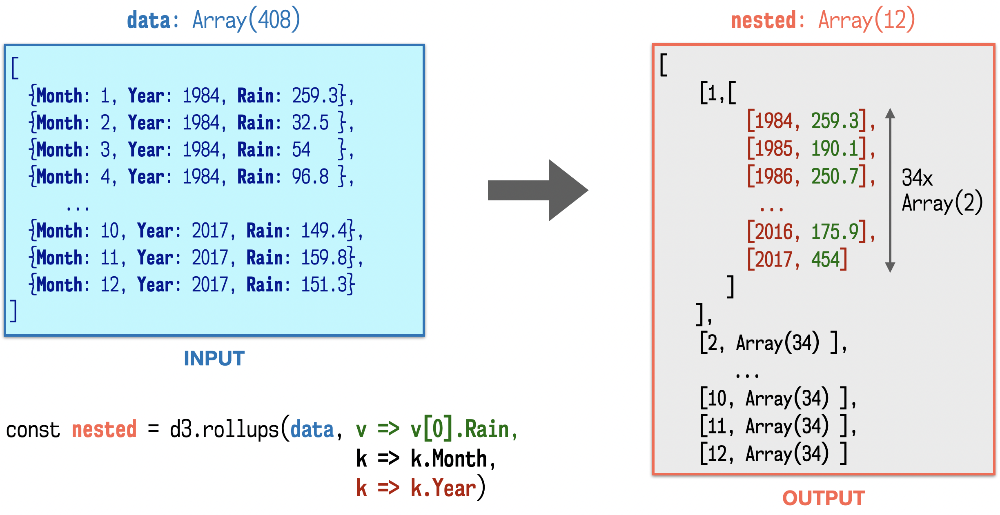
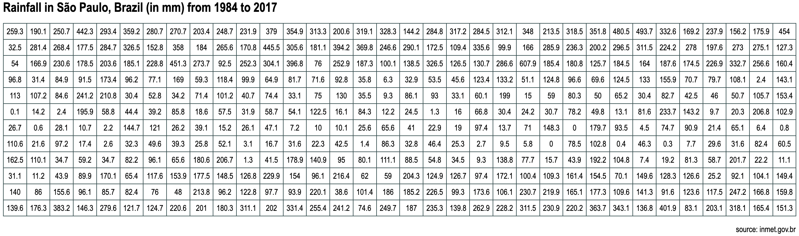
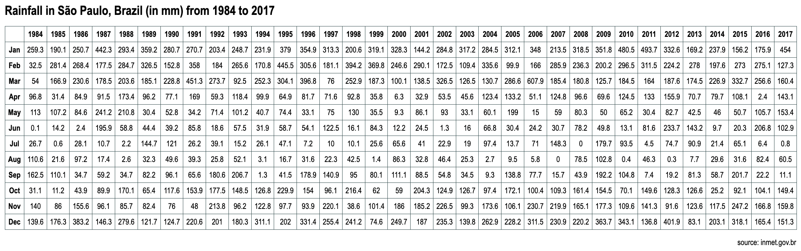
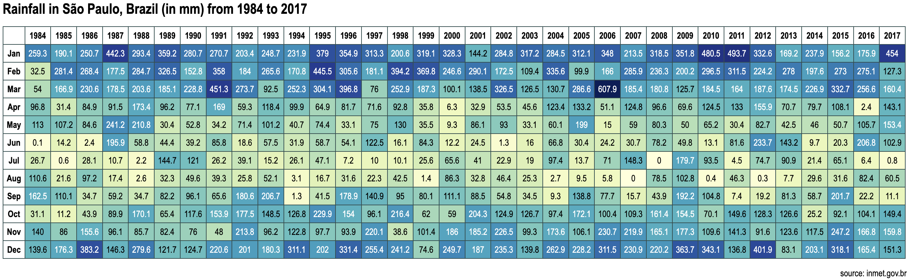
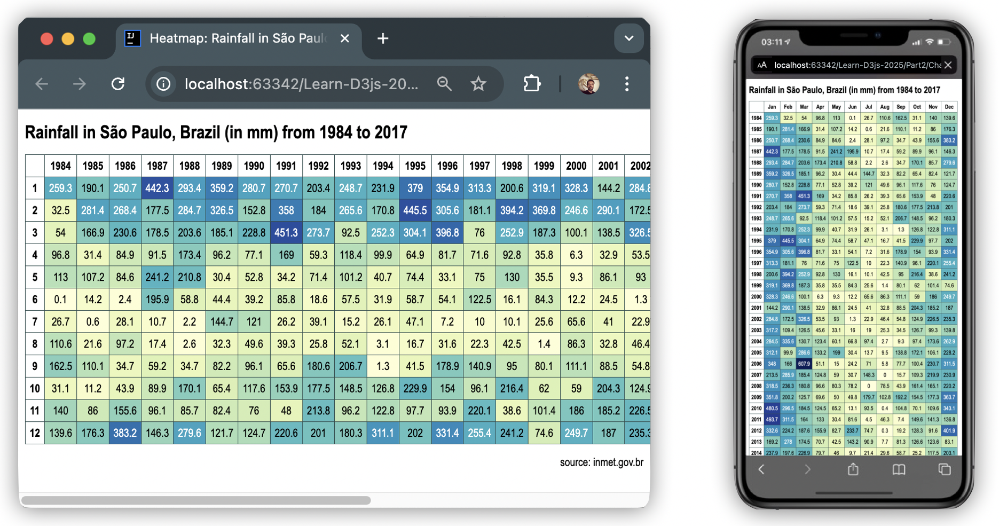
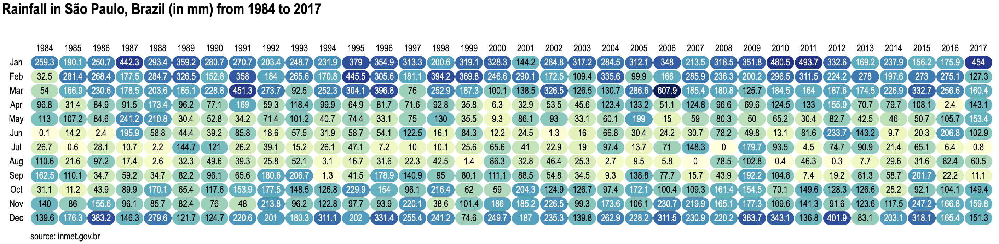

<link href="./css/styles.css" rel="stylesheet">

# Creating a heatmap table

In this tutorial we will use grouping techniques to transform data so that it easily maps to an HTML table and use it to create a heatmap visualization.

Of course, instead of HTML cells, you could use SVG rectangles, circles, or even other symbols. This is suggested as an exercise. 

The heatmap will highlight the average amount of rain for each month using a gradient of two hues. The goal is to practice grouping and binding to a hierarchical nested structure. This is a step-by-step tutorial, so you can code along, or view the files from each step in your browser. You will find them in the [`Chapter07/HeatmapTable/`](../Chapter07/HeatmapTable/) subdirectory.

This is a small application, so we will use a single HTML file to contain the code. You can start with an empty HTML file, or use the template provided in [`HeatmapTable/0-empty.html`](../HeatmapTable/0-empty.html). It contains an HTML `<table/>` element, a CSS style sheet, and the following script block, which loads the D3 library and contains the URL of a CSV data source in tidy format:

```js
<script type="module">
    import * as d3 from "https://cdn.skypack.dev/d3@7";
    const dataFile = "../data/rain_sao_paulo_tidy.csv";   // check if file location is correct
</script>
```

Note that the URL is a relative path (you might have to adjust it, or move the file to another folder, if you are loading your file from somewhere else).

## Table of contents

* [The data](#the-data)
* [Step 1: Loading the CSV file](#step-1-loading-the-csv-file)
* [Step 2: Transforming the data structure](#step-2-transforming-the-data-structure)
* [Step 3: Binding the data to visual elements](#step-3-binding-the-data-to-visual-elements)
* [Step 4: Adding headers](#step-4-adding-headers)
* [Step 5: Creating a heatmap](#step-5-creating-a-heatmap)
* [Exercise 1: Refactor to display a vertical table](#exercise-1-refactor-to-display-a-vertical-table)
* [Exercise 2: Make the chart responsive](#exercise-2-make-the-chart-responsive)
* [Exercise 3: Refactor using SVG](#exercise-3-refactor-using-svg)
* [Final application](#final-application)

## The data

The original CSV file that contains the data used in this tutorial is [`data/rain_sao_paulo_wide.csv`](../data/rain_sao_paulo_wide.csv), obtained from the Brazil's National Institute of Meteorology ([`bdmet.inmet.org.br`](https://bdmet.inmet.org.br)) and contains the average amount of rain in millimeters measured monthly in the city of São Paulo, from 1984 to 2017. Its 35 rows and 13 columns are structured in a wide format. Here is an excerpt:

```csv
Year,Jan,Feb,Mar,Apr,May,Jun,Jul,Aug,Sep,Oct,Nov,Dec
1984,259.3,32.5,54,96.8,113,0.1,26.7,110.6,162.5,31.1,140,139.6
1985,190.1,281.4,166.9,31.4,107.2,14.2,0.6,21.6,110.1,11.2,86,176.3
1986,250.7,268.4,230.6,84.9,84.6,2.4,28.1,97.2,34.7,43.9,155.6,383.2
... +30 rows ...
2017,454,127.3,160.4,143.1,153.4,102.9,0.8,60.5,11.1,149.4,159.8,151.3
```

In `Chapter 7`, we used the `d3.csv()` parser with a row function to reorganize the file into a tidy format, which is easier to group. This type of transformation, however, is usually better performed at the server side, so for this tutorial we will use a tidy CSV, which was saved in [`data/rain_sao_paulo_tidy.csv`](../data/rain_sao_paulo_tidy.csv). It has the following general structure.

```csv
Month,Year,Rain
1,1984,259.3
2,1984,32.5
3,1984,54
... +403 rows ...
11,2017,159.8
12,2017,151.3
```

This is the file that we will load in the next section.

## Step 1: Loading and inspecting the CSV file

The first step is to load and parse the file, obtaining an array of objects with the data. We shall use the `d3.csv()` parser with the `d3.autoType` row function to parse numeric strings into numbers, and then check to see if the data is in the desired format:

```js
const data = await d3.csv(dataFile, d3.autoType);
console.log(data); 	// inspect the data
````

_Figure 1_ illustrates this process and compares the original CSV file structure with the resulting object structure after loading and parsing the file.


_Figure 1 – Loading a CSV file and parsing it into a JavaScript object. Code: [`HeatmapTable/1-load-parse.html`](../HeatmapTable/1-load-parse.html)._

Note that although the data is in a tidy format, unlike the example we used in _Chapter 7_, the months here are numbers.

The next step is to reorganize the data in a format that is suitable for display.

## Step 2: Transforming the data structure

HTML tables are nested hierarchical structures. In a table, the `<td>` data cell is nested in a `<tr>` row, which is part of the `<table>`. Columns are formed by the `<td>` data cells inside the rows. It will be easier to bind the data if it has a similar structure. For example, to have years as columns and months as rows, you must reorganize the data so that the years are grouped by month first, then by year. This way you can bind months to `<tr>` elements, and years to `<td>` elements.

You can achieve this sort of nesting with `d3.rollup()`, which takes the data array, a reduce function and one or more functions that return the grouping keys, and generates an array of nested maps. We won’t be using the keys to retrieve any values, so it’s simpler to use `d3.rollups()`, as it returns nested arrays instead of maps.

```js
const nested = d3.rollups(data,
                          v => v[0].Rain, 	// reduce function
                          k => k.Month,      	// first key
                          k => k.Year);      	// second key
```

_Figure 2_ compares the nested structure and the original object dataset. Pay attention to the properties used in each function. `Month` and `Year` respectively become the major and the minor keys to access the data. The `Rain` property provides the values that we want to display. The reduce function (in green) transforms this data into the leaves of the tree.


_Figure 2 – Converting a flat tabular structure into a two-level-deep nested tree using `d3.rollups()`. Code: [`HeatmapTable/2-nest-rollup.html`](../HeatmapTable/2-nest-rollup.html)_.

The result is a 12-element array, where each element is a tuple representing a month. The first element (the major key) is the number of the month, and the second, a 34-element array of year tuples, where the first element (the minor key) is the year, and the second is the data: the amount of rain measured in millimeters.

To select a value you would first choose a month (in black), and then a year (in red). In this application, we aren't selecting anything, but binding the data to visual elements that have a similar structure.

Now that we finally have the data in its expected format, we can use it to populate and display an HTML table.

## Step 3: Binding the data to visual elements

The data can be directly bound to nested `<tr>` and `<td>` selections by joining the dataset to a `<table>`. First, append (or select) the HTML table. Your HTML page already has an empty `<table/>` element. This will select it:

```js
const table = d3.select("table");
```

Then bind the dataset to the table rows, in the `<table>` context. The following code will create a new `<tr>` for each element from the 12-element `nested` array, that is, it will create 12 `<tr>` elements:

```js
const tr = table.selectAll("tr.month")
                .data(nested)			// Array(12)
                    .join("tr")
                        .attr("class", "month")
                        .attr("title", m => m[0]);	// m = [month, Array(34)]
```

After the join, the data bound to each `<tr>` has two elements (`[month,Array(34)]`). We will only use the first element, which is the month number (stored above in the title attribute). You can check if this code generated the `<tr>` elements as expected using your browser’s development tools.

Now, in the `<tr>` context, create a new selection for `<td>`, and bind (using `data()` again) the second element of the current data, which is the 34-element array that contains the years (in the format `[year, rain]`). The following code will create a new `<td>` for each year, that is, it will create 34 `<td>` elements inside each `<tr>`:

```js
tr.selectAll("td.year")
  .data(m => m[1])                  	// m = [month, Array(34)]
      .join("td").attr("class", "year")
          .attr("title", y => y[0])       	// y = [year, rain]
          .text(y => y[1]);
```

After the join, the data bound to each `<td>` now has two elements: the first is the year (that we stored above in the `title` attribute), and the second is the amount of rain, which displayed as text.

_Figure 3_ compares the nested data structure to the nested HTML `<table>` elements.


_Figure 3 – Mapping the nested data to a nested HTML table selection. Code: [`HeatmapTable/3-html-table.html`](../HeatmapTable/3-html-table.html)._

Now that the data was bound to graphical elements, you can launch the page and finally see the rendered result on your screen. The table should look like the screenshot in `Figure 4`. If it doesn’t, use your browser tools to inspect the generated HTML. It may give you some clues about what went wrong.


_Figure 4 - An HTML table displaying nested data. Code: [`HeatmapTable/3-html-table.html`](../HeatmapTable/3-html-table.html)._

We are done displaying the data, but the chart still needs some context so that the viewer knows what those numbers mean. Let’s add some informative headers.

## Step 4: Adding headers

To add headers, we will need to insert an extra row above all other rows, for the years, and an extra column at left, for the months.

We have month numbers (the `<tr>` keys), but not month names. You can create a formatting function that converts a date into 3-letter month name, compatible with your locale, with `d3.timeFormat()` (see the section on _Internationalization tools_ in _Chapter 7_):

```js
const fmt = d3.timeFormat("%b");
```

To place a column before the first column, use `selection.insert()` (see _Chapter 6_) in the `<tr>` context. These are the month labels. Since the `fmt()` function we defined requires a JavaScript `Date` object, we created one and set the month by subtracting 1 from the key (`m[0]`), since JavaScript months start counting from `0`:

```js
tr.insert("th", "td:first-of-type")
  .attr("class", "month-label")
      .text(m => fmt(new Date().setMonth(m[0]-1)))   	// Jan, Feb, etc.
```

For the years, insert a row above the first row, in the `<table>` context:

```js
const header = table.insert("tr", "tr:first-of-type")
                    .attr("class", "header-row");
```

You can get the year from any one of the 12 sub-arrays. Here we are getting it from the first row (`nested[0]`). The first element (`nested[0][0]`) is the month number (key), and the second (`nested[0][1]`) is the array with 34 sub-arrays, one per year. The year is the first element in each:

```js
header.selectAll("th.year-label")
      .data(nested[0][1]) 				// any month
          .join("th").attr("class", "year-label")
              .text(y => y[0]) 				// the year
```

Finally, insert an empty cell at table position (0,0), so that the table cells are complete:

```js
header.insert("td", "th:first-of-type");
```

A fragment of the generated HTML is listed below. You can see this in your browser’s inspector:

```html
<table>
  <tr class="header-row">
    <td></td> <!-- empty cell -->
    <th class="year-label">1984</th>
    <th class="year-label">1985</th>
     ... 
    <th class="year-label">2017</th>
  </tr>
  <tr class="month" title="1">
    <th class="month-label">Jan</th>
      <td class="year" title="1984" ... >259.3</td>
      <td class="year" title="1985" ... >190.1</td>
      ... 
      <td class="year" title="2017" ... >454</td>
  </tr>
  <tr class="month" title="2"> ... </tr>
   ... 
  <tr class="month" title="12"> ... </tr>
</table>
```

The result is shown in `Figure 5`.


_Figure 5 - The table after adding headers. Code: [`HeatmapTable/4-headers.html`](../HeatmapTable/4-headers.html)._

To turn the table into a heatmap, we need to add colors. This will be addressed in the next section.

## Step 5: Creating a heatmap

You can create a heatmap visualization by mapping a color scale to represent the drier and wetter months in each table cell. An exponential scale (using `d3.scalePow()`) will allow you to control the contrast between dry and wet months, by adjusting the exponent from approximately `0.5` (drier) to `2` (wetter). We will use an intermediate value:

```js
const color = d3.scalePow().exponent(.75);
```

The default range is 0 to 1. To configure the domain for this scale, we need to compute the extent array using all the values from the `Rain` property. It’s easier to get the values from the original data:

```js
color.domain(d3.extent(data, d => d.Rain));
```

A color scheme interpolator from the _d3-scales-chromatic_ module (that we cover in `Chapter 10`) is used to generate the color strings. This interpolator receives a value between 0 and 1 and returns a color string ranging from light yellow (lower values) to dark blue (higher values). The following code applies the color to the background of each <td>:

```js
d3.selectAll("td.year")
    .style("background-color", y => d3.interpolateYlGnBu(color(y[1])));
```

The text inside each `<td>` must contrast with its background to be readable. This can be achieved by using the scaled color value to decide if the text will be white or black:

```js
d3.selectAll("td.year")
    .style("color", y => color(y[1]) > .5 ? 'white' : 'black');
```    

The result is shown in `Figure 6` (with CSS styling, titles and footnote added in static HTML).


_Figure 6 – Heatmap created in HTML by grouping data in table format. Code: [`Heatmap/5-heatmap.html`](../Heatmap/5-heatmap.html)._

The final code is available in [`HeatmapTable/5-heatmap.html`](../HeatmapTable/5-heatmap.html). If you want to continue improving this chart, try some of the exercises in the next sections.

## Exercise 1: Refactor to display a vertical table

Swap months and years in the heatmap visualization to display a vertical table, which should scroll vertically and display well in a mobile device.

## Exercise 2: Make the chart responsive

Create a responsive chart that displays the table horizontally if viewed in a screen that is wider than 700px, but vertically otherwise. _Hint_: get the device’s width using:

```js
window.matchMedia("screen and (max-width: 700px)")
```

To test, open the file in a browser, and resize the window. The chart should change orientation when the width crosses the 700px threshold. Figure 7 shows how it would appear in a computer and a mobile phone.


_Figure 7 – Responsive heatmap table displayed in a desktop browser and mobile device browser._

You can then add a `'change'` event listener to it and redraw the chart when the width changes. See the template file for more hints.

## Exercise 3: Refactor using SVG

Replace the HTML table with SVG.

Since you are not bound to a strict hierarchical structure like an HTML table, you don't need to use `d3.insert()` or any complex selectors. The joins will be much simpler. You can also add rounded corners to the rectangles, as shown in _Figure 7_, or even use other shapes.


_Figure 8 – Heatmap table implemented with SVG._

## Final application

The final code, which incorporates the changes in all exercises (a responsive SVG heatmap table), is available in [`HeatmapTable/final-heatmap-table.html`](../HeatmapTable/final-heatmap-table.html).


