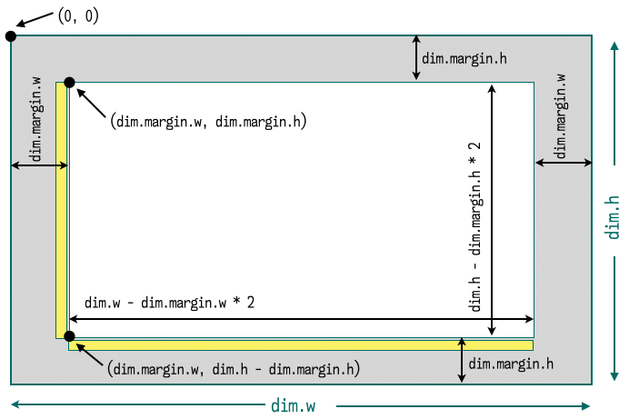
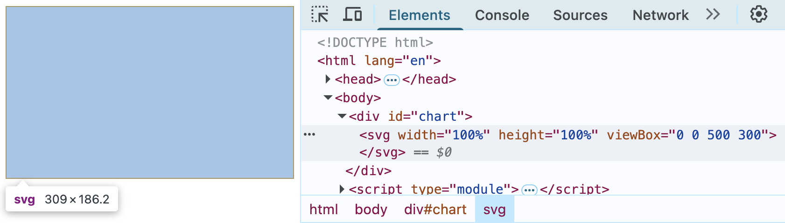
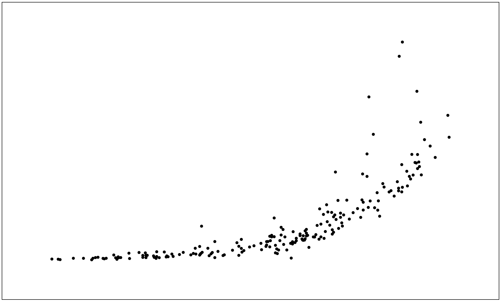
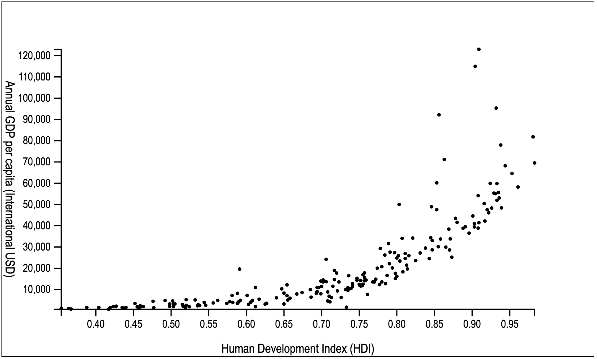
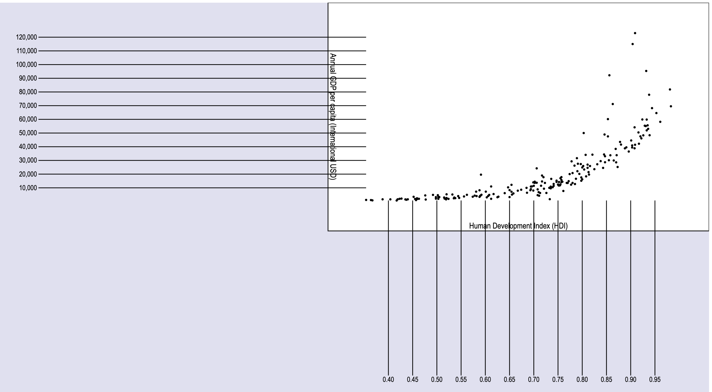
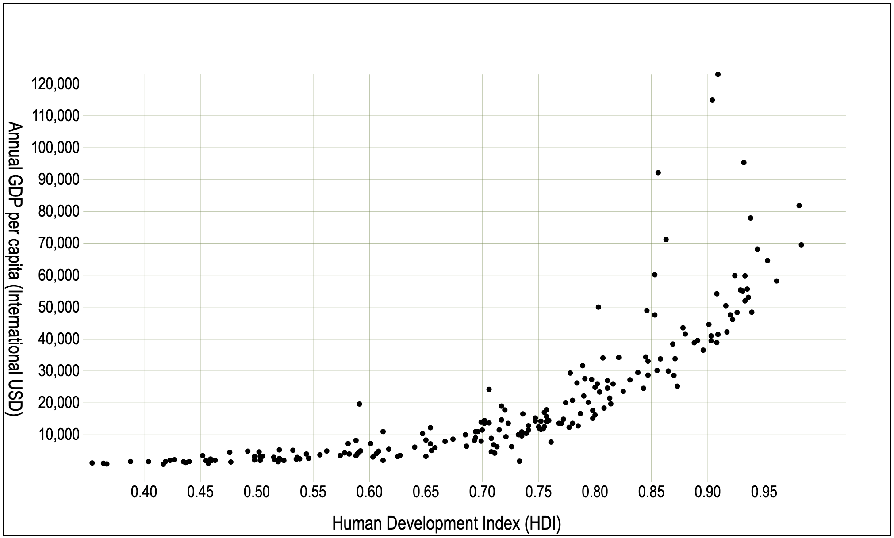

<link href="https://fonts.googleapis.com/css2?family=Source+Serif+4:ital,wght@0,400;0,700;1,400;1,700&display=swap" rel="stylesheet">
<link href="./css/fonts.css" rel="stylesheet">
<link href="./css/styles.css" rel="stylesheet">

# Creating a Scatterplot – Part 1

In this tutorial, you will apply what you learned in the last three chapters to create a scatterplot. We will start by loading the data to create a simple chart, set up dimensions and scales, plot the dots, then add axes, labels, and adjust the scales. In the second part, we will add colors and interactive features.

You can run and view the complete code for each step in the `Chapter09/StepByStep/` folder. As in other tutorials, each step contains a complete application folder, consisting of an `index.html` file, a local `js/` subfolder where JavaScript modules will be stored, and a local `css/` subfolder for the stylesheets. To code as you read, you can create a similar structure or start with step 1 (`StepByStep/1-load-data/`). To view the results after each step, launch the `index.html` file in a local web server and preview it in your browser.

## Table of contents
The following section are contained in this tutorial:
- [The data](#the-data)
- [Step 1: Loading and preparing the data](#step-1-loading-and-preparing-the-data)
- [Step 2: Setting up the page](#step-2-setting-up-the-page)
- [Step 3: Drawing dots on a Cartesian grid](#step-3-drawing-dots-on-a-cartesian-grid)
- [Step 4: Adding axes and labels](#step-4-adding-axes-and-labels)
- [Step 5: Configuring axis styles](#step-5-configuring-axis-styles)
- [Step 6: Using a logarithmic scale](#step-6-using-a-logarithmic-scale)

## The data

For this visualization, we will use the `un_regions_2017.csv` data file, located in the `Chapter10/data/` folder (you can copy it to a `data/` subfolder in your application folder). A fragment is shown here, highlighting some of its headers and listing some data rows:

```csv
Country,     Continent,     Pop_2016, HDI_2017, GDP_NOM_2017, GDP_PPP_2017
Armenia,     Asia,           2924816,  0.755,    3936.79832,  12509.63961
China,       Asia,        1378665000,  0.752,    8826.99410,  14243.53261
Argentina,   South America, 43847430,  0.825,   14398.35877,  23597.11775
Canada,      North America, 36264604,  0.926,   45032.11991,  48317.17458
Mozambique,  Africa,        28829476,  0.437,     426.22197,   1287.23487
Egypt,       Africa,        95688681,  0.696,    2412.72708,  10995.00567
New Zealand, Oceania,        4693200,  0.917,   42940.57829,  42204.74574
Italy,       Europe,        60627498,  0.880,   31952.97592,  41581.12079
... +211 rows ...
```

The complete file contains more headers and over 200 rows. The data from this file was compiled from multiple sources, such as the United Nations and the World Bank. Our goal, for the complete tutorial is to create a visualization of this data in a scatter chart comparing the _Gross Domestic Product_ (GDP) per capita (in international USD) and _Human Development Index_ (HDI) of different countries and the continents they belong to. In the last step of _Part 2_, we will add population information and create a bubble chart.

So, let’s start.

## Step 1: Loading and preparing the data

To create the visualization from scratch, start by creating a project folder for your application using your IDE, then create three subfolders: `js/`, `css/`, and `data/`. Next, copy `un_regions_2017.csv` from `Chapter09/data` to the `data/` directory. Then, create a new JavaScript module called `data.js` in the `js/` folder. It will contain an asynchronous function to load and parse the data source.

Add the following two lines to `js/data.js`. This code will import the D3 library (as an ESM module from the SkyPack CDN) and store the URL for the data source.

```js
import * as d3 from 'https://cdn.skypack.dev/d3@7';
const file = "data/un_regions_2017.csv";
```

**Important Note**: The CSV file’s location will depend on where you store it. The preceding code assumes you copied it to the local `data/` folder in your project folder (which is your document root). If you are using the code examples directly from the `StepByStep/` folder, a relative URL that points to `Chapter09/data/` is used.

Now let’s create a function to load the CSV and obtain the data we need for the chart. Since this function will be used outside the module, it needs to be exported. It should also be asynchronous, since it will return a promise containing the parsed data:

```js
export async function load() {  /* ... */ }
```

Here is a possible implementation using the `d3.csv()` parser:

```js
export async function load() {
    return d3.csv(file, function(row) {
        if(+row.HDI_2017 > 0 && +row.GDP_PPP_2017 > 0) {
            return {
                name: row.Country,
                hdi: +row.HDI_2017,
                gdp: +row.GDP_PPP_2017
            }
        }
    });
}
```

The CSV parser declares a row function that filters only entries that have a positive HDI and GDP. It also replaces the row object with one that contains just the data we will use, using shorter names for each property. Note the `+` before the numerical fields to convert them to numbers.

To run this code, import the load function from `js/data.js` in `index.html`, call `load()` using `await` to obtain the data, and print it to the console:

```html
<script type="module">
    import {load} from './js/data.js';

    const data = await load();
    console.log(data);
</script>
```

This will log the dataset to your browser’s console. It should contain 200 entries, since 19 were filtered out. Inspect it and select any object to view its properties. Make sure each object has `name`, `hdi`, and `gdp` properties. Here's an example:

```js
{name: "Canada", hdi: 0.926, gdp: 48317.1745835151}
```

See the full code for this step in `StepByStep/1-load-data/`. Now let’s set up the page to display the chart.

## Step 2: Setting up the page

In this step, we set up dimensions, scales, and the SVG viewport, where the chart will be rendered. _Figure 1_ contains a sketch of the chart’s layout.



_Figure 1 – A sketch of the layout for the scatterplot. The data will be displayed in the inner rectangle. Axes (yellow rectangles) and labels will be placed in the margins._

Create a `js/common-1.0.js` module to be shared by other modules. It will contain a dimensions object (`dim`) and an application object (`app`). The dimension object will define width, height, and margins:

```js
const dim = {
    w: 500, h: 300,
    margin: {h: 40, w: 50}
};
```

The application object will store the data (initially empty) and two scales. We will start with a linear scale for both axes. For now, we only set the ranges. The scales will fit the data in the center of the chart, with vertical and horizontal margins. Note that the range for the _y_-axis is inverted: it starts from the lower margin and grows upwards, which is the default for a positive-quadrant Cartesian chart.

```js
    const app = {
        data: {},
        scale: {
        x: d3.scaleLinear()
             .range([dim.margin.w, dim.w - dim.margin.w]),
        y: d3.scaleLinear()
             .range([dim.h - dim.margin.h, dim.margin.h]),
    }
}
```

Since we are using the D3 library, it needs to be imported at the beginning of the module:

```js
import * as d3 from 'https://cdn.skypack.dev/d3@7';
```

We also need to export these two objects so they can be used in other modules:

```js
export {dim, app};
```

Now go to the `js/data.js` module, add an import for the app object, and update the `load()` function so that it copies the data obtained in the previous step to the `app.data` object, storing it in a new `countries` property.

```js
import {app} from './common-1.0.js';
/* ... */
export async function load() {
    app.data.countries = await d3.csv(file, function(row) { /* ... */ });
    return app;
}
```

We are returning the app object so we can inspect it from `index.html`.

Back to `index.html`, create a `<div>` to accommodate the `<svg>` element. This will allow you to resize the chart later and make the page responsive if you wish. Also, add a link to `css/main.css`, where we will place CSS rules:

```html
<!DOCTYPE html>
<html lang="en">
<head><title>Annual GDP compared to HDI (2017)</title></head>
<link rel="stylesheet" href="css/main.css">
<body>
  <div id="chart"></div>
  <script type="module"> <!-- ... --> </script>
</body>
</html>
```

For now, add just one rule to `main.css`, placing a border around the SVG viewport:

```css
svg { border: solid 1px; }
```

Let’s create one more module: `js/view.js`. It will be used to render the chart. For now, it will just contain a `draw()` function with the code that generates the SVG viewport. This requires imports for the D3 library and for the `dim` object (from `js/common-1.0.js`):

```js
import * as d3 from 'https://cdn.skypack.dev/d3@7';
import {dim} from './common-1.0.js';

export function draw() {
    d3.select("#chart")
        .append("svg")
            .attr("width", "100%")
            .attr("height", "100%")
            .attr("viewBox", `0 0 ${dim.w} ${dim.h}`);
}
```

To generate the SVG code, import the `draw()` function from the `js/view.js` module and call it after the data is loaded in `index.html`. You can also inspect `app.data` to see if it was populated as expected.

```html
<script type="module">
    /* ... */
    import {draw} from './js/view.js'; // don’t forget to import it!
    const app = await load();
    console.log(app.data);  // inspect app.data.countries
    draw();
</script>
```

This will make the SVG occupy all the space available. If you resize the browser, it should always fit in the window. Use your browser’s element inspector to view the generated SVG code.



_Figure 2 – Generated SVG code after step 2_

The full code for this step is in `StepByStep/2-setup-page/`. In the next step, we set the scale’s domains and use them to finally plot the dots on the screen.

## Step 3: Drawing dots on a Cartesian grid

To compare GDP with HDI, we will use a Cartesian space, with one axis for the GDP and the other for the HDI. In this step, we will just plot the dots without any context.

The domain for each scale will be the full extent of its data. Let’s create a `config()` function in `js/data.js` to configure the domains:

```js
function config() {
    app.scale.x.domain(d3.extent(app.data.countries, d => d.hdi));
    app.scale.y.domain(d3.extent(app.data.countries, d => d.gdp));
}
```

Then call it from `load()` (in `data.js`) after the data is loaded and before returning:

```js
export async function load() {
    /* ... */
    config();
    return app;
}
```
Now we can plot the dots. Add an import for the `app` object in `js/view.js`, since we need access to `app.data.countries`, `app.scale.x`, and `app.scale.y`:

```js
import {dim, app} from './common-1.0.js';
```

Next, create the `drawChart()` function. It binds 1.5-pixel circles to the data entries and uses the pair of scaled GDP/HDI values as each circle’s center coordinates:

```js
function drawChart() {
    d3.select("svg")
      .selectAll("circle.dot")
         .data(app.data.countries)
            .join("circle").attr("class", "dot")
               .attr("r", 1.5)
               .attr("cx", d => app.scale.x(d.hdi))
               .attr("cy", d => app.scale.y(d.gdp));
}
```

Don’t forget to add the `'dot'` class to the circle after `join()`, since it is used in `selectAll()`. This will avoid a common bug (discussed in _Chapter 6_).

To render the dots, just add a call to `drawChart()` from your `draw()` function:

```js
export function draw() {
    /* ... */
    drawChart();
}
```

Reload the page and you should now have something like _Figure 3_ on your screen:



_Figure 3 – A simple scatterplot comparing GDP per capita (_y _axis) with HDI (_x _axis) among 194 countries in 2017. Code: `StepByStep/3-scatter-dots/`_

The chart shows an exponential relationship between HDI and GDP, but we don’t know which countries are represented, which axis is HDI, which is GDP nor any values. Context is necessary. We will provide it with axes and labels in the next step.

## Step 4: Adding axes and labels

A typical Cartesian chart has a horizontal _x_-axis with tick labels at the bottom, and a vertical _y_-axis with tick labels on the left side.

Let’s add axis functions to the app object in `js/common-1.0.js` and connect them to their respective scales:

```js
app.axis = {
    x: d3.axisBottom(app.scale.x),
    y: d3.axisLeft(app.scale.y)
}
```

Now open `js/view.js`, where we will create a new `drawAxes()` function to draw the axes and labels. It should be called in the `draw()` function before calling `drawChart()`, so that the axes are rendered under the data:

```js
export function draw() {
    /* ... */
    drawAxes();
    drawChart();
}
```

As we saw in _Chapter 8_, the usual way to render an axis is using the `call()` method in a selection chain. This is done here in the `drawAxes()` function, which also translates each axis (originally at the viewport’s origin) to its classical Cartesian position. It’s also good practice to add a descriptive class to each axis, such as _x_-axis and _y_-axis, as used here:

```js
function drawAxes() {
    d3.select("svg").append("g").attr("class", "x-axis")
      .attr("transform", `translate(${[0, dim.h - dim.margin.h]})`)
      .call(app.axis.x);
    
    d3.select("svg").append("g").attr("class", "y-axis")
      .attr("transform", `translate(${[dim.margin.w, 0]})`)
      .call(app.axis.y);
      /* ... */
}
```

This function should also add labels for the axes, a horizontal label below the _x_-axis and a vertical label to the left of the _y_-axis. The vertical label is rotated 90 degrees.

```js
function drawAxes() {
/* ... */
    d3.select("svg").append("text").attr("class","label")
      .text("Human Development Index (HDI)")
      .attr("transform", `translate(${[dim.w / 2, dim.h - 3]})`)

    d3.select("svg").append("text").attr("class","label")
      .text("Annual GDP per capita (International USD)")
      .attr("transform", `translate(${[3, dim.h / 2]}) rotate(90)`)
}
```

To guarantee that the label is rotated along its center, you need to set the `text-anchor: middle` CSS property. Since this is a static property, it’s best to declare it in a style sheet, along with other static styles for the labels (`css/main.css`):

```css
text {
    font-family: 'Arial Narrow', sans-serif;
    font-size: 7pt;
}
.label {
    font-size: 8pt;
    text-anchor: middle;
}
```

After making all these changes, preview the `index.html` file. Your chart should look like _Figure 4_.



_Figure 4 – Adding a simple Cartesian grid and labels. Code: `StepByStep/4-axes-labels/`_

Now we have some context and can see that high GDP values are somewhat related to high HDI values, that the growth is exponential, and that it seems that most countries have a GDP per capita below 10,000 international dollars. There is still a lot we can do to improve it. In the next section, we will explore some other ways to style your axes.

## Step 5: Configuring axis styles

Let’s configure some styles to reduce the clutter and make the chart easier to read. Perhaps we don’t need those thick domain lines, since there are so many dots that appear right on top of them. You could easily remove them from the DOM with the following:

```js
d3.select(".domain").remove();
```

But maybe just hiding them will be enough. Adding this rule in `css/main.css` will do it:

```css
.domain {
    opacity: 0;
}
```

It’s hard to read the dots that are far from the axes. We could fix this by creating a visible grid behind the dots. By adding a couple of tick configuration methods to each axis function, you can increase the lengths of the tick lines so that they fill the entire chart area. We can compute the correct sizes using the margins and viewport dimensions. Let’s try it. Edit this code in `js/common-1.0.js`:

```js
app.axis = {
    x: d3.axisBottom(app.scale.x)
         .tickSize(dim.h - dim.margin.h * 2 + 10)    
         .tickPadding(2),
    y: d3.axisLeft(app.scale.y)
         .tickSize(dim.w - dim.margin.h * 2 + 10)
         .tickPadding(2)
}
```

Here, we extended the horizontal axis tick line to fill the chart's vertical space, and the vertical axis tick line to fill its horizontal space, adding an extra 10 pixels to cross the domain line.

Reload the file in your browser. What do you see? It seems that the tick lines indeed grew longer, but they moved offscreen. In _Figure 5_, we extended the viewport to show all four quadrants, and you can see that they grew down and to the left. The lines need to be moved in the other direction.



_Figure 5 – First attempt at extending the tick lines. Use `view-1.3.1.js` to see this effect._

The ticks grew left and down. To make them occupy the chart area, we need to move them up and right. The _x_-axis ticks should start at the top margin, so the vertical position is `dim.margin.h`. The _y_-axis starts at the right margin, which is the `dim.w - dim.margin.w` position. Call the following code at the end of `drawAxes()` (or replace the original transforms) to apply these changes:

```js
d3.select(".x-axis")
  .attr("transform", `translate(${[0, dim.margin.h]})`);
d3.select(".y-axis")
  .attr("transform", `translate(${[dim.w - dim.margin.w/2, 0]})`);
```

Now reload the page and the grid should be in place.
The lines are still too dark and thick. Let’s make them thinner and lighter with the following CSS styles (add them to `css/main.css`):

```css
.y-axis line, .x-axis line {
    stroke-width: .25;
    stroke: rgba(114, 138, 74, 0.5);
}
```

The result is shown in _Figure 6_.


_Figure 6 – Configuring the style and size of grid lines in the chart area. Code: `StepByStep/5-axis-tick-styles/`._

Although it seems much easier to relate the position of a dot to its values, it’s still difficult to identify their positions in this chart since they are too close to each other. Perhaps we can improve their visual distribution with a different scale.

## Step 6: Using a logarithmic scale
Since the GDP per capita grows exponentially, and most data points use the first 10% of the scale, a non-linear scale might improve readability. Since all GDP values in our dataset are greater than zero, we can use a logarithmic scale: just replace `scaleLinear()` with `scaleLog()` (in `js/common-1.0.js`).

```js
app.scale.y = d3.scaleLog()
                .range([dim.h - dim.margin.h, dim.margin.h])
```

After this change, you might notice that the ticks in the vertical scale now appear in scientific notation, which is the default when an axis uses a logarithmic scale. You can change it back to how it was before configuring the _y_-axis with the `ticks()` method:

```js
app.axis.y.ticks(8, ',')
```

That’s it, the logarithmic scale provides more space between the dots, and you can finally distinguish most of them, as shown in _Figure 7_.


_Figure 7 – An improved chart using a logarithmic scale for the GDP per capita. Code: `StepByStep/6-log-scale/`_

We now have a lot of context information in our chart, but nothing to give us any clue about which countries are represented. There are a couple of ways we can improve it:

* Using _tooltips_ that appear when the user hovers over a dot. The tooltip should include at least the name of the country. It could also include the country’s GDP and HDI data.
* Applying _colors_ to the dots according to the continent they belong to. This would require that we also extract continent information from the data source and create a legend showing the continent represented by each color.

These steps will be implemented in the second part of this tutorial, after _Chapter 10_, which covers everything about colors in D3. If you think you already know how to do it, go ahead! Coding is the best way to learn.


