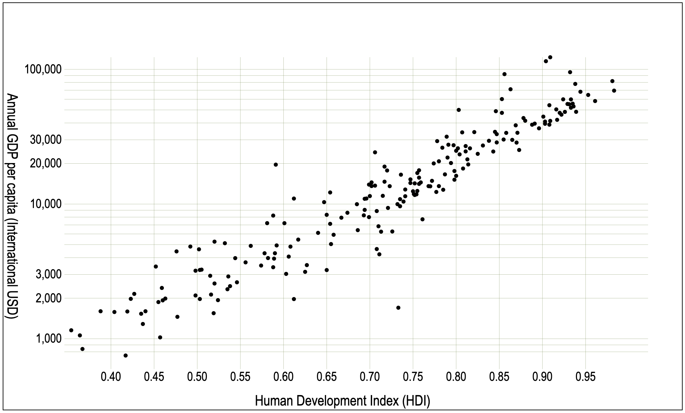
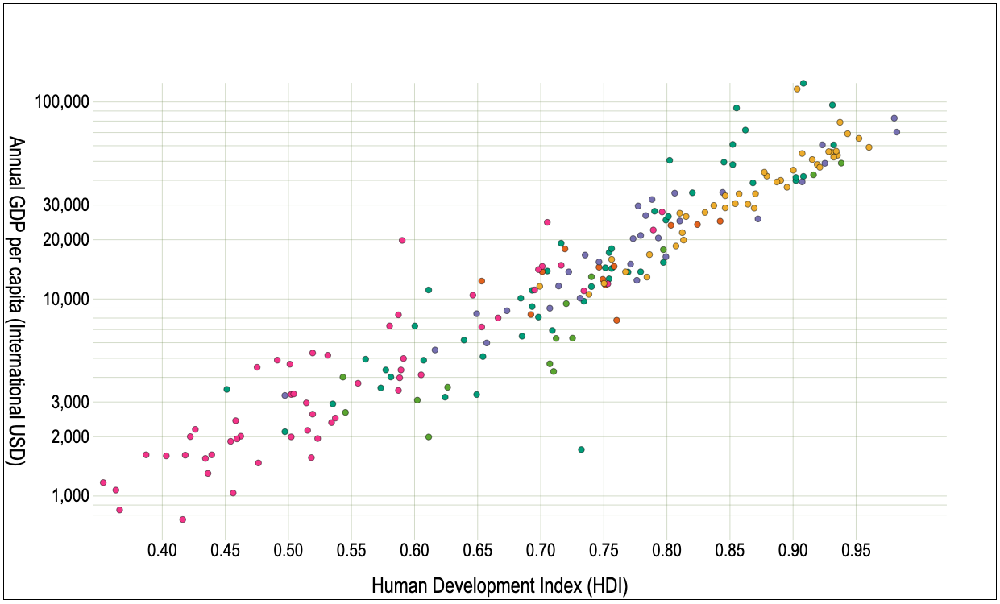
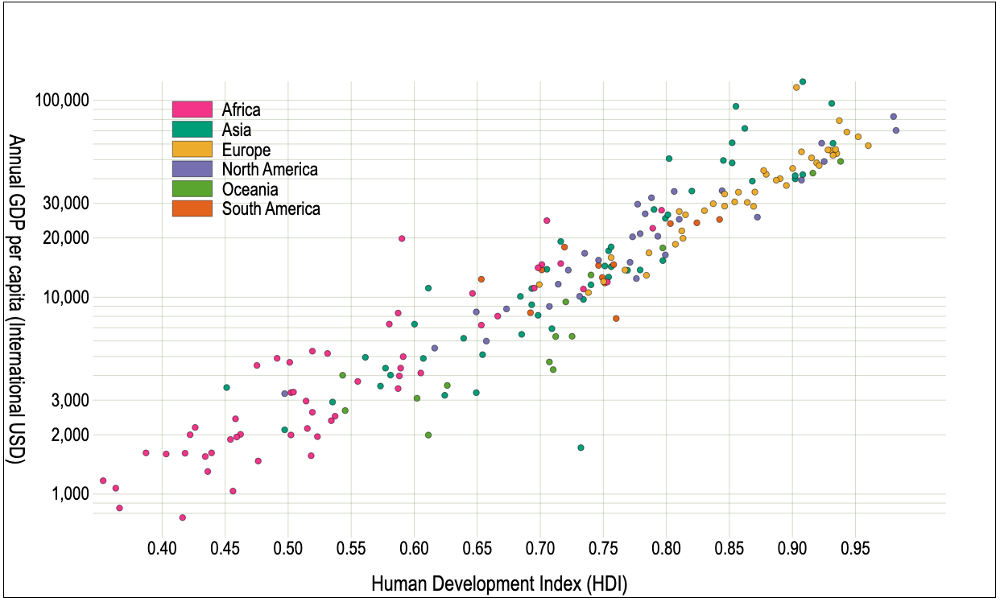
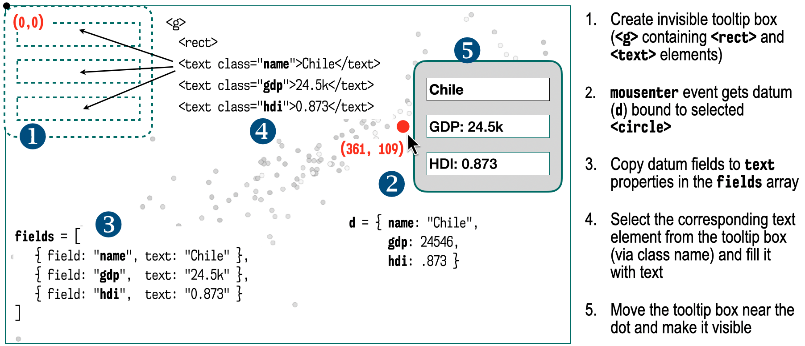
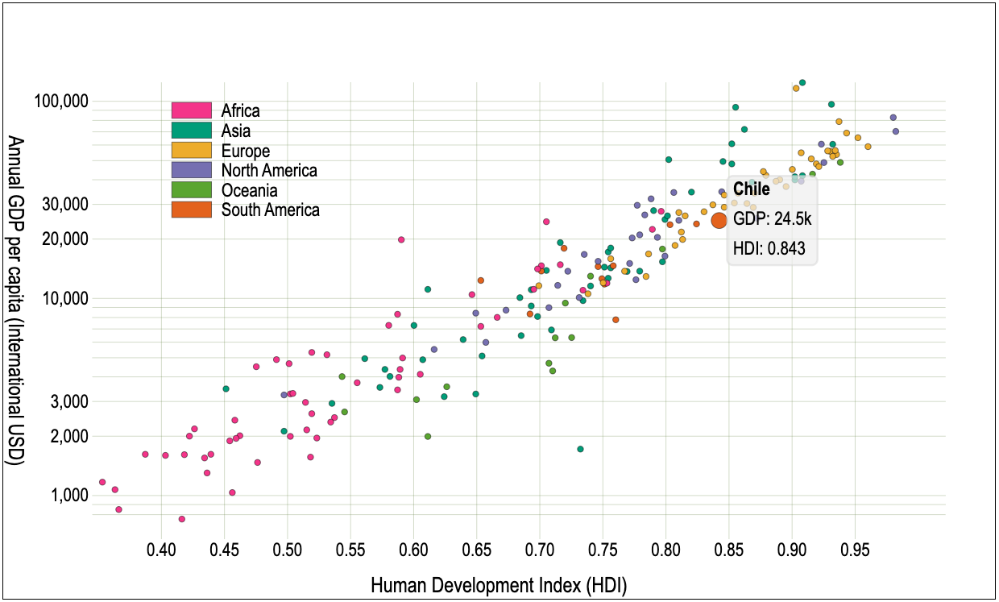
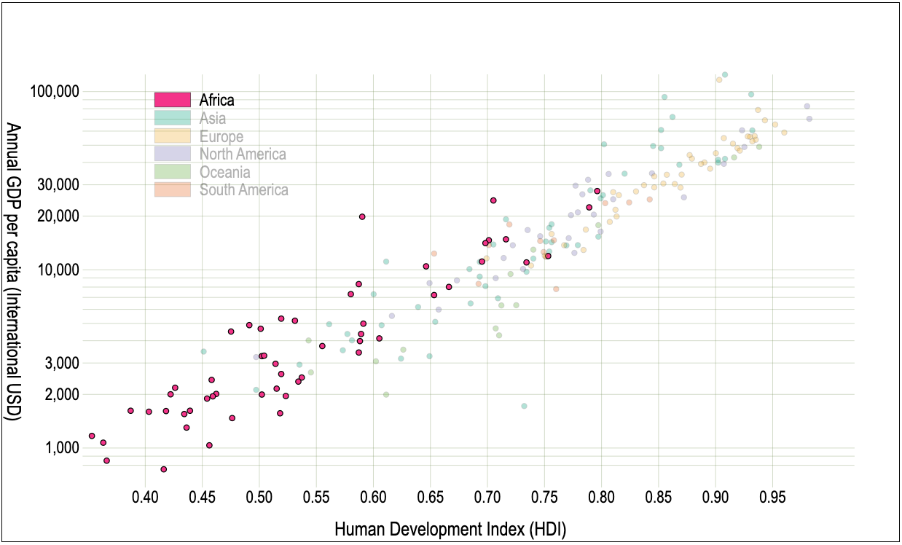
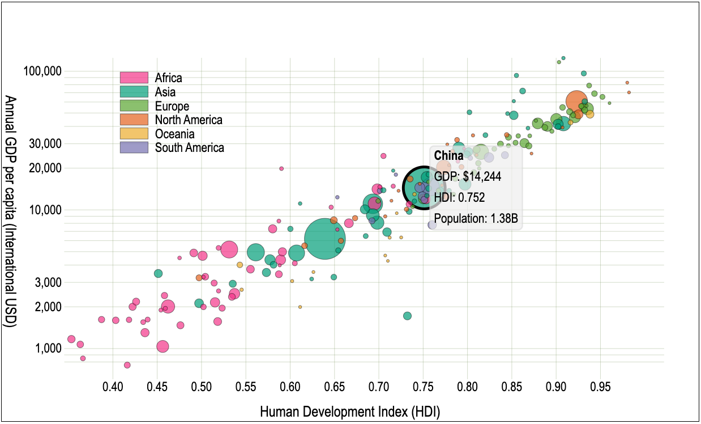

<link href="https://fonts.googleapis.com/css2?family=Source+Serif+4:ital,wght@0,400;0,700;1,400;1,700&display=swap" rel="stylesheet">
<link href="./css/fonts.css" rel="stylesheet">
<link href="./css/styles.css" rel="stylesheet">

# Online tutorial: creating a scatterplot – part 2

In the first part of this tutorial we plotted dots representing countries on a Cartesian graph that crossed their GDP and HDI values (for 2017). The GDP was plotted with a logarithmic scale, and a light-gray grid was used for context, as shown in _Figure 1_.


_Figure 1 – Scatterplot comparing GDP and HDI developed in [part 1](../../Chapter09/Tutorial). It has_

The CSV data source used is also copied in this chapter's repository, in [`Chapter10/data/un_regions_2017.csv`](../data/un_regions_2017.csv). A fragment is shown below listing some headers and rows:

```csv
Country,     Continent,     Pop_2016, HDI_2017, GDP_NOM_2017, GDP_PPP_2017
Armenia,     Asia,           2924816,  0.755,    3936.79832,  12509.63961
China,       Asia,        1378665000,  0.752,    8826.99410,  14243.53261
Argentina,   South America, 43847430,  0.825,   14398.35877,  23597.11775
... +216 rows ...
```

Now we will continue improving this chart. You can continue the project you started in the first part of the tutorial or start with the last step, which is copied in [`Chapter10/StepByStep/6-log-scale`](../StepByStep/6-log-scale).

The chart, as it is, doesn’t provide enough context for the viewer, since it is not possible to know which country represents each dot. Placing the name of the country beside each dot is impractical, but we can assign a specific color for each country that belongs to the same continent. For that, we need to obtain that information from the CSV source. This will be done in the next step.

## Table of contents
This tutorial contains the following sections:
* [Step 7: Grouping dots by category](#step-7-grouping-dots-by-category)
* [Step 8: Adding tooltips](#step-8-adding-tooltips)
* [Step 9: Making the legends interactive](#step-9-making-the-legends-interactive)
* [Step 10: Creating a bubble chart](#step-10-creating-a-bubble-chart)
* [Exercise - Make the legend clickable](#exercise---make-the-legend-clickable)
* [Final version](#final-version)

## Step 7: Grouping dots by category

To group the dots by their continent, we need to add continent information for each country. This information is available in the CSV. Edit the parser’s row function as highlighted below (in the `load()` function, from `js/data.js`). This will add a new `continent` property to each parsed row object, copying the data from the CSV’s `Continent` column.

```js
app.data.countries = await d3.csv(file, function(row) {
    if(+row.HDI_2017 > 0 && +row.GDP_PPP_2017 > 0) {
        return {
            /* ... */,
            continent: row.Continent
        }
    }
});
```

Now that each data point object contains a `continent` property, we can use it as a category to group countries and identify them with a color code.

The color can be specified as a function selected by continent, implemented with an ordinal scale. The `app.color` function will return a color from the `d3.schemeDark2` color scheme for each category. This function should be added as a property to the `app` object in `js/common.js`:

```js
app.color = d3.scaleOrdinal(d3.schemeDark2);
```

Since all continent names are different, calling the `app.color` function with a continent name will return a unique color for each continent. The following code will paint each dot according to its continent (in the `drawChart()` function, from `js/view.js`):

```js
d3.selectAll(".dot")
  .style("fill", d => app.color(d.continent)) // d = continent’s name
```

Load your page (`index.html`) to see the results. It should look like _Figure 2_.


_Figure 2 – Adding a different color for each continent._

Now it is possible to identify which dots belong to the same continents, but we still need to identify the continent. Let’s add a legend.

The legend is implemented using a `<g class="legend">` element placed in an empty part of the chart. It contains one `<g class="item">` element for each continent, which contains a rectangle, filled with the continent’s color, and a `<text>` element, with the continent’s name. Let’s store the rectangle’s dimensions in the dim object (`js/common.js`):

```js
dim.legend = {w: 20, h: 10}
```

The legend can be generated with a data join, but we first need a set of unique continent names, which can be obtained as follows:

```js
new Set(d3.map(app.data.countries, d => d.continent));
```

Since we may use this data in other modules, store the set in the `app.data` object. This code will go in a `config()` function, created in the `js/data.js` module:

```js
function config() {
    const continents =
        new Set(d3.map(app.data.countries, d => d.continent));
    app.data.continents = d3.sort(continents, d3.ascending);
    /* ... */
}
```

The continents were sorted in alphabetical order. If `continents` was an array, we could have simply used the native JavaScript `sort()` method, but since it’s a set (which doesn’t have that method), we used `d3.sort()`, which accepts any iterable collection.

Now we can generate the legend, binding rectangles and text elements to the `continents` set. Create a new `js/legend.js` module, and add the following code:

```js
import * as d3 from 'https://cdn.skypack.dev/d3@7';
import {dim, app} from './common.js';

export function drawLegend() {
    // creates one <g> for the legend, and moves it near the top-left corner
    const legend = d3.select("svg")
                     .append("g").attr("class", "legend")
                     .attr("transform", `translate(${[85, 50]})`);

    // creates one <g> for each continent (binds the continents set)
    legend.selectAll("g.item")
          .data(app.data.continents)
             .join("g").attr("class", "item")   
                .each(function(d, i) {
                    d3.select(this).append("rect")		// adds a rectangle
                       .attr("y", i * dim.legend.h)
                       .attr("height", dim.legend.h - 2)
                       .attr("width", dim.legend.w)
                       .style("fill", app.color(d));
                    d3.select(this).append("text")		// adds the text
                       .attr("y", 5 + i * dim.legend.h)
                       .attr("x", dim.legend.w + 5)
                       .text(d);
                });
}
```

This code will place the legend in the top-left part of the chart, draw a rectangle for each continent, fill it with the continent’s color, and append a text beside it, with the continent’s name.

The legend box should be rendered after drawing the other objects. To call `drawLegend()` from the `draw()` function (`js/view.js`), you need to import it:

```js
import {drawLegend} from './legend.js';
```

Then call it as the last command in the function:

```js
export function draw() {
    /* ... */
    drawLegend();
}
```

We still need some adjustments in the stylesheet (`css/main.css`). The following CSS rules align the text with the rectangle and add a stroke around legend boxes and dots:

```css
.legend text {
    alignment-baseline: middle;
}
circle, .legend rect {
    stroke: black;
    stroke-width: .2;
}
```

The full code so far is in `StepByStep/7-category-colors/`. The result is shown in _Figure 3_. The chart now reveals which continents have higher or lower GDP and HDI:



_Figure 3 – Using color to group dots by continent. Code: `StepByStep/7-category-colors/`._

You are probably curious to know what European country is that dot at the top right of the chart, or which African country has a nearly 10k GDP per capita but lags behind many poorer countries in HDI. We can’t place static labels beside each dot – that would make the chart unreadable, but we can add interactive tooltips to display the country’s name and other information when the user moves the mouse over a dot. Let’s do it!

## Step 8: Adding tooltips

To provide the viewer with information about each dot, we will create a tooltip component with a rectangle and some text fields so that when the user hovers over a dot, it displays the data near the dot. It will be implemented it in a new `js/tooltips.js` module.

The module requires D3 and the `app` object from `js/common.js`. It should export three functions. One will draw the tooltip and the other two will respond to events.

```js
import * as d3 from 'https://cdn.skypack.dev/d3@7';
import {app} from './common.js';

function draw() {}
function show(event, d) {}
function clear(event) {}

export {draw, show, clear};
```

Now let’s import all the functions in this module to the `js/view.js` module, using a `tooltip` prefix:

```js
import * as tooltip from './tooltips.js';
```

The `tooltip.draw()` function is called only once, so place it in `draw()`. It will render a hidden empty tooltip, which will only be updated and made visible when the user hovers a dot.

```js
function draw() {
    /* ... */
    tooltip.draw();
}
```

Event handlers need to be added to each circle so that when the mouse hovers a dot, the tooltip is displayed with its data. We can configure them adding to the `circle.dot` selection an `on()` method to listen for the `'mouseenter'` event, and another to listen for the `'mouseout'` event, calling the functions from the `tooltip` module that implement the response:

```js
d3.select("svg")
  .selectAll("circle.dot")
     .on("mouseenter", tooltip.show)
     .on("mouseleave", tooltip.clear);
```

The event handler functions will receive two arguments: the current event, and the datum bound to each circle, which contains the name, GDP and HDI of each country.

Now let's return to the `js/tooltips.js` module. We need to create the tooltip box, populate it when the user hovers over a dot, and display it near the dot.

A tooltip will display three fields. We can bind its container to an array of data, which will make it easier to update the text fields. In the following `fields` array, each field is an object with a name (the `field` property), and a function (the `text` property) that will assemble the string for display when passed the data obtained from the selection:

```js
const fields = [
    {field: "name", text: d => d.name},
    {field: "gdp", text: d => "GDP: " + app.format.gdp(d.gdp)},
    {field: "hdi", text: d => "HDI: " + d.hdi}
];
```

The value for the GDP field is returned by a function that takes the data and formats it as currency. This function was added to our app object in `js/common.js`:

```js
app.format = {
    gdp: d3.format("$,.0f")
}
```

The tooltip will be rendered as an invisible `<g>` element containing a rectangle (initially 80 pixels wide with vertical space for three lines) and three empty text fields. When the user hovers over a dot, the event handler receives the datum for the selected country and uses it to populate the `fields` array with the data to be displayed, which will be bound to the text elements. The rectangle is then resized to fit the text, moved to a position near the selected dot, and finally made visible. _Figure 4_ illustrates this process.


_Figure 4 – Tooltip design._

Let’s implement this in code. The `draw()` function will generate a `<g>` container that is initially hidden (`opacity: 0`), containing a `<rect>` element with rounded corners.

```js
function draw() {
    const tooltip = d3.select("svg").append("g")
                      .attr("class", "tooltip")
                      .attr("opacity", 0);
    
    tooltip.append("rect")
           .attr("width", 80)
           .attr("height", fields.length * lineH)
           .attr("rx", 3).attr("ry", 3)
           .attr("x", -padding).attr("y", -padding);
    /* ... */
}
```

Note that the code will adjust the height of the box, depending on the number of lines. Currently we are displaying three lines, but if more are added, we won’t have to change this code.

The function above uses two top-level constants that were declared in this module: a 3-pixel padding for the text inside the rectangle, and 15 pixels of vertical space for each line:

```js
const padding = 3;
const lineH = 15;
```

A data join will append the text fields, using the field’s name (the `field` property) as the class name for each `<text>` element (we will use this to select the text field later and update it):

```js
function draw() {
    /* ... */
    tooltip.selectAll("text")
           .data(fields.map(f => f.field))
             .join("text")
               .attr("class", d => d)
               .attr("y", (_, i) => i * lineH);
}
```

Note that we did not set any `text()` method for the `<text>` elements. The tooltip is a hidden box with three empty fields. The data to fill the fields will be provided by the circle only when it responds to the `'mouseenter'` event.

Now let’s implement the `show()` function, which responds to the `'mouseenter'` event. It performs three tasks: highlighting the selected dot, populating the tooltip and displaying it beside the dot.

```js
function show(event, d) {
    d3.select(event.target).attr("r", 4);	// makes the dot larger
    makeTooltip(d);	 // populates the tooltip with data
    placeAndShow();	 // moves the tooltip near the dot and shows it
}
```

The selected circle is obtained via the event’s `target` property. Since this is a DOM object, it must be converted to a selection using `d3.select()`. The preceding code doubles its radius.

The `makeTooltip()` function requires the datum bound to the selected circle to obtain the `hdi`, `gdp` and `name` properties and copy them to the `fields` array to populate the tooltip text elements:

```js
function makeTooltip(d) {
    fields.forEach(f => d3.select(".tooltip." + f.field)
                          .text(f.text(d)));
    /* ... */
}
```

This code will select the corresponding `<text>` element using class selectors such as `'.tooltip .name'`, `'.tooltip .gdp'`, etc. and set its contents calling the `text()` function from each object in `fields`.

The tooltip box width depends on its contents. To resize it we must discover the longest line _after_ the text is rendered. This information can be obtained calling `getComputedTextLength()` (see _Chapter 2_) on each text node to obtain an array of lengths, then setting the rectangle’s width attribute from the longest one:

```js
function makeTooltip(d) {
    /* ... */
    const lengths = d3.selectAll(".tooltip text").nodes()
                      .map(t => t.getComputedTextLength());

    const boxWidth = d3.max(lengths) + padding * 2;  // get the new width

    d3.select(".tooltip rect")
      .attr("width", boxWidth);   // resize the tooltip box to fit the text
}
```

Note that, since we are using a DOM method, the selection must be converted to DOM using `nodes()`.

Now that the tooltip box is ready, we can finally move it near the dot and show it. This is implemented in the `placeAndShow()` function below. The position is based on the dot’s coordinates: the scaled HDI and GDP data values. Once it is in place, it can be made visible:

```js
function placeAndShow(d) {
    const position = [app.scale.x(d.hdi) + 7,
                      app.scale.y(d.gdp) + padding - fields.length * lineH/2];

    d3.select(".tooltip")
      .attr("transform", `translate(${position})`) 	// move it
      .attr("opacity", 1);  // show it
}
```

When the mouse leaves a dot, its radius should return to its normal size, and the tooltip should be hidden. This is implemented in the `clear()` function:

```js
function clear(event) {
    d3.select(event.target).attr("r", 1.5);
    d3.select(".tooltip").attr("opacity", 0);
}
```

Now that the hard work is done, we just need to configure some styles. Let’s create a CSS file just for the tooltips, called `css/tooltips.css`. It should be imported from `css/main.css` adding the following command as the first line in the file:

```css
@import url('./tooltips.css');
```

Then, in `css/tooltips.css`, add the following CSS style rules:

```css
.tooltip {
    pointer-events: none;
    transition: opacity 500ms;
}
.tooltip rect {
    fill: #eee;
    fill-opacity: 0.7;
    stroke: gray;
    stroke-opacity: .5;
}
.tooltip text {
    alignment-baseline: hanging;
}

.tooltip .name {
    font-weight: bold;
}
```

The `pointer-events:none` property is important so that the tooltip doesn’t capture mouse events (otherwise you won’t be able to click on any point that appears under a tooltip box). The `transition` property will guarantee a smooth update when the opacity changes. The other styles are applied to the rectangle and text. The last one will make the name of the country appear in bold in the tooltip.

Now launch the application and see the result (_Figure 5_). You should now be able to move the mouse over a dot, discover which country it represents, and see the values for GDP and HDI. Check the full code in `StepByStep/8-tooltips/`.



_Figure 5 – On hovering a dot, it doubles in size and a tooltip is displayed. Code: `StepByStep/8-tooltips/`._

You could stop here or continue to add more features. What else? We could make the legends interactive, for example. It would be nice to quickly see where all the African or European countries are. We could do that by highlighting the dots that belong to each continent and fading the others when hovering a legend label. If you want to try, then let’s go for one or two more steps.

## Step 9: Making the legends interactive

This time we will implement the changes via CSS using the `classed()` method to add and remove classes from selections. Start by creating two CSS classes in `css/main.css`, one for each state. The `'show'` class will be applied to dots when their continent is selected, so that they stand out with an outline. The `'fade'` class will be applied to all dots and to legend items not currently selected, so that they become less visible. Finally, a CSS transition is declared for all changes in legend objects (`.item`) and circles (`.dot`). This is necessary because D3 transitions don’t work with class updates.

```css
.show {
    stroke: black;
    stroke-width: .5;
}
.fade {
    opacity: .3;
}
.item, .dot {
    transition: all 250ms;
}
```

The following code attaches the event handlers to all legend items, so that they react to when the user passes the mouse over them (in `js/legend.js`):

```js
d3.select(".legend").selectAll(".item")
  .on("mouseenter", showContinents)
  .on("mouseleave", clearContinents)
```

The `showContinents()` event handler conditionally adds or removes classes to and from selections of legend items and dots using the `classed()` method. This is done by matching the data that is bound to the current element (the event target) with selections of dots and items. The `clearContinents()` handler simply removes these classes from all elements.

```js
function showContinents(event, d) {
    d3.selectAll(".item")
        .classed("fade", k => k != d)
    d3.selectAll(".dot" )
        .classed("fade", k => k.continent != d)
        .classed("show", k => k.continent == d);
}

function clearContinents() {
    d3.selectAll(".item, .dot")
        .classed("fade", false)
    d3.selectAll(".dot")
        .classed("show", false);
}
```

The result is shown in _Figure 6_.



_Figure 6 – On hovering a legend item, related dots are highlighted.
Code: `StepByStep/9-interactive-legends/`._

The full code so far is in `StepByStep/9-interactive-legends/`.
Our chart doesn’t show any population information. China and San Marino are represented by equal-sized dots. It would be cool if dots had sizes proportional to their populations. We can do that with a bubble chart in one more step.

## Step 10: Creating a bubble chart

In this last step we will create a bubble chart representing the population of each country as the area of the circle. To obtain the population, include the `Pop_2016` field from the source CSV. Don’t forget to check that it’s greater than zero. These are the relevant changes in the `load()` function (from `js/data.js`):

```js
export async function load() {
    app.data.countries = await d3.csv(file, function(row) {
        if(/* ... */ && +row.Pop_2016 > 0) {
            return { /* ... */,  pop: +row.Pop_2016 };
        }
    });
    /* ... */
}
```

Also, in `data.js`, sort the `app.data.countries` dataset in the `config()` function by ascending population. This is important so that the smaller circles don’t get overlapped by the larger ones (they will be bound in array order):

```js
app.data.countries.sort((a,b) => d3.descending(a.pop, b.pop));
```

In `js/common.js` we need to set a new scale. Since the population will be represented by the area of the circle, a square root scale is best. In the app object, set the range (it will allow circles from 2 to 30 pixels wide):

```js
app.scale.r = d3.scaleSqrt().range([1, 15]);
```

Then set the domain in the `config()` function:

```js
app.scale.r.domain(d3.extent(app.data.countries, d => d.pop));
```

Since populations can be very large, we will need a formatter. Let’s use standard SI units. The following code will format the number appending a k, M or G after the population, with three digits after the decimal point:

```js
app.format.pop = d3.format(",.3s");
```

In the `drawChart()` function (`js/view.js`), replace the `r` attribute of the dots with a scaled population, as shown below:

```js
d3.selectAll(".dot")
  .attr("r", d => app.scale.r(d.pop));
```

In the `tooltips.js` module, add one more object to the `fields` array. The rest of the code will adapt automatically to fit the additional line of text:

```js
const fields = [    
    /* ... */,
    {field: "pop", text: d => "Population: " + app.format.pop(d.pop).replace("G","B")}
];
```

Note that we replaced the “G” (meaning Giga) for “B” (meaning Billions) after the string is formatted for the population.

We still need to make a couple of changes in the `show()` and `clear()` event handlers. Since our circles now have different radii, we can no longer use this property to highlight the selected circle. We can replace it with a stroke width:

```js
function show(event, d) {
    d3.select(event.target).style("stroke-width", 2);
    /* ... */
}
```

To turn off a style, you just need to pass `null` as the value:

```js
function clear(event) {
    d3.select(event.target).style("stroke-width", null);
    /* ... */
}
```

It's done. The full code for the bubble chart is in `StepByStep/10-bubble/`. A screenshot with the result is shown in _Figure 7_:



_Figure 7 – A bubble chart encoding population as the area of each circle. Code: `StepByStep/8-bubble.html`._

There are still many improvements that could be made. You might feel that the chart could be more interactive, for example, to zoom in, especially in parts of the chart where many countries are clustered together. We will do that, but only after _Chapter 14_, where this chart will be revisited to add zooming behavior. For now, you can try a simple improvement to the legend, making it clickable and freezing the continent selection. This is suggested as an exercise below.

## Exercise - Make the legend clickable

The legend currently only responds to mouse over events. Make it clickable and handle the `'click'` event so that it freezes the selection of dots when the user clicks on the rectangle or the name of the continent. Clicking again on the legend should clear the selection and return the chart to its previous state.

This exercise only requires changes in the `js/legend.js` module. You can start with the commented [template](../StepByStep/exercise/template) application and try ou the result in the [solution](../StepByStep/exercise/solution).

## Final version

The final version, which you can access in `StepByStep/final/`, incorporates the changes from the exercise above, and a few minor changes, such as:

* The `view.js` module reuses the Cartesian chart module (`chart-utils.js`) instead of the one we created here from scratch (mostly to review what was learned in _Chapter 8_). This module is used in several Cartesian charts in this book.
* All the JavaScript code in `index.html` was moved to a single `js/main.js` module, which imports all the other modules. This is a better practice than placing code in script tags in the HTML file.


