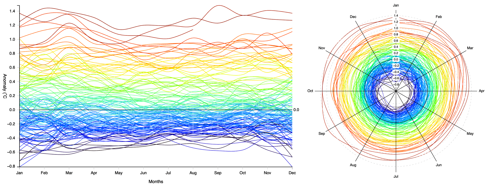
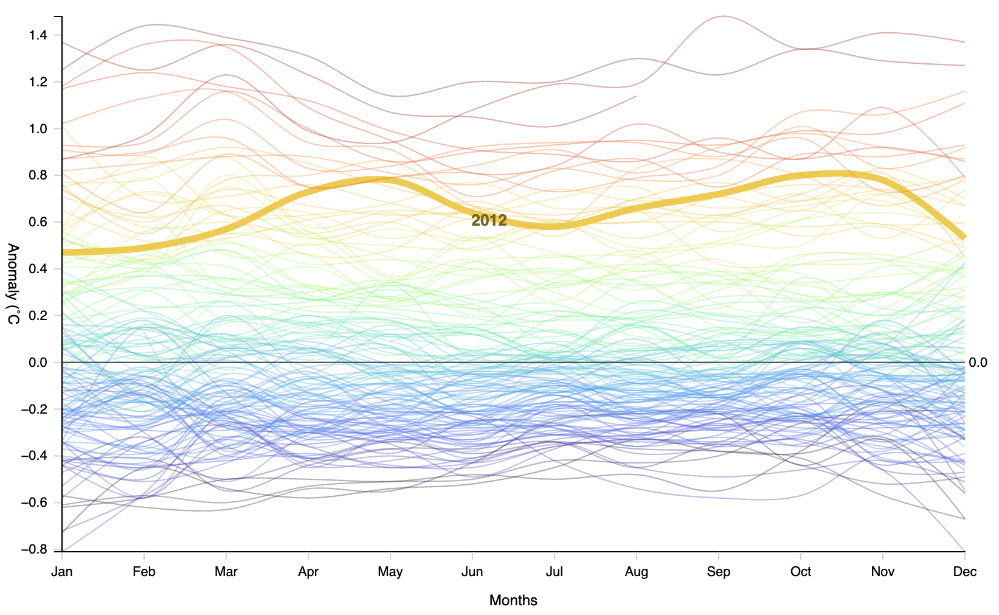
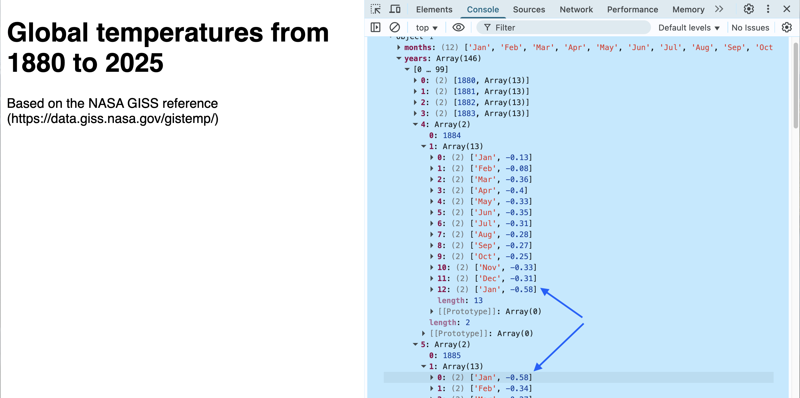
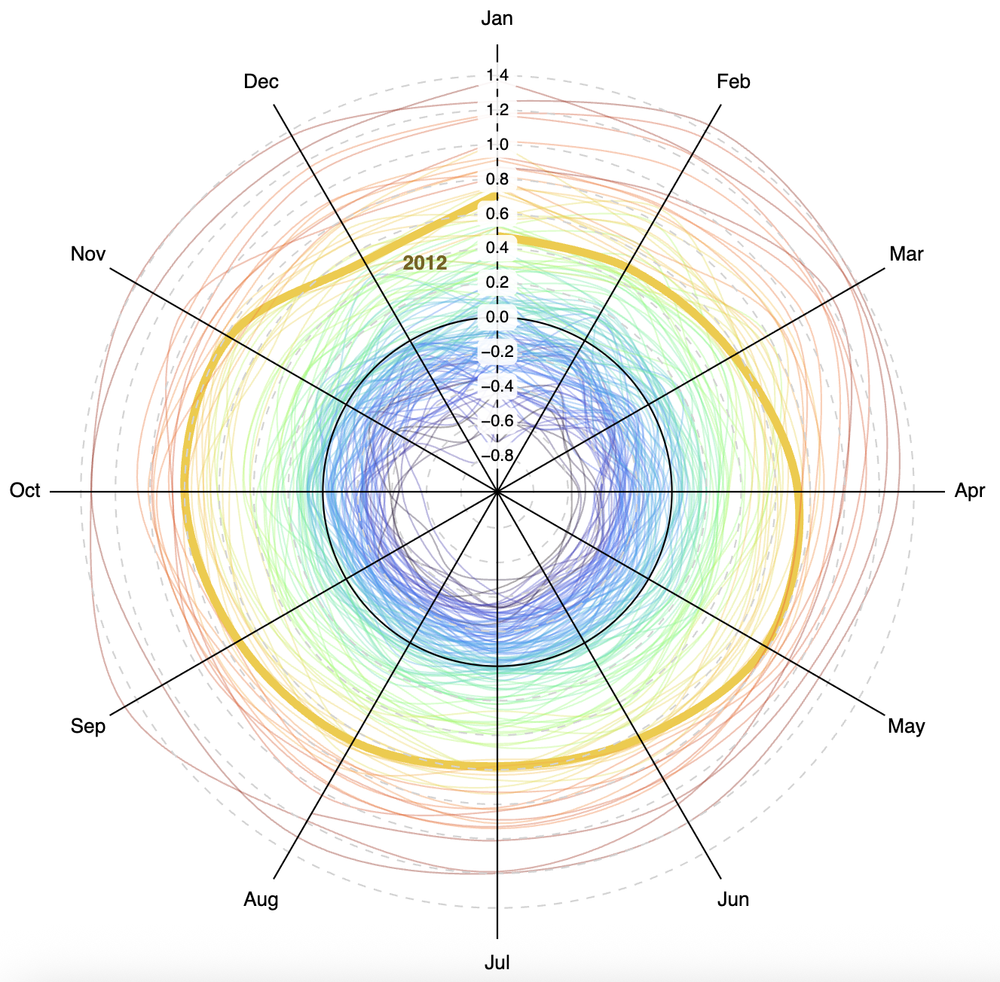
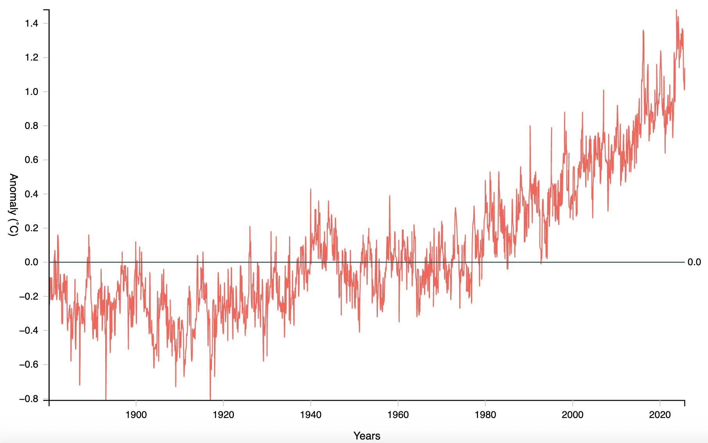
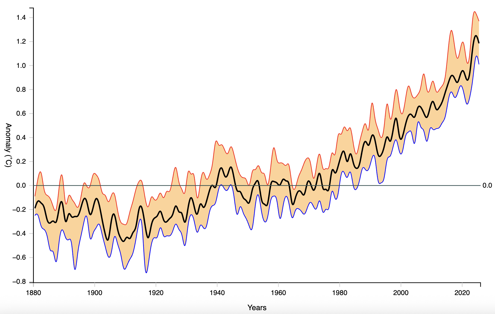

<link href="https://fonts.googleapis.com/css2?family=Source+Serif+4:ital,wght@0,400;0,700;1,400;1,700&display=swap" rel="stylesheet">
<link href="./css/styles.css" rel="stylesheet">

# Visualizing global warming with line charts

NASA’s Goddard Institute for Space Studies (GISS) is a laboratory in New York City that regularly publishes data and studies related to climate change. One of the most popular public databases available at the GISS website is the average monthly measurements of temperature anomalies between 1880 and 2024. In this tutorial, we will create line data visualizations with this data.

The charts that will be created are shown in _Figure 1_. The first is a multi-series line chart comparing the temperature variations for each year from 1880 to 2024. The second is a polar line chart (spiral) showing the same data in a radial layout.


_Figure 1 – Global warming visualizations: (left) multi-series line chart; (right) polar line chart (spiral). Data source: [https://data.giss.nasa.gov/gistemp](https://data.giss.nasa.gov/gistemp). 

At the end of the tutorial, two exercises are provided to explore alternative line chart styles for the same dataset.

## Table of contents
The following sections are contained in this tutorial:
- [144 years in a multi-series line chart](#144-years-in-a-multi-series-line-chart)
  - [Step 1: Initial setup](#step-1-initial-setup)
  - [Step 2: Getting the data](#step-2-getting-the-data)
  - [Step 3: Configuring the scales](#step-3-configuring-the-scales)
  - [Step 4: Writing the line function](#step-4-writing-the-line-function)
  - [Step 5: Rendering the chart](#step-5-rendering-the-chart)
  - [Step 6: Making it interactive](#step-6-making-it-interactive)
- [The global warming spiral: a polar line chart](#the-global-warming-spiral-a-polar-line-chart)
  - [Step 1: Preparing the data](#step-1-preparing-the-data)
  - [Step 2: Configuring the scales](#step-2-configuring-the-scales)
  - [Step 3: Writing the line function](#step-3-writing-the-line-function)
  - [Step 4: Rendering and events](#step-4-rendering-and-events)
- [Exercises: More line visualizations](#exercises-more-line-visualizations)
  - [Exercise 1: plot the data as a single line](#exercise-1-plot-the-data-as-a-single-line)
  - [Exercise 2: plot the data as an area chart with a median line](#exercise-2-plot-the-data-as-an-area-chart-with-a-median-line)

## 144 years in a multi-series line chart

In this tutorial, you will apply what you learned in _Chapter 11_ to create a line chart using global surface temperature data from NASA's public GISS portal. The chart will compare average global temperature variations from 1880 to 2024, with a line for each year. 

There are six steps. In each step you will progressively build the application, starting with loading and parsing the data, configuring the scales, writing the line function, rendering the chart, and finally adding interactivity. The code is distributed in different modules, organized as follows:

```
app/
    ├── data/
    │   └── GLB.Ts.1880.2025.csv
    ├── css/
    │   └── styles.css
    ├── js/
    │   ├── common.js
    │   ├── data.js
    │   ├── main.js
    │   └── view.js
    └── index.html
```

To code as you read, you can create either a similar project structure or start with the template files provided for step 1 in [`Chapter11/StepByStep/Cartesian/1-start/`](../StepByStep/cartesian/2-start/). 

Follow each completed step using the app folders in [`Chapter11/StepByStep/`](../StepByStep/). The modified files in each step are versioned as `main-1.0.js`, `main-1.1.js`, etc., so you can compare them with the original files before each change. The steps use a common data file located in the chapter's `StepByStep/data/` folder.

To view the results after each step, launch its `index.html` file in a local web server and preview it in your browser.

### Step 1: Initial setup

This step describes the initial file structure for the project, as shown above. Two files won't be modified throughout the tutorial: `index.html` and `css/main.css`. The [`index.html`](../StepByStep/1-start/index.html) file is a normal HTML file used as the entry point for the data visualization, and the [`CSS file`](../StepByStep/1-start/css/main.css) contains basic styles for the body and SVG elements, that won't be used until step 5.

Most of the code in the JavaScript modules (located in the `js/` folder) will use D3, so they should import it:

```js
import * as d3 from "https://cdn.skypack.dev/d3@7";
```

The `js/common.js` module will contain and export constants and objects shared by other modules. At this point, it only contains an empty `data` object, which will be populated later:

```js
export {data};
const data = {};
```

The `js/data.js` module exports a function that will parse and load the data in the next step:

```js
export async function load() {}
```

The `js/main.js` module imports the `data` object from `js/common.js` and the `load()` function from `js/data.js`, that will be created in the next step to load and parse the data:

```js 
import {data} from "./common.js";
import {load} from "./data.js";
await load();
console.log(data);  // check the data
```

The `js/main.js` module is called from `index.html`, and is the main entry point for the application:

```html
<script type="module" src="js/main-1.0.js"></script>
```

You can now open `index.html` in your browser (using a local web server) to verify that everything is set up correctly. Only static HTML will show up on the page, and the console will show an empty `data` object.

The modules will be progressively modified in the following steps to create the complete application. In the next step, we will write the `load()` function in `js/data.js` to load and parse the data.

### Step 2: Getting the data

This application uses a public domain CSV file obtained from the Goddard Institute for Space Studies [website](https://data.giss.nasa.gov/gistemp). The CSV file, called `GLB.Ts+dSST.csv`, includes measured and estimated temperature anomalies in degrees Celsius between 1880 and 2024. Temperature anomalies indicate how much higher or lower an average temperature is compared to a reference period. By plotting lines for each year in a Cartesian system we can view how the Earth's temperature has changed throughout these years.

The complete file contains measurements per year, quarter and month. A reduced version, containing only the columns for each month, is provided. [Open it!](../StepByStep/data/GLB.Ts.1880.2025.csv) A fragment is shown below:

```csv
Year,Jan,Feb,Mar,Apr,May,Jun,Jul,Aug,Sep,Oct,Nov,Dec
1880,-.19,-.25,-.09,-.16,-.10,-.21,-.18,-.10,-.14,-.23,-.21,-.18
1881,-.20,-.14,.03,.05,.06,-.19,.00,-.04,-.16,-.22,-.19,-.07
1882,.16,.14,.04,-.17,-.15,-.23,-.16,-.07,-.14,-.24,-.17,-.36
1883,-.29,-.36,-.13,-.18,-.18,-.07,-.08,-.15,-.22,-.12,-.24,-.12
   ...
2022,.91,.89,1.05,.83,.84,.92,.93,.95,.89,.96,.72,.79
2023,.87,.97,1.23,.99,.94,1.08,1.19,1.19,1.48,1.34,1.41,1.37
2024,1.25,1.44,1.39,1.31,1.14,1.20,1.20,1.30,1.23,1.34,1.29,1.27
2025,1.37,1.25,1.36,1.23,1.07,1.05,1.01,1.14,,,,
```

To avoid unnecessary duplication, all completed steps in `StepByStep/Cartesian` reference the original file from a common `StepByStep/data/` folder, using the following URL (from `js/data.js`):

```js
const file = "../data/GLB.Ts.1880.2025.csv";
```

But if you are creating this tutorial in your own application folder or IDE project, copy the file to a local `data/` folder in your app or project folder, and access it from the `js/data.js` module (outside the `load()` function), as follows:

```js
const file = "./data/GLB.Ts.1880.2025.csv";
```

Now we can load and parse the data. First, add the following import statements to the top of the `js/data.js` module:

```js
import * as d3 from "https://cdn.skypack.dev/d3@7";
import {data} from "./common.js";
```

The `data` object will be used to store the parsed data for use by other modules.

In the `load()` function, use `d3.csv()` to load and parse the CSV file. The `d3.autoType` row function will automatically convert any numeric values from strings to numbers:

```js
export async function load() {
    const csv = await d3.csv(file, d3.autoType);
    console.log(csv);  // add this to inspect the result
    /* … */
}
```

Open `index.html` in your browser (using a local web server) and check the console to verify that the data has been loaded and parsed correctly. It should return the following object array. This data is in a wide format (see _Chapter 7_ for a discussion on wide and long formats). Note that some months have `null` values:

```js
[
    {Year: 1880, Jan: -0.19, Feb: -0.25, ..., Dec: -0.18},
    {Year: 1881, Jan: -0.2,  Feb: -0.14, ..., Dec: -0.07},
      /*... +141 objects ... */
    {Year: 2024, Jan: 1.25,   Feb: 1.44,   ..., Dec: 1.27},
    {Year: 2025, Jan: 1.37,   Feb: 1.25,   ..., Dec: null}
]
```

But this is not the data we will store yet. We need to separate the data for the _x_- and _y_-axes first.

The array generated by `d3.csv()` has a `columns` property containing the CSV headers. We can use it to get the data for _x_-axis (the months), ignoring the first element (which is the `Year`) and storing the result in the `data.months` array:

```js
data.months = csv.columns.splice(1);    // ignore the first element
```

The data for the _y_-axis can be grouped by year in an array where the first element is the year, and the second element is a 12-element array of month-value pairs (this is the standard format expected by `d3.line()`):

```js
data.years = csv.map(obj => [obj.Year, data.months.map(d => [d, obj[d]])]);
```

This will be stored in the `data.years` array. Each entry will have the format `[year,Array(12)]`, where `Array(12)` contains the month-value pairs for that year.

Place this code in the `load()` function, which now looks like this:

```js
export async function load() {
    const csv = await d3.csv(file, d3.autoType);
    // console.log(csv);  // you can remove this line now

    data.months = csv.columns.splice(1);    // ignore the first element
    data.years = csv.map(obj => [obj.Year, data.months.map(d => [d, obj[d]])]);
}
```

The structure of the `data` object is now as follows:

```js
{
    months: ['Jan', 'Feb', 'Mar', ..., 'Dec'],
    years: [
        [1880, [['Jan', -0.19], ['Feb', -0.25], ..., ['Dec', -0.18]]],
        [1881, [['Jan', -0.2],  ['Feb', -0.14], ..., ['Dec', -0.07]]],
          /*... +142 arrays ... */
        [2024, [['Jan', 1.25],   ['Feb', 1.44],   ..., ['Dec', 1.27]]],
        [2025, [['Jan', 1.37],   ['Feb', 1.25],   ..., ['Dec', null]]]
    ]
}
```

Open the `index.html` file in your browser (using a local web server) and check the console to verify that the data has been loaded and parsed correctly, and has the structure shown above.

### Step 3: Configuring the scales

We will now configure the scales to map the data to screen coordinates. Open the `js/common.js` module to add and export two more objects: `dim` and `app`:

```js
import * as d3 from "https://cdn.skypack.dev/d3@7";

export {data, app, dim};

const data = {};
const dim = {};     // dimensions and margins
const app = {};     // common functions and data
```

The `dim` object will contain the dimensions and margins for the SVG container:

```js
const dim = {
    width: 800, height: 500, margin: {left: 75, right: 50, top: 50}
};
```

The `app` object will declare the scales for the _x_- and _y_-axes:

```js
const app = {
    scale: {
        month: d3.scalePoint()
                 .range([dim.margin.left, dim.width - dim.margin.right]),
        temp: d3.scaleLinear()
                .range([dim.height - dim.margin.top, dim.margin.top])
    }
};
```
We will use a point scale for the months (_x_-axis) and a linear scale for the temperatures (_y_-axis). At this point, we can set up the ranges for the scales, but not the domains yet, since they depend on the data. The

Open the `js/data.js` module again and export a new `config()` function:

```js
export function config() {
    /* … add code here … */
}
```

This function will be called from `js/main.js` after loading the data:

```js
await load();
console.log(data);
config();   // add this line
``` 

Now back to `js/data.js`, we can implement `config()` to set up the domains. 

Months use a point scale, so the domain for `app.scale.month` is the `months` array itself. Add the following code to the `config()` function:

```js
app.scale.month.domain(data.months);
```

To configure the domain for `app.scale.temp`, which is a linear scale, we need to obtain the maximum and minimum temperatures for the entire set, that is, its _extent_. This will require some manipulation. First, get the data as an array containing arrays of temperatures for each year:

```js
const series = data.years.map( d => d[1].map(v => v[1]) );
```

To understand how the data above was obtained, let's take a look at the structure of `data.years`:

* Each element `d` has the format `[year, Array(12)]`.
* We are selecting the second element `d[1]`, which is a 12-element array. 
* Each element in that 12-element array has the format `[month, temperature]`.
* We are again selecting the second element `v[1]`, which is the temperature. 
* The result is an array with the format `[Array(12),Array(12),…]` where each 12-element array contains only the temperature values for each year.

Log the `series` array to the console to verify its structure. It should look like this:

```js
[
  [-0.19, -0.25, -0.09, ..., -0.18],  // 1880
  [-0.2,  -0.14,  0.03, ..., -0.07],  // 1881
    /*... +141 arrays ... */
  [0.86,  0.97,  1.20, ..., 1.43],    // 2023
  [1.27,  1.4,   1.35, ..., null]     // 2024
]
```

A flattened version of this array to `d3.extent()` will return what we need to compute the extent and set up the domain for `app.scale.temp`. Add the following code to the `config()` function:

```js
app.scale.temp.domain(d3.extent(series.flat()));
```

Now we can set up the color scale.

The color of the line for each year should represent the average temperature for that year compared to the temperature measured in other years. A sequential scale, such as `d3.scaleSequential()`, is best to map the continuous input domain to an interpolated color range, like the `d3.interpolateTurbo` color scheme. This will render lines from blue to red, passing through greens and yellows. It should make lower values be perceived as cooler than higher values:

```js
const mean = series.map(d => d3.mean(d));   // get the average for each year
app.color = d3.scaleSequential(d3.interpolateTurbo)
              .domain(d3.extent(mean));
```

This sets up the scales. Your `config()` function in `js/data.js` should now look like this:

```js
export function config() {
    app.scale.month.domain(data.months);

    const series = data.years.map( d => d[1].map(v => v[1]) );
    app.scale.temp.domain(d3.extent(series.flat()));

    const mean = series.map(d => d3.mean(d));   // get the average for each year
    app.color = d3.scaleSequential(d3.interpolateTurbo)
                  .domain(d3.extent(mean));
}
```

The next step is to configure the line function.

### Step 4: Writing the line function

Since our data is in the standard format for lines, the code for the configuration methods `x()` and `y()` should be straightforward. Add the following to your `config()` function in `js/data.js`:

```js
export function config() {
    /* … code added in step 2 */
    app.line = d3.line()
                 .x(d => app.scale.month(d[0]))
                 .y(d => app.scale.temp(d[1]))
                 .defined(d => d[1] && !isNaN(d[1]))
                 .curve(d3.curveCatmullRom);
}
```

As the dataset may contain undefined data, the `defined()` method is necessary. It will ignore values which are undefined, null or not a number, not rendering any lines between them. An alternative is to filter them out from the dataset, so the chart will interpolate between the valid points.

Now we can finally draw the lines.

### Step 5: Rendering the chart

The rendering code will be placed in a new module: `js/view.js`. Create it and import the constants and the D3 library:

```js
import * as d3 from "https://cdn.skypack.dev/d3@7";
import {dim, app} from "./common.js";
import * as utils from "./chart-utils.js";  // get this from the chapter's js/ folder
```

Copy the `chart-utils.js` file from the chapter's `js/` folder to your application's `js/` folder. It contains utility functions that will be used to render axes and grids.

Now configure a chart container (a `<g>` element) appended to the root `<svg>`:

```js
const svg = d3.select("body").append("svg")
                             .attr("height", dim.height)
                             .attr("width", dim.width);
const chart = svg.append("g");
```

Finally, export a `draw()` function. It will contain the rest of the code shown in this step:

```js
export function draw() {
    /* … */
}
```

To render the chart, call `draw()` from the `js/main.js` module after the data is loaded. This is what the final `js/main.js` file should look like:

```js
import {data, app} from "./common.js";
import {load, config} from "./data.js";
import {draw} from "./view.js";

await load();
config();
draw();
```

Now let's implement the `draw()` function.

Join each year’s data to a `<g class="line">` element, appending to it a single child `<path>` element for each line:

```js
export function draw() {
    chart.selectAll("g.line")
         .data(data.years)    // data.years = [[1880, [['Jan', -0.19], ['Feb', -0.25], ..., ['Dec', -0.18]]], [1881, ...], ...]
           .join("g")
             .attr("class", "line")
             .append("path")
               .datum(d => d[1])    // d[1] = [['Jan', -0.19], ['Feb', -0.25], ..., ['Dec', -0.18]]
               .attr("class", "months")
               .attr("d", app.line)
               .style("stroke", d => app.color(d3.mean(d.map(v => v[1]))));
    /* ... */
}
```

Note that d[0] contains the year (e.g. `1880`), and d[1] contains a data array in the standard format expected by `d3.line()` (e.g. `[['Jan', -0.19], ...]`) - a list of month names and temperatures. This array is bound to each `<path>` element and passed to the line function. The mean value of the 12 temperatures within a year is obtained to get the line’s fill color.

To add a Cartesian system for context, we are using the `chart-utils.js` module, from where the `cartesianAxes()` function is called, with the following options:

```js
export function draw() {
    /* ... previously added code not shown ... */
    utils.cartesianAxes()
         .container(chart)
         .xScale(app.scale.month)
         .yScale(app.scale.temp)
         .xLabel("Months")
         .yLabel("Anomaly (˚C)")();
}

```

Now, after reloading the page, you should finally see the chart will all the lines. 

But... there are too many! How can you know what year each line corresponds to? 

A solution is to make the chart interactive. Pointing to a line or hovering over it could provide us the information we need. Let’s implement that feature!

### Step 6: Making it interactive

By attaching the `'mouseover'` and `'mouseout'` events to the `<g class="line">` objects you can add make the chart react when the user hovers over a line.

The following code implements the event handlers, highlighting the selected line and printing the corresponding year. Add it to the `draw()` function:

```js
export function draw() {
    /* ... Code added in step 5 not shown ... */
    
    chart.selectAll("g.line")
        .on("mouseover", function (event, d) {
            const [x, y] = d3.pointer(event);   // get mouse pointer coordinates
            const selectedLine = d3.select(event.target);   // get the selected line

            chart.append("text").attr("class", "year")  // add year label near pointer
                .attr("x", x + 10).attr("y", y + 10)
                .text(d[0]);

            chart.selectAll("g.line path") // make all other lines fainter
                .style("opacity", .25);

            selectedLine.style("stroke-width", 5)  // make line thicker and opaque
                .style("opacity", 1);
        })
        .on("mouseout", function () {
            chart.selectAll("text.year").remove(); // remove the year label
            chart.selectAll("g.line path")
                .style("stroke-width", null)
                .style("opacity", null); // restore CSS opacity+stroke for all lines
        });
}
```

The code above appends a new `<text>` element with class `year` to the chart on each `'mouseover'` event, positioning it near the mouse pointer and setting its text to the year (the first element of the bound data array `d[0]`). It also makes all other lines fainter by reducing their opacity, while increasing the stroke width and opacity of the selected line.

This code could be improved. Instead of adding and removing the year label on each event, you could simply create it once (initially offscreen or invisible) and just update its position/opacity and text content. Try this as an exercise!

The screenshot in `Figure 2` shows the effect when the user hovers over the line for 2023.


_Figure 2 – A multi-series line chart showing global temperature variation from 1880 to 2025.
Data source: [https://data.giss.nasa.gov/gistemp](https://data.giss.nasa.gov/gistemp). Code: [`StepByStep1/Cartesian/final/`](../StepByStep1/Cartesian/final/)._

This concludes our first line chart tutorial. You can run and explore the final version in [`StepByStep1/Cartesian/final/`](../StepByStep1/Cartesian/final/), which contains minor improvements. In the next section, we will revisit this dataset and plot it as a spiral in a polar chart.

<hr>

## The global warming spiral: a polar line chart

In this tutorial, we will attempt an alternative plot for the global warming line chart, rendering it as a spiral in a polar visualization. 

The code developed in the previous tutorial will be used as a starting point. This will be a faster tutorial with only four steps, as the steps will focus on the main changes, ignoring details such as imports and common constants. You can, however, view and run the code for each step from the subfolders in the [`StepByStep/Radial/`](../StepByStep/radial/) folder.

### Step 1: Preparing the data

This visualization uses the same data as the Cartesian chart but to create a continuous spiral with different paths, we need an extra point at the end of each dataset, as twelve points only produce eleven line segments. This wouldn’t be necessary if we rendered a single `<path>` element, as the missing segments would be interpolated, but in this visualization we use a different `<path>` for each year, so each year segment can have a different color.

Copy the first value of the next series as the thirteenth value of each series, adding the following code to the `load()` function (`data.js`):

```js
export async function load() {
    /*... existing code ...*/
    
    data.years.forEach( (d,i) =>
        d[1].push(data.years[i+1]     // if there is a next line
            ? data.years[i+1][1][0]   // push first value of next line
            : d[1][d[1].length-1])    // otherwise repeat last value of current
    );
}
```

With the change, each entry should have 13 points, as `data.years` in the console.


Figure 3 – The data after repeating the next year's first value as this year's last value. Code: `StepByStep/Radial/1-data/`.

The scales also need to be updated, since we are now using a radial layout.

### Step 2: Configuring the scales

The radial chart is defined within a square area, so we will define an equal width and height for the SVG container. Open the `js/common.js` module and replace the `dim` object with the following code:

```js
const dim = {
    width: 600, height: 600, margin: 30
};
```

The `app.scale` object also needs to be set up for the radial visualization. We are using two linear scales. The angle scale maps the months to angles between 0 and 2π radians, while the radius scale maps temperature values to radii between 0 and half the width (or height) of the SVG container, minus the margin:

```js
const app = {
    scale: {
        angle: d3.scaleLinear().range([0, 2*Math.PI]),
        radius: d3.scaleLinear().range([0, dim.width/2 - dim.margin])
    }
};
```

We also need to write an updated `config()` function in `data.js`. Remove code that configured the `app.scale.month` and `app.scale.temp` domains, replacing it with the code below.

This will configure the `app.scale.angle` domain, which is limited between 0 and the number of months (13, after adding the extra point):

```js
app.scale.angle.domain([0, data.months.length]);
```

The `app.scale.radius` domain is limited by the temperature extent, but we will make the minimum 0.2˚C smaller so that the temperatures don’t all get cluttered in the center. Making the maximum 0.1˚C larger will also add space between the lines and the full length of the axes:

```js
function config() {
    app.scale.angle.domain([0, data.months.length]);

    const series = data.years.map( d => d[1].map(v => v[1]) );
    const temperatures = series.flat();
    app.scale.radius.domain([d3.min(temperatures) - .2, d3.max(temperatures) + .1]);

    /** ... existing code (app.color configuration) ... */
}
```

No changes are necessary for the `app.color` function. Our next step is to write the radial line function using these scales.

### Step 3: Writing the line function

The line function will be called for each 13-element array.

The index is the angle, and the first element of each coordinate pair is the radius. As before, we shall ignore missing data and use a curve for smooth transitions:

```js
app.line = d3.lineRadial()
             .angle((_,i) => app.scale.angle(i))
             .radius(d => app.scale.radius(d[1]))
             .defined(d => d[1] && !isNaN(d[1]))
             .curve(d3.curveCatmullRom);
```

Add the code above to the `config()` function, after setting up the scales and colors. Now we can finally draw the lines.

### Step 4: Rendering and events

The chart container should be set up (in `js/view.js`) so that the origin is at the center:

```js
const chart = svg.append("g")
                 .attr("transform", `translate(${dim.width/2},${dim.height/2})`);
```

We also need axes. In the following code we configured our utility ([`chart-utils.js`]()) function to render a grid. Add this to the `draw()` function in `js/view.js`, replacing the Cartesian code, before configuring any events:

```js
utils.radialAxes().container(chart)
                  .aScale(app.scale.angle)
                  .rScale(app.scale.radius)
                  .angularData(data.months)
                  .numTicks(10)
                  .useGrid(true)
                  .backdropOpacity(.9)();
```

The rest of the code is identical to the Cartesian version, since all the magic is already performed by the line function.  You can also reuse all the event handling code without changing anything. After rendering the axis, you should have a chart like the one shown in _Figure 4_.


Figure 4 – Radial line chart showing increasing relative global temperatures. Source: NASA Godard Institute for Space Studies (data.giss.nasa.gov/gistemp). Code: `StepByStep/Radial/4-interactive/`.

If you would like to experiment further, try the exercises below, which show the data using other line chart styles.

## Exercises: More line visualizations

The following exercises explore the global warming dataset with different line visualizations.

### Exercise 1: plot the data as a single line

Create a Cartesian visualization for the GISS temperatures plotting a single line for all years. Use a full date (instead of a month) and a timescale for the _x_-axis. Each point should be an ISO Date in the format year-month-day. This means over 1700 points for the _x_-axis. The result should look like the screenshot in _Figure 5_. You can start with the [template folder](../StepByStep/exercise1/template), which contains comments and boilerplate code.


_Figure 5 – Line chart created in Exercise 1. Code: [`/StepByStep/exercise1/solution`](../StepByStep/exercise1/solution)._

### Exercise 2: plot the data as an area chart with a median line

Plotting 1700 points in a single line may be too dense to see the temperature variations for each year. Instead of using monthly data points, compute the median, minimum, and maximum temperature for each year, then plot a shaded area between a topline and a baseline to show the temperature range, and a line for the median temperature. Use curves. The result should look like the screenshot in _Figure 6_. You can start with the [template folder](../StepByStep/exercise2/template), which contains comments and boilerplate code.


_Figure 6 – Line chart created in Exercise 2. Code: [`/StepByStep/exercise2/solution`](../StepByStep/exercise2/solution)._


