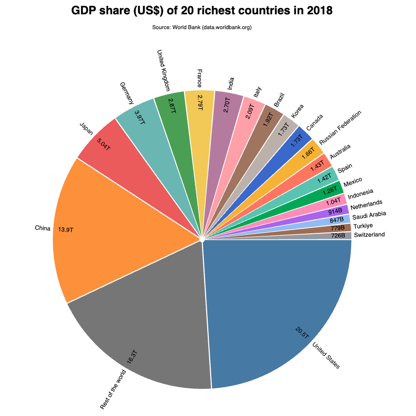

<link href="https://fonts.googleapis.com/css2?family=Source+Serif+4:ital,wght@0,400;0,700;1,400;1,700&display=swap" rel="stylesheet">
<link href="./css/styles.css" rel="stylesheet">

# Comparing GDPs with a Pie chart

In this tutorial, we will use data from a CSV file to create a pie chart comparing the GDP of the world’s wealthiest countries in 2018, according to the public data made available by the [World Bank](https://data.worldbank.org).

The application follows the same conventions as previous tutorials, with an `index.html` file, a stylesheet, and module scripts. Only the scripts are modified in each step. The final project structure is as follows:

```
app/
├── data/
│   └── gdp-world-bank-2022.csv
├── css/
│   └── main.css
├── js/
│   ├── common.js
│   ├── data.js
│   ├── main.js
│   └── view.js
└── index.html
```

This tutorial has four steps. You can set up a project folder, copying the initial files and directories from step 1 (`StepByStep1/1-setup`), which contain boilerplate code for the initial setup. The data file [`gdp-world-bank-2022.csv`](../../data/gdp-world-bank-2022.csv) is stored in the `data/` folder of this chapter’s repository. It contains data for 216 countries from 1960 to 2022. 

Here is a sample of its contents:

```csv
Country,Code,1960, ... ,2021,2022
Aruba,ABW,, ... ,405586592.178771,487709497.206704
Afghanistan,AFG,537777811.111111, ... ,19955929060.841,14266499429.8746,
Angola,AGO,, ... ,66505129989.243,106782770714.619
   ... +212 lines ...
Zimbabwe,ZWE,1052990400, ... ,28371238665.8646,27366627153.0852
```

Copy this file to your project's local `data/` folder.

The subfolders in `StepByStep1/` don't include a local `data/` folder but instead refer directly to the data file from the chapter's `data/` folder, via a relative URL.

## Table of contents

The following sections are included in this tutorial:
- [Step 1: Page setup](#step-1-page-setup)
- [Step 2: Loading and preparing the data](#step-2-loading-and-preparing-the-data)
- [Step 3: Creating the pie and arc functions](#step-3-creating-the-pie-and-arc-functions)
- [Step 4: Rendering the chart](#step-4-rendering-the-chart)

To view the results after each step, launch its `index.html` file in a local web server to preview it in your browser.

## Step 1: Page setup

Let’s start with the `js/common.js` module and set the viewport’s dimensions, a `data` object, and an `app` object, which will contain the functions used for the pie and arcs. Since the data file contains more than 200 countries, we set `app.limit` to determine how many countries to display:

```js
export {dim, app, data};
const dim = {width: 750, height: 750, margin: 100};
const data = {};
const app = {
    limit: 20   // display data for 20 countries
}
```

The `js/view.js` file will contain the code for rendering the chart. For now, just import the D3 library and the `js/common.js` module and create the SVG with a single `<g>` container for the chart placed in the center:

```js
import * as d3 from "https://cdn.skypack.dev/d3@7";
import {app, dim} from "./common.js";

d3.select("#limit").text(app.limit);        // update the title of the page

const svg = d3.select("body")
              .append("svg")
                .attr("width", dim.width).attr("height", dim.height);
const chart = svg.append("g")
                 .attr("class", "pie")
                 .attr("transform", `translate(${[dim.width/2, dim.height/2]})`);
```

The `js/main.js` module, which is loaded by `index.html`, simply imports `js/view.js`:

```js
import "./view.js";
```

This will allow the code access to the `<span id="limit"></span>` section in the page’s title, which will display the current limit:

```html
<!DOCTYPE html><html lang="en">
<head>
    <title>GDP pie chart</title>
    <link rel="stylesheet" href="css/main.css">
</head>
<body>
  <h1>GDP share (US$) of <span id="limit"></span> richest countries in 2018</h1>
  <p>Source: World Bank (data.worldbank.org)</p>
  <script type="module" src="./js/main.js"></script>
</body>
</html>
```

Launching this file will show the generated text in `<h1>` and the SVG to render the chart (although empty). Inspect it with your browser tools, and you should find the following generated SVG code:

```html
<svg width="750" height="750">
    <g class="pie" transform="translate(375,375)"></g>
</svg>
```

Now let’s load the data.

## Step 2: Loading and preparing the data

Open `js/data.js`, import the D3 library, and the `app` and `data` objects from `js/common.js`. Then create a constant with the URL of the CSV file. The following assumes that you are loading the file from the local `data/` folder in your project:

```js
import * as d3 from "https://cdn.skypack.dev/d3@7";
import {app, data} from "./common.js";

const file = "../data/gdp-world-bank-2022.csv";
```

Loading and parsing happen in a `load()` function, which should be exported. It calls `d3.csv()` with a row function to filter just the data we need: the name from the `Country` column, and the GDP value from the `2018` column (converted to _Number_ via the `+` operator). The data still needs some preparation before being used by the pie chart, so we will pass it to a local `prepare()` function (to be defined later, in the same module) before saving it in the `data` object:

```js
export async function load(file) {
    const csv = await d3.csv(file, row => ({country: row['Country'], 
                                            gdp: +row['2018'] }));  
    data.countries = prepare(csv); 
}
```

The `prepare()` function sorts the countries in descending GDP order and keeps only the first `limit` objects. The remaining objects are replaced by a new object called `'Rest of the world'`, which contains the sum of their GDPs:

```js
function prepare(data) {
    const selection = data.sort((a,b) => d3.descending(a.gdp, b.gdp))
                          .slice(0, app.limit);
    const rest = data.filter(d => !selection.includes(d));      
    selection.push({country: 'Rest of the world', gdp: d3.sum(rest, d => d.gdp)});
    return selection;
}
```

Call `load()` in `js/main.js` and print the contents of `data` to the console to verify that the data was loaded and prepared correctly:

```html
import {load} from "./data-1.1.js";
import {data} from "./common-1.1.js";
import "./view-1.0.js";

load().then(() => console.log(data));
```

This result is stored in `data.countries`. You should see the following array in your console (truncated here to fit):

```js
[   {country: "United States", gdp: 20533057312000},
    {country: "China", gdp: 13894907857925.9},
    /* ... +17 objects ... */
    {country: "Switzerland", gdp: 725568717468.001},
    {country: "Rest of the world", gdp: 16257186043060.822}   ]
```

Now the data has `limit + 1` elements and can be used to create a pie chart. 

## Step 3: Creating the pie and arc functions

Open `js/common.js` again to configure the pie chart in the `app` object. We will set up an arc generator function (`app.arc`), a pie layout function (`app.pie`), and a color scale (`app.color`).

The `d3.pie()` function must be configured to set the `gdp` property as the value for the arcs. Slices are rendered in the default descending order, so no sorting is necessary, but our pie will be rotated 90 degrees to start at the 3 o’clock position. This requires shifting both start and end angles by `Math.PI / 2` radians:

```js
app.pie = d3.pie().value(d => d.gdp)
                  .startAngle(Math.PI / 2).endAngle(Math.PI * 2.5);
```

The arcs are configured with a minimum inner radius, just enough to apply some padding between the slices. A margin will guarantee some space for the text labels:

```js
app.arc = d3.arc().innerRadius(5).outerRadius(dim.width/2 – dim.margin)
                  .padAngle(.2)
                  .padRadius(10);
```

The chart works best with no more than 10 slices, but you can add up to 20. The `app.color` function concatenates another palette to allow more colors (although they are very similar). The last color in either case is a medium gray, used for the slice that represents the rest of the world:

```js
app.color = d3.scaleOrdinal(app.limit <= 10 
             ? d3.schemeTableau10.concat("#777")
             : d3.schemeTableau10.concat(d3.schemeObservable10).concat("#777"));
```

We can now finally render the pie.

## Step 4: Rendering the chart

Open `js/view.js` and add an import for the `data` object from `js/common.js`:

```js
import * as d3 from "https://cdn.skypack.dev/d3@7";
import {app, dim, data} from "./common.js";
```

Create and export the `draw()` function to draw the chart. Slices are added to the `chart` container (see [Step 1](#step-1-page-setup)), already positioned in the viewport’s center. The following selection binds a new `<g class="slice">` element to each object generated by the `app.pie` function:

```js
export function draw() {
    const slices = chart.selectAll("g.slice")
                        .data( app.pie(data.countries) )
                           .join("g").attr("class", "slice");
    /*…*/
}
```

A `<path>` is then appended to each slice, which uses the generated object to render the data string for the path’s `d` attribute. The `app.color` function provides different fill colors for each arc:

```js
export function draw() {
    /*…*/
    slices.append("path")
          .attr("d", app.arc)
          .attr("fill", app.color);
}
```

We could describe the pie slices using a legend or placing values near the centroid. Here, we'll use the `pieLabels()` utility function from our `chart-utils.js` module, which reuses the centroid code from the previous section. It lets you set the label’s distance from the center using a `radius()` factor and its `direction()`, which can be `RADIAL`, `TANGENTIAL` or `NONE` (horizontally aligned). Copy it to your project's `js` folder, then import it (also in `js/view.js`):

```js
import * as utils from "./chart-utils.js";
```

In our chart, the `pieLabels()` function will be called twice: the first time to display the GDP values _inside_ the slices, and the second time to display the country names _at the edge_ of each slice. The selection is also filtered so that slices that are too small to fit text don’t display labels:

```js
utils.pieLabels()  // inner labels for GDP values, for some slices
     .container(slices.filter(d => d.endAngle - d.startAngle > 0.05)) 
     .arc(app.arc)
     .property('gdp')
     .radius(1.7)
     .direction(utils.direction.RADIAL)
     .format(d => d3.format(",.3s")(d).replace('G','B'))();

utils.pieLabels()   // outer labels for the countries, for some slices
     .container(slices.filter(d => d.endAngle - d.startAngle > 0.03))
     .arc(app.arc)
     .property('country')
     .radius(2)
     .direction(utils.direction.RADIAL)();
```

Our formatter (`d3.format()`) prints values in SI notation with a `'T'` suffix for Tera (which also works for Trillions) or a `'G'` suffix for Giga. Replacing `'G'` with `'B'` provides an abbreviation for Billions.

Now reload your visualization, and you should see a chart like _Figure 1_. 


_Figure 1 – A pie chart created from a public data source comparing the GDP of the 20 wealthiest countries in 2018. Source for the data: [World Bank Open Data](https://data.worldbank.org). Code: [`StepByStep1/4-draw/`](../StepByStep1/4-draw/)._

Inspect the generated code to view how the SVG structure was created. Doing this is important not only for debugging, but also in case you intend to add more features, such as updates, interactive features, and animation. Here is a fragment of the generated SVG:

```html
<g class="pie" transform="translate(375,375)">
    <g class="slice">
        <path d="..." fill="#4e79a7"></path> 
        <text class="inner slice label" x="..." y="..." ...>20.5T</text>
        <text class="outer slice label" x="..." y="..." ...>United States</text>
    </g>
    <g class="slice">...</g>
    <!-- … +19 slices … -->
</g>
```

You will find the final code in `StepByStep/4-draw`. Try changing the value for `app.limit` and see how the chart adapts to different data.

_Note_: this application had to load a large CSV file (more than 200 rows) to extract only a few data points for the pie chart. In a real application, you could improve this visualization by previously aggregating the data on the server side, so that only the required data is sent to the client. You could also add interactive features that send requests to the server for different data, to select different years, or change the number of countries displayed. These features require deploying a backend server or using a service to host the data, which is beyond the scope of this book.
