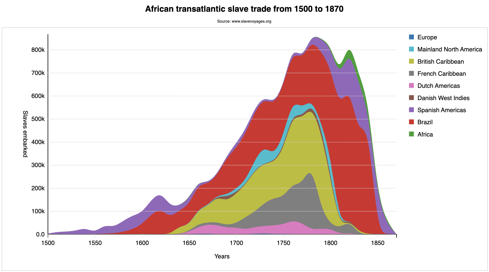

<link href="https://fonts.googleapis.com/css2?family=Source+Serif+4:ital,wght@0,400;0,700;1,400;1,700&display=swap" rel="stylesheet">
<link href="./css/styles.css" rel="stylesheet">

# Visualizing the transatlantic slave trade with a stacked area chart

In this tutorial we will plot a stacked area chart comparing the number of people kidnapped from Africa during the transatlantic slave trade, from 1500 to 1870. This data was generated in CSV format by [`slavevoyages.org`](https://slavevoyages.org) and contains the estimated population per decade by flag (country, continent, region).

This application follows the same conventions as the previous tutorials, with the following structure:

```
app/
├── data/
│   └── slave-trade-data.csv
├── css/
│   └── main.css
├── js/
│   ├── common.js
│   ├── data.js
│   ├── main.js
│   └── view.js
└── index.html
```

You can set up the project structure by copying the `StepByStep2/1-setup/` folder from this chapter’s repository and copy the `slave-trade-data.csv` data file from the `data/` folder of this chapter’s repository. It is a typical CSV file in a wide format, which does not require much transformation and is easy to stack:

```csv
Year,Europe,Mainland North America,British Caribbean, ...+4 cols... ,Brazil,Africa
1501-1510,0,0,0,0,0,0,1900,0,0
1511-1520,637,0,0,0,0,0,8807,0,0
1521-1530,0,0,0,0,0,0,10990,0,0
    ... +31 rows ...
1841-1850,0,0,592,0,0,0,63345,487161,45444
1851-1860,0,476,0,0,0,0,151573,8812,10556
1861-1870,0,0,0,0,0,0,44415,0,9776
```

The subfolders in `StepByStep2/` don't include a local `data/` folder but instead refer directly to the data file from the chapter's `data/` folder, via a relative URL.

## Table of contents

The following sections are included in this tutorial:
- [Step 1: Page setup](#step-1-page-setup)
- [Step 2: Loading and preparing the data](#step-2-loading-and-preparing-the-data)
- [Step 3: Creating the stacked data](#step-3-creating-the-stacked-data)
- [Step 4: Rendering the chart](#step-4-rendering-the-chart)

To view the results after each step, launch its `index.html` file in a local web server to preview it in your browser.


## Step 1: Page setup

This step describes the initial setup of the project. The code is minimal, as no data is loaded or visualized yet.

Dimensions, scales, and any global objects are set in `js/common.js`. A time scale is used for the _x_-axis, which displays decades, and a linear scale for the _y_-axis:

```js
export {dim, app, data};

const dim = {
    height: 400, width: 800,
    margin: {top: 10, left: 75, bottom: 60, right: 150}
};
const data = {};
const app = {
    scale: {
        x: d3.scaleTime().range([dim.margin.left, dim.width - dim.margin.right]),
        y: d3.scaleLinear().range([dim.height - dim.margin.bottom, dim.margin.top])
    }
};
```

In `view.js` just configure the SVG, which will be appended to a `<div>` element in the page identified by the ID `#chart`:

```js
import {dim} from "./common.js";
const svg = d3.select("#chart")
              .append("svg")
                  .attr("width", "100%")
                  .attr("height", "100%")
                  .attr("viewBox", `0 0 ${dim.width} ${dim.height}`);
```

Then, the `main.js` file simply imports `view.js` to execute the code that creates the SVG viewport:

```js
import "./view.js";
```

The `index.html` page contains the `<div>` where the SVG will be contained, links the stylesheet used by the code, and loads the `js/main.js` module:

```html
<head>
    <title>Transatlantic slave trade</title>
    <link rel="stylesheet" href="./css/main.css">
</head>
<body>
  <div id="chart">
    <h1>African transatlantic slave trade from 1500 to 1870</h1>
    <p>Source: www.slavevoyages.org</p>
  </div>
  <script type="module" src="./js/main.js"></script>
</body>
</html>
```

Launching this file will show nothing more than the text in `<h1>` and `<p>`, but already generates the SVG viewport, which is made visible due to a border added in CSS.

Now let’s load the data.

## Step 2: Loading and preparing the data

Prepare the `js/main.js` module to inspect the raw data after loading. The `load()` function will be created in the next step:

```js
import "./view.js";
import {load} from "./data.js";

load().then(raw => console.log(raw));   // Logs the raw data returned by `load()`
```

Create the `js/data.js` module to load the CSV file, import D3 and declare the path to the data file (assuming you have the file in a local `data/` folder):

```js
const file = "../data/slave-trade-data.csv";
```

Create and export an asynchronous `load()` function in `data.js` and use `d3.csv()` to parse the data. A row function is used to transform the values in the `Decade` column (a string like `'1511-1520'`) into a year that represents that decade, and to convert the other values to numbers. For now, we will just return the parsed data for inspection:

```js
export async function load(file) {
    const rawData = await d3.csv(file, row => { 
        row.Decade = +row.Decade.split("-")[0] - 1; 
        Object.entries(row).forEach(([k,v]) => {
            if (k !== "Decade") row[k] = +v;
        });
        return row;
    })
    return rawData;
}
```

Reload the page and inspect the data it in your browser’s console. Now it’s an array with 37 objects:

```js
[   {"Decade":1500,"Europe":0,"Spanish Americas":1900,"Brazil":0, /*…*/},
    {"Decade":1510,"Europe":637,"Spanish Americas":8807,"Brazil":0, /*…*/},
    {"Decade":1520,"Europe":0,"Spanish Americas":10990,"Brazil":0, /*…*/},
    /* … +34 objects … */                                                   ]
```

The next step is to configure a stacking function.

## Step 3: Creating the stacked data

In this step we will transform the data so that it can be used to render a stacked area chart. No graphics are generated in this step, but the transformed `data` object will be logged to the console so we can inspect the stacked data and keys. This is the modified `js/main.js` file:

```js
import "./view-1.0.js";
import {load} from "./data.js";
import {data} from "./common.js";

load().then(() => console.log(data));   // Now logs the `data` object
```

Return to `data.js` to complete the `load()` function. After loading the data, it creates the stacked dataset and sets up the scales, area functions and a color function. We do this in separate functions, local to the module:

```js
export async function load(file) {
    /*…*/
    makeStack(rawData);
    config(rawData);
}
```

The `makeStack()` function creates the stack and stores keys and stacked data in a global `data` object.

The raw data is already in a wide format, where the keys (`series`) are the flags and the rows are the decades. The data will be stacked by flag. Keys can be obtained from the CSV headers, stored in the `columns` property (created and added by the CSV parser).

```js
function makeStack(rawData) {
    data.keys = rawData.columns.filter(d => d !== "Decade");
    const stack = d3.stack().keys(data.keys)
                            .order(d3.stackOrderAppearance)  
                            .offset(d3.stackOffsetNone);     
    data.stacked = stack(rawData);
}
```

The local `stack` function is configured so that areas are stacked in order of appearance, which is probably best to highlight the chronological aspect of this chart. You can adjust these settings and use other configurations for order and offset if you wish.

The `config()` function sets up scales, area function, and colors. A list of decades and a date parser utility function are necessary to configure the _x_-scale:

```js
function config(rawData) {
    const decades = rawData.map(d => d.Decade);
    const toDate = d3.timeParse('%Y');   // converts year string to Date object

    /* ... more code added next ... */
}
```

The rest of the code snippets shown in this step are all part of the `config()` function.

Since the _x_-axis is a time scale, years need to be converted to dates (using the `toDate()` parser defined above) to set the domain. The _y_-domain is computed by flattening the `data.stacked` array twice, to place all values at the same level:

```js
app.scale.x.domain([toDate(d3.min(decades)), toDate(d3.max(decades))]);
app.scale.y.domain([0, d3.max(data.stacked.flat(2))]);
```

The area function is no more complicated than the ones we have used in simpler charts. It will be called in the context of each pair of _y_-values in `data.stacked`, which has the format `[y0, y1, data: {Decade, ...}]`. We can assign each value to `y1` and `y0`, and parse the value obtained from `data.Decade` to obtain the date required by the timescale:

```js
app.area = d3.area().x(d => app.scale.x(toDate(d.data.Decade)))
                    .y0(d => app.scale.y(d[0]))
                    .y1(d => app.scale.y(d[1]))
                    .defined(d => !isNaN(d[1]))
                    .curve(d3.curveBasis);
```

Each area represents a flag (`keys`), so the colors should be mapped to them:

```js
app.color = d3.scaleOrdinal(d3.schemeCategory10.reverse()).domain(data.keys);
```

This concludes the `config()` function.

If you reload the page, there is still nothing to see, but you can inspect the data in your browser’s console. It contains the keys and the stacked array, which will be used to render the area chart:

```js
{keys: Array(9), stacked: Array(37)}
```

Now we can finally draw the areas.

## Step 4: Rendering the chart

The final version of `js/main.js` now just calls the `draw()` function after loading the data:

```js
import {draw} from "./view.js";
import {load} from "./data.js";

load().then(draw);
```

It should be added to `view.js`. All you need now is a simple data join:

```js
export function draw() {
    svg.selectAll("path")
        .data(data.stacked)
          .join("path")
            .attr("d", app.area)
            .style("fill", (d,i) => app.color(i));
    
    /* … draw cartesian axes and legends */
}
```

The rest of the code creates Cartesian axes and legends using functions from our `chart-utils.js` module. To use it, copy it to the `js/` folder of your project, then import it in `view.js`:

```js
import * as utils from "./chart-utils.js";
```

The Cartesian axes are rendered normally, but we format the _y_-axis ticks to use SI prefixes for thousands and millions:

```js
const [,yAxis] = utils.cartesianAxes()
                      .container(svg)
                      .xScale(app.scale.x)
                      .yScale(app.scale.y)
                      .xLabel('Years')
                      .yLabel('Slaves embarked')
                      .showHorizontalGrid(true)();

    yAxis.tickFormat(d3.format(".2s"));
    d3.select("g.y-axis").call(yAxis);
```

A `<g>` container is placed at the right side of the chart for the legend:

```js
const legend = svg.append("g")
                  .attr("transform", `translate(${[dim.width - dim.margin.right + 20, dim.margin.top]})`)
```

It is created using the `utils.legend()` function, using the flags as the data and the color function defined earlier:

```js
    utils.legend()
        .container(legend)
        .data(data.keys)
        .color(app.color)();
```

Load the page and you should see result is shown in _Figure 1_:


_Figure 1 – A stacked area chart comparing nationality of ships that participated in the transatlantic slave trade from 1500 to 1870. Source for the data: [`slavevoyages.org`](https://slavevoyages.org). Code: [`StepByStep2/4-draw`](../StepByStep2/4-draw)._

If you prefer to work with tidy data, look at `StepByStep2/5-slave-trade-tidy/`, which loads the same file and transforms it into a tidy representation (in `data.js`) before using it. The data will have the form (printed in the console):

```js
[   {Decade: 1500, Flag: "Europe", Value: 0},
    {Decade: 1500, Flag: "Spanish Americas", Value: 1900},
    {Decade: 1500, Flag: "Brazil", Value: 0},
    /* … +332 more objects … */                                               ]
```

It is more complex to stack tidy data, but it is a useful exercise to understand how to work with different data formats.

