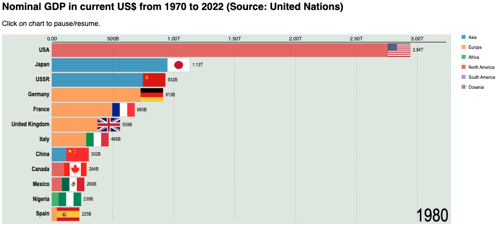
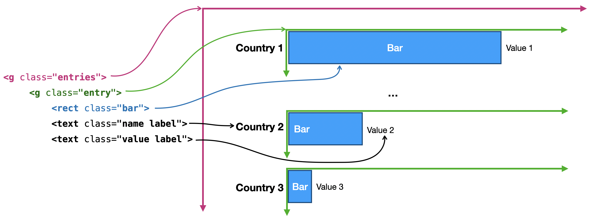
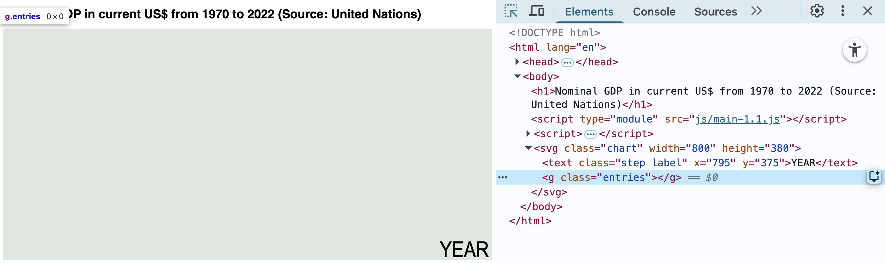
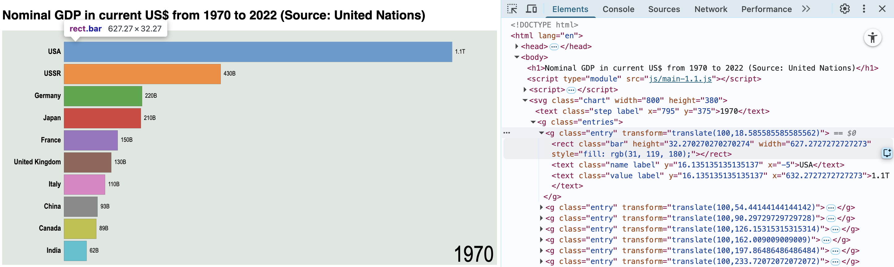
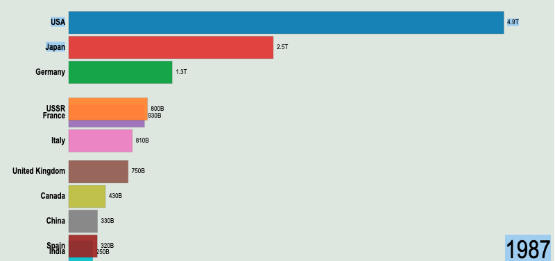
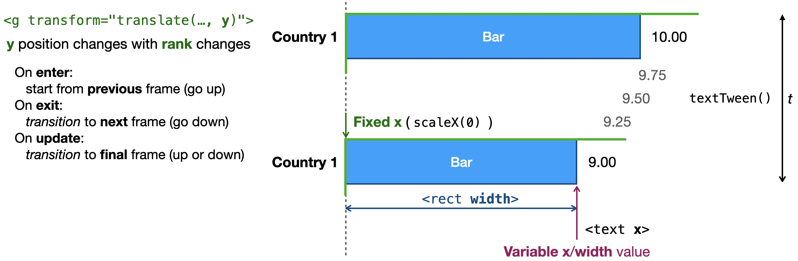
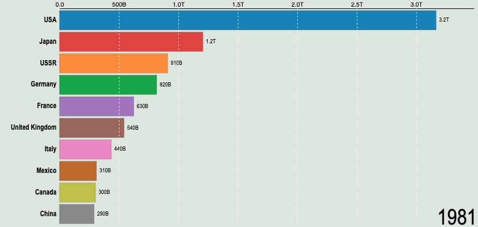
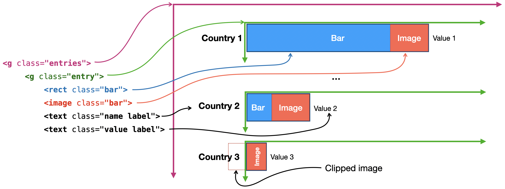
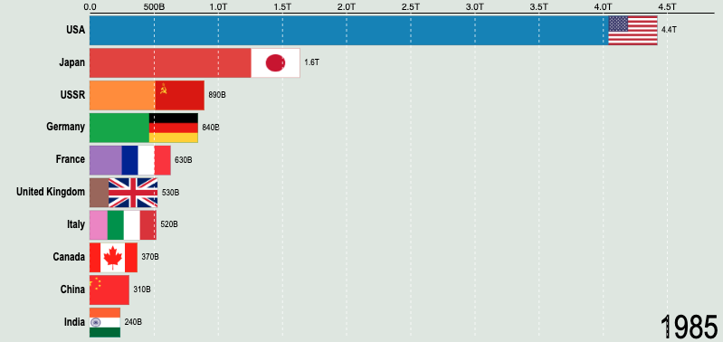
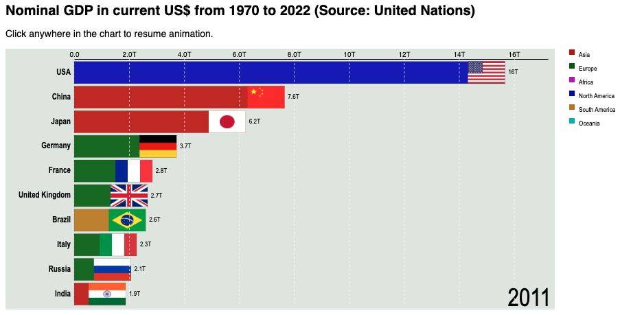

# The GDP Race

In this tutorial, you will create a racing bar chart – a horizontal bar chart where each bar grows and shrinks and moves up and down as time elapses. This exercise explores several concepts discussed in this chapter, including controlling, interrupting, and resuming transitions, using interpolated frames, tweening, and managing complex data updates.

The chart compares the gross GDP of different countries from 1970 to 2022. A static screenshot of the final application is shown in _Figure 1_. Open [`Examples/Bar-chart-race-GDP`](../Examples/Bar-chart-race-GDP/index.html) to see it in action.



_Figure 1 – Static screenshot of a racing bars animation. Code: [`Examples/Bar-chart-race-GDP`](../Examples/Bar-chart-race-GDP)_

The project folder for this tutorial follows the same structure as previous examples, with separate folders for data, CSS stylesheets, and JavaScript modules. This project has an additional module for the animation code:

```
app/
├── data/
│   └── un_gdp.csv
├── css/
│   └── main.css
├── js/
│   ├── common.js
│   ├── data.js
│   ├── main.js
│   ├── view.js
│   └── animation.js
└── index.html
```

The [data file](../StepByStep/data/un_gdp.csv) was generated from the [United Nations open database](https://data.un.org/), slightly altered to include continents and country codes. It’s available in the `StepByStep/data/` folder for this chapter. In the `StepByStep/` subfolders, it is accessed directly via a relative URL, but you should copy it to a local `data/` folder in your application project folder, as shown above.

This file contains the same data we used for the pie chart created in _Chapter 11_. Although it was generated from the same source, the file was processed to remove empty fields and edited to deal with countries that appeared, disappeared, or merged from 1970 to 2024 (e.g. the Soviet Union, East Germany), and provide the data in a _tidy_ format, which is easier to use.

Open the file and inspect it. It’s a CSV with five columns, 11k+ rows and the following structure:

```csv
country,year,value,continent,code
Afghanistan,1970,1748886596.862996,Asia,AFG
Afghanistan,1971,1831108981.957219,Asia,AFG
Afghanistan,1972,1595555481.8054674,Asia,AFG
... +11,553 lines ...
Zimbabwe,2021,24118150864,Africa,ZWE
Zimbabwe,2022,26418592961,Africa,ZWE
```

This tutorial is much larger than previous ones, and it's also more complex, but don't give up. Work on each step and inspect the results in the page and in the console. Make sure you understand each step before proceeding to the next one. In the end, you will have a complete animated bar chart application that you can modify and extend, and will become more familiar with the process of creating animated visualizations with D3.js.

## Table of contents

This tutorial is divided into the following steps:
- [Step 1: Planning and initial setup](#step-1-planning-and-initial-setup)
- [Step 2: Loading and preparing the data](#step-2-loading-and-preparing-the-data)
- [Step 3: Drawing the bars](#step-3-drawing-the-bars)
- [Step 4: Updating with transitions](#step-4-updating-with-transitions)
- [Step 5: Directing the updates](#step-5-directing-the-updates)
- [Step 6: Animating the chart](#step-6-animating-the-chart)
- [Step 7: Using interpolated frames](#step-7-using-interpolated-frames)
- [Step 8: Adding axes](#step-8-adding-axes)
- [Step 9: Adding images](#step-9-adding-images)
- [Step 10: Pausing the animation](#step-10-pausing-the-animation)
- [Exercise: Classifying bars by continent](#exercise-classifying-bars-by-continent)

Each completed step is a subfolder in the `StepByStep/` folder. Each step modifies some script files, and may make small changes in the `index.html` and `main.css` files. Modified files in each step are numbered with a version suffix (e.g., `main-1.1,js`, `main-1.2.js`, etc.). As in previous tutorials, you can start with the first module and code along or run the code provided for each step.

## Step 1: Planning and initial setup

We will use the same structure as the horizontal bar charts we created in _Chapter 4_. The generated SVG should place the entire chart in a `<g>.entries` block containing a fixed number of child `<g>.entry` elements that represent bar groups, each containing a `<rect>.bar`, for the bar, and two `<text>` elements, for the labels. Name labels are placed left, at a fixed right-aligned _x_ position, and value labels go right, at a fixed distance from the bar, relative to the bar’s width (_Figure 2_).


_Figure 2  – Planning the layout for the animated bar chart_

Since this is a horizontal bar chart, the _x_-scale is a linear scale configured to occupy most of the chart's width. As bars are updated at each animation frame, the domain will be recomputed for each frame so that the size of the top (longest) bar never changes. We reserved 100 pixels on the left side for the names (and flags) of the countries. The _y_-scale is a band scale. Its domain fits an extra offscreen bar used to configure the animation so that bars leave and enter the chart from the bottom (instead of from the default top-left).

We will start with an `index.html` file, a CSS file, and three modules, which already contain some code, described here.

The `common.js` module contains the global settings for the application. It exports a `chart` object, which will contain the data used by the application and controls to change the views, a `dim` object with dimensions and margins, and an `app` object with a few global constants and scale functions:

```js
import * as d3 from "https://cdn.skypack.dev/d3@7.9.0";

export { app, dim, chart };

const chart = {}; // data used by the chart and controls to change the views
const dim = { width: 800, margin: {top: 15, right: 10, bottom: 5, left: 100} };
const app = {
    barHeight: 40,      // will be used to compute the height of the chart
    numBars: 10,        // will be used to compute the height of the chart
    scale: {
        x: d3.scaleLinear().range([dim.margin.left, dim.width - dim.margin.right]),
        y: d3.scaleBand().padding(0.1)
    }
}
dim.height = app.barHeight * app.numBars - 20;
app.scale.y.domain(d3.range(app.numBars+1))
           .range([dim.margin.top,
dim.height - dim.margin.bottom + dim.height/app.numBars]);
```

The height of the chart will be determined by the number of bars and the desired height of each bar. These parameters will be used to configure the _x_-scale.

The `view.js` module exports a `draw()` function that creates the `<svg>.chart` container, places a `<text>.step.label` object for the year label at bottom-right, and appends the `<g>.entries` container for the bars:

```js
import * as d3 from "https://cdn.skypack.dev/d3@7.9.0";
import {dim} from "./common.js";

const svg = d3.select("body").append("svg").attr("class", "chart");

export function draw() {
    // 1) Configure the SVG
    svg.attr("width", dim.width).attr("height", dim.height);  
    
    // 2) A label to display each year or step
    svg.append("text").attr("class", "step label")
        .attr("x", dim.width - 5).attr("y", dim.height - dim.margin.bottom)
        .text("YEAR");  // placeholder for the year
    
    // 3) A container for the chart entries (bars + labels + icons)
    svg.append("g").attr("class", "entries");
}
```

The `index.html` file loads a stylesheet (see `css/main.css`) that configures fonts, margins, backgrounds, and colors. A gray background is applied to the SVG via CSS. The page also loads the `main.js` module, which, in this step, simply imports the `view.js` module and calls `draw()`:

```js
import * as view from "./view.js";
view.draw();
```

Launch `index.html` and inspect the generated SVG code. It should look like _Figure 3_.


_Figure 3 – The application after step 1 showing the generated SVG code. Code: [`StepByStep/step-1-setup/`](../StepByStep/step-1-setup/)._

The full code is in [`StepByStep/step-1-setup/`](../StepByStep/step-1-setup/), which you can use as a starting point to set up your project and code along the next steps.

## Step 2: Loading and preparing the data

The `data.js` module will contain everything related to data (except for the data URL, which will be placed in `main.js`). It should import D3 and the `app` and `chart` objects from `common.js`:

```js
import * as d3 from "https://cdn.skypack.dev/d3@7.9.0";
import {app, chart} from "./common.js";
```

To load and parse a data file, use the following `load()` function. It receives the URL to a CSV resource, parses the data, and sends the result to a `prepare()` function that will transform the data and store it in a global constant to be used by the rest of the application:

```js
export async function load(file) {
    const rawData = await d3.csv(file, d3.autoType);
    prepare(rawData);
}
function prepare(rawData) { /* ... */ }
```

Remember to use `d3.autoType` in the parser to automatically convert the fields that contain numbers into JavaScript numbers (see _Chapter 5_), since the default is to load them as strings.

The `prepare()` function adds two properties to the global `chart` object: a set of keys to retrieve country-related data, and the ranked data to be displayed. The keys, stored in `chart.keys`, are obtained from country names using a `Set` (or `d3.union`) to guarantee that they are unique:

```js
function prepare(rawData) {
    chart.keys = new Set(rawData.map(d => d.country));
    /* ... more code to be added ... */
}
```

Preparing the data, which will be stored in `chart.data`, requires several additional steps.

First, group the data by year, and then by country. Each data frame compares countries in the same year. With this grouping, we can retrieve a country's data within that year to draw the bar. Using `d3.rollup()` returns the data as nested maps. Add the following line to `prepare()`:

```js
    const byYearMap = d3.rollup(rawData, v => v[0].value,
                                         d => d.year,
                                         d => d.country);
```

The external collection doesn’t need to be a map, since years are loaded sequentially. We can convert the external map to an array and sort it (add the following line to `prepare()`):

```js
    const byYearArray = [...byYearMap].sort((a,b) => d3.ascending(a[0], b[0]));
```

This will put each entry in the following format, where each entry contains a year and a map:

```js
[
    [1970, dataMap], 
    [1971, dataMap], 
       /* ... */, 
    [2022, dataMap]
]
```

You can use `dataMap.get(country)` to obtain the GDP for that country in that year. The chart will display bars in descending GDP order. It will be easier to shift them up and down if we sort the countries for each year and add a `rank` property to them. The following code, which ends `prepare()`, transforms the data for each year with a `rank()` function that will perform these changes:

```js
function prepare(rawData) {
    /* ... code added in preceding steps ... */

    chart.data = byYearArray.map(([year, dataMap]) => [year, rank(dataMap)]);
}
```

The `rank()` function receives the `dataMap`, converts it to an array, replaces each object with one just containing the country and value properties, sorts these objects by descending value, and then adds a `rank` property to each one.

```js
function rank(dataMap) {
    const data =
        [...chart.keys].map(k => ({country: k, value: dataMap.get(k)}))
                       .sort((a, b) => d3.descending(a.value, b.value));
    for (let i = 0; i < data.length; ++i) {
        data[i].rank = Math.min(app.numBars, i);
    }
    return data;
}
```

This will assign a different rank number to the _visible_ bars (countries) in each year. The other bars (not visible in that year) will have the same rank of `app.numBars`, placing them offscreen at the bottom of the chart. This is important so that bars enter and leave the chart from the bottom whenever their rank is updated.

We can now use this code to prepare the data. Update the `main.js` module with the location of the data file and pass it to the `load()` function. After loading and parsing, it will draw the view and print the contents of the `chart` object to the console.

```js
import * as view from "./view.js";
import * as data from "./data.js";
import {chart} from "./common.js";

const file = "../../data/un_gdp.csv";  // data source location (adjust if necessary)

data.load(file)
    .then(() => {
        view.draw();
        console.log(chart); // inspect the chart object
    });
```

Inspect the data and expand the `chart` object logged to the JavaScript console. You should see the first array with a list of 218 keys (`chart.keys`):

```js
Set(218) {'Afghanistan', 'Albania', 'Algeria', 'Andorra', 'Angola', ...}
```

The second array (`chart.data`), with 53 elements, contains the ranked data for each country by year. Note the `rank` properties that were added to each entry. Only the first 10 will be shown on the screen, since `app.numBars` is `10`. All the offscreen countries in a year have the same rank:

```js
[
    [1970,
        [
            {country: 'USA', value: 1073303000000, rank: 0},          
            {country: 'USSR', value: 433412461168.88885, rank: 1},
            {country: 'Germany', value: 215835185576.7532, rank: 2},
            /*... +6 ... */,
            {country: 'India', value: 62422483000.43385, rank: 9},
            {country: 'Mexico', value: 47470239952.52976, rank: 10},    // offscreen
            {country: 'Australia', value: 45216647240.08956, rank: 10}, // offscreen
            /*... +206 ... */,
            {country: 'Yemen', value: undefined, rank: 10},             // offscreen
        ]
    ],
    [1971, /*...*/], /*... +50 ... */, [2022, /*...*/]
]
```

Now that we have all the data, we can start drawing the bars.

## Step 3: Drawing the bars

The goal of this step is to draw a bar chart for a single year and test our configuration. Add the following functions to `common.js` to provide colors for the bars and formatting for the values:

```js
app.color =
    d3.scaleOrdinal(d3.schemeCategory10
                      .concat(d3.schemeCategory10.map(c => d3.color(c).darker())));
app.fmt = d3.format('.2s');
```

Add one more line to the `draw()` function (in `view.js`) to draw the bars for the first frame:

```js
export function draw() {
    /* ... code added in previous steps ... */
    
    show(chart.data[0]);
}
```

The `show()` function is called to display each animation data frame. In the preceding code, it is called once to display the first one. Each data frame contains a `year` and a `data` object. Before drawing the bars, the horizontal scale is set so the longest bar occupies the available space (here we added 10% more space). The year is added to the placeholder at the bottom right:

```js
function show(dataFrame) {
    const [year,data] = dataFrame;

    app.scale.x.domain([0, data[0].value * 1.1]);
    drawBars(data);				// this function will draw the bars

    d3.select(".step.label").text(year); // updates the year label
}
```

It’s useful to have a couple of reusable functions that compute widths and positions. This will make the rest of the code easier to read. The `initWidth()` function returns the width of a bar given a datum. It will be used to draw the bar and place the value labels. The `initRank()` function generates the transform string that will place the bar vertically, based on its rank:

```js
const initWidth = d => app.scale.x(d.value) - app.scale.x(0);
const initRank = d => `translate(${[app.scale.x(0), app.scale.y(d.rank)]})`;
```

This step will draw bars for a single year. The `drawBars()` function should be familiar, since you created similar code in _Chapter 4_. The preceding functions are used to resize and place bars and labels. The data consists of the visible bars representing the first 10 (`app.numBars`) countries:

```js
function drawBars(data) {
    // Bar width is based on value
    const initWidth = d => app.scale.x(d.value) - app.scale.x(0);
    
    // Vertical position is based on rank
    const initRank = d => `translate(${[app.scale.x(0), app.scale.y(d.rank)]})`;
    
    // Reduce the data to the visible bars
    const visible = data.slice(0, app.numBars);

    // Data join with the visible data
    const entry =  svg.select(".entries")
                      .selectAll("g.entry")
                         .data(visible)
                            .join("g")
                                .attr("class", "entry")
                                .attr("transform", initRank);

    // The bar
    entry.append("rect")
         .attr("class", "bar")
         .attr("height", app.scale.y.bandwidth())
         .attr("width", d => initWidth(d))
         .style("fill", d => app.color(d.country));

    // The name label at left
    entry.append("text")
         .attr("class", "name label")
         .attr("y", app.scale.y.bandwidth()/2)
         .attr("x", -5) // and align right
         .text(d => d.country)

    // The value label at right
    entry.append("text")
         .attr("class", "value label")
         .attr("y", app.scale.y.bandwidth()/2)
         .attr("x", d => initWidth(d) + 5)
         .text(d => app.fmt(d.value).replace('G', 'B'))
}
```

The text formatter represents billions with a `'G'` suffix (for Giga). We replaced it with a `'B'` (Billions). Launch the `index.html` file, and you should see the screenshot in _Figure 4_, which also shows the generated code.



_Figure 4 – A static bar chart created from a single data frame, showing generated SVG code. Code: [`StepByStep/step-3-bars/`](../StepByStep/step-3-bars/)_

To inspect the bar chart for another year, call `show()` (in the `draw()` function) with any index between 0 and 52:

```js
show(chart.data[52]);  // data for 2022
```

The next step is to display all the other years and update the bar chart with new values when the year changes.

## Step 4: Updating with transitions

The chart should display bars representing ten (`app.numBars`) countries with the largest nominal GDP for that year, in descending order. When bar widths change, they also move the value label horizontally, but not the name label, unless a bar’s rank changes between years, which moves the entire group up or down. If a bar becomes smaller than the last one, its group will leave the chart, moving down, while a new bar group, moving up, enters the chart. All this should happen smoothly, with transitions.

To manage transitions, we will create a new `animation.js` module.

Since showing a new bar chart will be triggered by a different module, the `show()` function (in `view.js`) must be exported:

```js
export function show(dataFrame) { /* ... */ }
```

Before creating the animation, we will transition to the next view manually. This code is implemented in the `animation.js` module and will later be replaced by the animation code. The `start()` function registers a `'click'` event handler that updates the view with the next frame until it reaches the last one, and then starts again:

```js
import * as view from "./view.js";
import {chart} from "./common.js";

// temporary implementation with a manual click to advance the frames
let index = 0;
export function start() {
    d3.select("body")
      .on("click", () => (index < chart.data.length)
                        ? view.show(chart.data[index++])
                        : view.show(chart.data[0]));
            }
```
The function is called from `main.js` after loading the file and drawing the first view:

```js
import * as animation from "./animation.js";
/* … */
data.load(file)
    .then(() => {
        view.draw();
        animation.start();  // add this line
    });
```

The chart’s dynamics require that _enter_, _exit_, and _update_ selections be treated separately, as we learned in _Chapter 6_, using the `join()` method. Here, we will create separate functions, `joinEnter()`, `joinExit()`, and `joinUpdate()`, for each case to modify and return each selection.

The new `drawBars()` function was refactored to contain just the main code for the data join (the code that creates bars and labels was moved to `joinEnter()`). It selects the `'entries'` group (added in the `draw()` function) and binds a new `'entry'` selection of `<g>` elements to the visible dataset (but doesn’t append anything):

```js
function drawBars(data) {
    const visible = data.slice(0, app.numBars);	  // filter the data to display
    const merged =
        svg.select(".entries")
            .selectAll("g.entry")
                .data(visible, d => d.country)    	// data key function is required
                    .join(
                        enter => joinEnter(enter),	    // modify enter selection
                        update => update,		    	// not used (just return it)
                        exit => joinExit(exit).remove()	// modify exit selection and remove it
                    );
    joinUpdate(merged);	// join the merged update selection here
}
```

Saving a reference to the merged selection is necessary to update its elements after the join. Inside the join, we will configure the _enter_ and _exit_ selections.

The `visible` array is the data, which filters the countries to display (selected from the dataset of over 200 countries). Note that the `data()` method is configured with the key function, `d => d.country`. This is critical to guarantee that each bar group is bound to a country, and not to the default sequential index. If you forget it, new countries will never enter the chart, since existing bars will be reused (see `Chapter 6` for more about data key functions).

The _enter_ selection is used when a country enters the `visible` array for the first time. It is passed to the `joinEnter()` function (which contains the rest of the code that was previously in `drawBars()`) and appends a new `<g>` element for each entry, adding bars and labels to it. The modified selection is saved in the `enterGrp` constant, which must be returned:

```js
function joinEnter(enter) {
    const initWidth = d => app.scale.x(d.value) - app.scale.x(0);
    const initRank = d => `translate(${[app.scale.x(0), app.scale.y(d.rank)]})`;
    
    const enterGrp = enter.append("g").attr("class", "entry")
                          .attr("transform", initRank);
    
    enterGrp.append("rect").attr("class", "bar")
            .attr("height", app.scale.y.bandwidth())
            .attr("width", d => initWidth(d))
            .style("fill", d => app.color(d.country));
    
    enterGrp.append("text").attr("class", "name label")
            .attr("y", app.scale.y.bandwidth()/2)
            .attr("x", -5)
            .text(d => d.country);
    
    enterGrp.append("text").attr("class", "value label")
            .attr("y", app.scale.y.bandwidth()/2)
            .attr("x", d => initWidth(d) + 5)
            .text(d => app.fmt(d.value).replace('G', 'B'));
    
    return enterGrp;		// don’t forget to return the modified selection
}
```

When the bar is updated, it will be resized. This involves changing the width of the bar, the value label’s position, and replacing the text in the value label. We will place this code in a `resizeBars()` function, because it will be reused later. It receives an entry `group` and a `width()` function, returning the modified group:

```js
function resizeBars(group, width) {
    group.select("rect.bar")
         .attr("width", width);
    group.select("text.value.label")
         .attr("x", d => width(d) + 5)
         .text(d => app.fmt(d.value).replace('G', 'B'));
    return group;
}
```

This function is called by `joinUpdate()`, which receives the merged selection that is updated when the data changes. It updates the bar group’s vertical position (based on the new rank) and resizes the bars. The transition will move the bar group up or down during one second while the bar’s width changes. Since this function is called last in `drawBars()`, it doesn’t need to return the modified selection:

```js
function joinUpdate(update) {
    const finalWidth = d => app.scale.x(d.value) - app.scale.x(0);
    const finalRank = d => `translate(${[app.scale.x(0), app.scale.y(d.rank)]})`;

    const updateGrp = update.transition().duration(1000).ease(d3.easeLinear)
                            .attr("transform", finalRank);

    resizeBars(updateGrp, finalWidth);
}
```

The _exit_ selection will transition a bar group when it leaves the bar chart towards the next rank. This should, in most cases, make it appear to move downwards and offscreen. We will fix any strange behaviors in the next step. The `joinExit()` function must return the modified _exit_ selection, since it is removed in `drawBars()`.

```js
function joinExit(exit) {
    const nextRank = d => `translate(${[app.scale.x(0), app.scale.y(d.rank+1)]})`;
    return exit.transition().duration(1000).ease(d3.easeLinear)
               .attr("transform", nextRank);
}
```

Now you should see bars switching positions as their values become larger or smaller than their neighbors, while other bars slowly enter and leave the chart at each click (_Figure 5_).



_Figure 5 – The user can now update the chart by clicking on it. Code: [`StepByStep/4-update`](../StepByStep/4-update)_

This step involved many changes, so make sure you understand each function and how they interact. If necessary, refer to the complete code in the [`StepByStep/4-update`](../StepByStep/4-update) folder.

Although the transitions are smooth, they still behave strangely. Entering bars appear out of nowhere, and exiting bars that are not in the last position vanish in the middle of the chart. Exiting bars also don’t shrink, and value labels don’t change during the transitions. We will address all these issues and refine the transitions in the next step.

## Step 5: Directing the updates

Most of the changes in this step involve data manipulation, so they will happen in the `data.js` module. A few changes will also be required in the `view.js` module.

To transition the entering bars correctly, we need to know their _previous_ rank and values. For exits, we need information about the country’s _next_ rank and value. Previous values will permit text tweening to the _current_ value during the transition. _Figure 6_ illustrates the problem we need to solve.


_Figure 6 - Animation frames need to know the previous and next values to direct transitions correctly_

To help with these transitions, we will create a pair of maps that return the data object for the previous year and for the next year. This requires a few steps of data manipulation and will be placed in a new function:

```js
function createNavigationMaps() { 
    /* ... the code will be added in this step ... */ 
}
```

First, create an array where each entry is a 2-element array containing the country and an array of `{country,value,rank}` objects for that country. This can be done by extracting the data objects from `chart.data` (which groups by year), flattening the array, and then regrouping by country:

```js
const allObjects = chart.data.flatMap(([,data]) => data);
const byCountry = d3.groups(allObjects, d => d.country);
```

The result will be an array containing `[country, [53 objects]]`, for example:

```js
[
    ["USA",[{country: 'USA', value: 1073303000000, rank: 0},
            {country: 'USA', value: 1164850000000, rank: 0},
            /* ...+51 objects... */]
    ],
    ["USSR",[{country: 'USSR', value: 433412461169, rank: 1},
             {country: 'USSR', value: 515797471199, rank: 1},
           /* ...+51 objects... */]
    ], /* ...+215 arrays... */
]
```

Next, we create adjacent pairs. Extracting the second element of each array (the list of 53 objects) and passing it to `d3.pairs()` (see _Chapter 7_) will replace each object with a 2-element array containing the current object and the next one, for each country.

Flattening the `byCountry` array will return a single list with all 2-element arrays for all countries. Providing this flattened array as the argument to `new Map()` creates a map that returns the `next object`, given the current one. Inverting the order of each pair will use the _second_ element as the key, and the first as the value, producing a map that returns the `previous object`:

```js
const nextMap =
    new Map(byCountry.flatMap( ([,data]) => d3.pairs(data)) );
const prevMap =
    new Map(byCountry.flatMap( ([,data]) => d3.pairs(data).map(([a,b]) => [b,a])) );
```

During updates, values are retrieved with `map.get()`. If the next or previous value doesn’t exist (at the beginning or end of a list), the current value should be used. The following pair of utility functions added to the `chart` object will reduce duplication and shorten the code:

```js
chart.nxt = d => nextMap.get(d) || d;	// get next or current
chart.prv = d => prevMap.get(d) || d;	// get previous or current
```

To set this up, place all the preceding code inside the `createNavigationMaps()` function and call it from `prepare()`, in the `data.js` module:

```js
function createNavigationMaps() { /*...*/ }
function prepare(rawData) {
    /*...*/
    createNavigationMaps();	// sets up chart.nxt() and chart.prv() functions
}
```

Now we can use `chart.nxt()` and `chart.prv()` to compute rank positions and bar widths.

In `joinEnter()`, the previous rank and values are used to set the initial parameters. For the first frame, this will be the current rank and value, but when new bars enter the page, they will come from the bottom, since their previous rank value will be larger:

```js
function joinEnter(enter) {
    const initRank =
        d => `translate(${[app.scale.x(0), app.scale.y(chart.prv(d).rank)]})`;
    const initWidth  = d => app.scale.x(chart.prv(d).value) - app.scale.x(0);
    /* ... */
}
```

The `resizeBars()` function needs an extra parameter to receive the previous or next value, which will be used to tween the value labels during the transition:

```js
function resizeBars(group, width, value) {
    /* ... */
    group.select("text.value.label").attr("x", d => width(d) + 5)
         .textTween(function(d) {
             const i = d3.interpolateNumber(value(d), d.value);
             return t => app.fmt(i(t)).replace("G", 'B');
         });
    return group;
}
```

The `joinUpdate()` function will call this function to tween from the value of the previous data frame to the current one:

```js
function joinUpdate(update) {
    const prevValue = d => chart.prv(d).value;
    const finalRank = d => `translate(${[app.scale.x(0), app.scale.y(d.rank)]})`;
    const finalWidth = d => app.scale.x(d.value) - app.scale.x(0);
    
    const updateGrp = update.transition().duration(1000).ease(d3.easeLinear)
                            .attr("transform", finalRank);
    return resizeBars(updateGrp, finalWidth, prevValue);
}
```

The `joinExit()` function does the opposite. It will transition towards the next value and rank, so we should see the bar group moving down, its bar shrinking, its values changing to a smaller number until the transition ends, and the selection is returned and removed.

```js
function joinExit(exit) {
    const nextValue = d => chart.nxt(d).value;
    const nextRank = d => `translate(${[app.scale.x(0), app.scale.y(chart.nxt(d).rank)]})`;
    const nextWidth = d => app.scale.x(nextValue(d)) - app.scale.x(0);
    
    const exitGrp = exit.transition().duration(1000).ease(d3.easeLinear)
                        .attr("transform", nextRank);
    return resizeBars(exitGrp, nextWidth, nextValue);
}
```

If you now run the application, you should see the new bars coming up from below, while old bars move down. You should also see sizes and labels changing while they move up and down. If the transitions are working as expected, we can finally proceed to code the animation.

## Step 6: Animating the chart

There are many ways to animate the data changes. One way to do it is using a timer. We can implement an animation function with `d3.interval()`. The following function calls `view.show()` for each data frame. When the last frame is shown, the timer stops:

```js
function animate(index) { 			// version 1 – using d3.interval()
    const timer = d3.interval(() => {
        if(index < chart.data.length-1) {
            view.show(chart.data[++index]);
        } else {
            timer.stop();
        }
    }, 1000);
}
```

Replace the code in the `start()` function with `animate(1)` to start the animation with the second frame, since the first frame is already shown (`show(chart.data[0])` was called in `view.draw()`):

```js
export function start() {
    animate(1);
}
```

If you reload the page, you will see the years changing automatically, updating the bars.

Although the timer solution works, the same effect can be obtained using transitions, which offers more flexibility. Here is a better implementation:

```js
function animate(index) {			// version 2 – using a new transition
    d3.select("svg.chart")
      .transition().duration(1000).ease(d3.easeLinear)
         .end().then(() => {
            view.show(chart.data[index]);
            if(index < chart.data.length-1) {
                animate(++index);
            }
         });
}
```

This recursive implementation configures a transition for the root SVG, which calls `view.show()` when the transition ends, and then calls `animate()` again after incrementing the `index`.

The problem with both these implementations is that they may interrupt the other transitions that run at the same time (updates and exits). If this happens with the _exit_ transition, objects that leave the chart may not be removed. We can avoid this using _a single transition_ for all animations, which will also make it more efficient, easier to configure and control.

First, set the transition’s duration as a constant in `common.js`, so we can easily adjust it later:

```js
const app.duration = 1000;
```

Then implement a transition factory (also in `common.js`), and export it so that other modules can reuse a transition with the same parameters:

```js
export function getTransition() {
    return d3.transition().duration(app.duration).ease(d3.easeLinear);
}
```

In `animation.js`, import `getTransition` from `common.js`, then modify the `animate()` function so that the main transition is now initialized with a call to `getTransition()`:

```js
function animate(index) {			// final version – reusing transitions
    d3.select("svg.chart")
        .transition(getTransition())
        .end().then(() => { /* ... same code as version 2 ... */ });
}
```

In `view.js`, import `getTransition()` and use it to initialize the transitions in `joinUpdate()` and `joinExit()`. Now all transitions run simultaneously with the same parameters:

```js
function joinUpdate(update) {
    /* ... */
    const updateGrp = update.transition(getTransition())    
                            .attr("transform", finalRank)
                            .style("opacity", 1);          // become opaque on update
    return resizeBars(updateGrp, finalWidth, prevValue);
}
function joinExit(exit) {
    /* ... */
    const exitGrp = exit.transition(getTransition())        
                        .attr("transform", nextRank)
                        .style("opacity", 0);              // disappear when leaving
    return resizeBars(exitGrp, nextWidth, nextValue);
}
```

The preceding code also sets a final `opacity` style to be applied at the end of the transition. This will make entering objects gradually visible and exiting objects gradually fade.

For new objects to become visible as they are updated, they must be transparent when entering, but not when the bars are created in the first frame (when the previous value is the same as the current value). The following code implements this requirement in the `joinEnter()` function:

```js
function joinEnter(enter) {
    /* … */
    const initOpacity = d => chart.prv(d).value === d.value ? 1 : 0;
    const enterGrp = enter.append("g").attr("class", "entry")
                          .attr("transform", initRank)
                          .style("opacity", initOpacity);
    /* … */
}
```

The animation runs continuously, but sometimes several bars quickly leave or enter the chart while growing or shrinking, making it hard to see who is ahead and who is behind. Increasing the duration won’t help, since the problem is in the data. We will try to fix this in the next step.

## Step 7: Using interpolated frames

A country’s GDP is measured annually, but actual changes occur gradually. If we had monthly data, we would probably see these changes happening more slowly. We don’t have that data, but by interpolating additional frames for each year, we can simulate it! This will eliminate abrupt changes and make the animation run much smoother.

In this step, we will use interpolation to generate 12 frames for each year. We may need to adjust this number later, so let’s store it in a variable (in `common.js`):

```js
app.numFrames = 12;
```

We need to lower the duration of the transitions, since we now have 12 times more frames. The bars will change position at this speed, but a yearly change will take 3 seconds (12x250). You can later adjust these values and see what works best:

```js
app.duration = 250;
```

In `data.js`, replace (or comment out) the code that creates `chart.data` with a call to `interpolateDataFrames()`, as shown next. We will write it to compute and add the intermediate frames:

```js
// chart.data = byYearArray.map(([year,dataMap]) => [year, rank(dataMap)]);
chart.data = interpolateDataFrames(byYearArray);
```

This function starts with a pair of adjacent entries obtained from `byYearArray`. We will add extra frames between them. After getting each pair, extract their years and data maps:

```js
function interpolateDataFrames(data) {
    const dataFrames = [];
    for (let pair of d3.pairs(data)) {
        const [entry1, entry2] = pair;
        const [year1, dataMap1] = entry1;
        const [year2, dataMap2] = entry2;
        /* ... for(...) {...} ... */
    }
    return dataFrames;
}
```

In the following `for` loop, a value of `t` with values in the [0,1] domain is obtained for each frame. It is used to get an interpolated year (such as `1970.0833`, `1970.1666`, etc.) and to create an interpolator function for the data values, since these depend on each country.

```js
for (let i = 0; i < app.numFrames; ++i) {
    const t = i / app.numFrames;
    const interpolatedYear = year1 * (1 - t) + year2 * t;
    const valueInterpolator = country => dataMap1.get(country) * (1 - t)
                                       + dataMap2.get(country) * t;
    const interpolatedData = rank(valueInterpolator);
    dataFrames.push([interpolatedYear, interpolatedData]);
}
```

The interpolator function is passed to a new version of our `rank()` function, modified to accept a function. You just need to change a single line in `rank()` so that it calls the interpolator (instead of retrieving from the data map, as before):

```js
function rank(valueInterpolator) {
    const data = [...chart.keys].map(k => ({country: k, value: valueInterpolator(k)}))
    /*... same code as in the previous version */
    return data;
}
```

The interpolator is called for every country, returning the interpolated value. The rest of the code is not changed. If you inspect the contents of `chart.data`, you will see that it now contains twelve times more elements:

```js
[
    [1970, Array(218)], [1970.0833, Array(218)], [1970.1667, Array(218)],
    /* ... +621 elements ... */
]
```

To inspect the interpolated values, expand any of the data arrays with fractional years above.
Only one change is necessary in `view.js`. Since years are no longer integers, you need to round them for display:

```js
export function show(dataFrame) {
    /* ... */
    d3.select(".step.label").text(Math.round(year));
}
```

Reload the page and check the results. The animation should run much smoother now.
The animation is working, bar values are always increasing, but that effect isn’t obvious since the largest bar never changes its size. We can fix this by providing a visual reference with an axis.

## Step 8: Adding axes

This step will add an animated horizontal axis at the top of the chart to provide context for all the bars (see `Chapter 8`). The `axis` function is added to `common.js` with a basic configuration for the ticks. Tick lines are stretched downwards (with `tickSizeInner()`) to cover the entire chart:

```js
app.axis = d3.axisTop().scale(app.scale.x)
             .tickSizeOuter(0)
             .tickSizeInner(-dim.height + dim.margin.top + dim.margin.bottom)
             .ticks(dim.width / 100, "s")
             .tickFormat(d => app.fmt(d).replace("G", 'B'));
```

A few styles are applied to the tick lines so that they won’t interfere with the chart (`main.css`). Semitransparent white lines will contrast with the light gray background of the chart:

```css
.tick line {				/* dashed, white, semitransparent tick lines */
    stroke: white;
    stroke-opacity: 0.7;
    stroke-dasharray: 3 3;
}
.tick:first-of-type line {		/* hide the first tick line */
    stroke-opacity: 0;
}
.tick text { fill: black; }
```

The axis is appended after all the other elements, so that it appears over the bars (`view.js`):

```js
export function draw() {
    /* ... */
    svg.append("g").attr("class", "axis")
        .attr("transform", `translate(0,${dim.margin.top})`);
}
```

Since the only fixed object is the largest bar, the axis should be resized after each data change. Setting the domain configures the axis, but the `axis` function still needs to be called again for the selection. Add the following code anywhere in `show()` after the scale’s domain is set:

```js
export function show(dataFrame) {
    /* ... */
    d3.select(".axis").transition(getTransition()).call(app.axis);
}
```

Reload the page to see an animated version of `Figure 7`. Now, as the axis moves, you can perceive that the bars are getting bigger even though the largest one does not move.



_Figure 7 – A screenshot of the bar chart race with animated axes Code: [`StepByStep/8-axes/`](../StepByStep/8-axes/)._

This animation is finished, but it would be much cooler if we could show the flags of each country on each bar. Let’s do this in the next step.

## Step 9: Adding images

In this step, we will add flag images to each bar. These images will be clipped to fit the bar’s height and aligned to the right of each bar. _Figure 8_ shows a sketch of how it should work and the SVG code that will be generated.



_Figure 8 – A plan for adding images to the bars and the generated SVG code_

A collection of royalty-free flag PNG thumbnails is available in `Chapter13/data/flags`. To use them, copy the `flags/` directory to your project's `data/` folder and add the following constant to your `common.js` module:

```js
app.imgDir = "../../data/flags/";		// adjust path if necessary
```

The preceding path works for examples in the `StepByStep/` folder and will load the files from their original location. If you copied the `flags/` folder to your local `data/` directory, use the following:

```js
app.imgDir = "../data/flags/";		// adjust path if necessary
```

File names use the three-letter code for each country (e.g., `USA.png`, `CHN.png`, `JPN.png`, etc.), available in the code property from the raw data file. Add the following line to `prepare()` (`data.js`). It will create a globally accessible map to retrieve a country’s code from its name.

```js
chart.icons = new Map(rawData.map(d => [d.country, d.code]));
```

The flag will be placed over the bar and right-aligned. If the bar is smaller than the image, it needs to be clipped. A clipping mask can be created in SVG with the `<clipPath>` element (see the example in [`SVG/5-svg-clipPath.html`](../SVG/5-svg-clipPath.html)), which should contain a shape to be used as the mask. This shape is the bar. We can’t place the bar in `<clipPath>`, but we can reference it using `<use>` if each bar has an ID.

We are using country names as keys, which sometimes have spaces in their names (e.g., “United Kingdom”). To use them in SVG we need to remove these spaces. The following `makeID()` function will replace spaces with underlines, creating valid IDs that can be used in SVG:

```js
function makeID(country) {
    return country.replace(/ /g,"_");
}
```

Now we can create a `<clipPath>` for each country, linking to the rectangle that represents the country’s bar, which is the shape that will clip the image:

```js
function createClipping() {
    svg.append("defs")
        .selectAll("clipPath")
            .data(chart.keys)
                .join("clipPath").attr("id", d => `clip-${makeID(d)}`)
                    .append("use")
                    .attr("href", d => `#bar-${makeID(d)}`);
}
```

Now call `createClipping()` in the `draw()` function.

```js
export function draw() {
    /* ... */
    createClipping(svg, app.numBars);
}
```

This will add a `<defs>` block to the SVG with a list of `<clipPath>` elements, one clip for each country. Inspect the generated code. An example `<clipPath>` is shown here:

```html
<clipPath id="clip-United_Kingdom">
    <use href="#bar-United_Kingdom "></use>
</clipPath>
```

Now a corresponding `id` also needs to be added to each bar. This can be done in `joinEnter()`:

```js
function joinEnter(enter) {
    /* ... */
    enterGrp.append("rect").attr("class", "bar")
            .attr("id", d => `bar-${makeID(d.country)}`)  // add an ID to the bar
    /* ... */
}
```

Each bar can now be referenced by a corresponding `<clipPath>` and will be used to clip the image to fit the bar. Here is an example (note the underline added by the `makeID()` function):

```html
<rect class="bar" id="bar-United_Kingdom" ...></rect>
```

Finally, an `<image>` element is added to draw the image. It uses the `icon()` function to get the complete path to the thumbnail, and references its clipping path via the `clip-path` attribute, as shown here:

```js
function joinEnter(enter) {
    /* ... */
    const icon = (key) => app.imgDir + chart.icons.get(key) + '.png';
    enterGrp.append("image")
            .attr("class", "bar").attr("preserveAspectRatio", "none")
            .attr("href", d => icon(d.country)) 	// uses path to icon file
            .attr("height", app.scale.y.bandwidth())
            .attr("width", app.scale.y.bandwidth() * (1 + 2/3))
            .attr("x", d => barWidth(d) - app.scale.y.bandwidth() * (1 + 2/3))
            .attr("clip-path", d => `url(#clip-${makeID(d.country)})`);
    return enterGrp;
}
```

Here is an example of the generated SVG for the image. Since flags have different aspect ratios, we also turned off this parameter in the SVG and stretched them to fit the bar’s height:

```html
<image class="bar" preserveAspectRatio="none" 
       href="../../data/flags/GBR.png"
       clip-path="url(#clip-United_Kingdom)">
</image>
```

Finally, the flag’s position needs to be updated in `resizeBars()` when the bar’s size changes: 

```js
function resizeBars(group, barWidth, value) {
    /* ... */
    group.select("image.bar")
         .attr("x", d => barWidth(d) - app.scale.y.bandwidth() * (1 + 2/3));
    return group;
}
```

Now you can reload the page and see the complete animation with images (_Figure 9_). Notice how the flags are clipped correctly, when necessary, to fit each bar.



_Figure 9 – The bar chart race with country flags. Code: [`StepByStep/step-9-images/`](../StepByStep/step-9-images/)_

Our animation is complete. It runs continuously and smoothly. What else could you want? Perhaps we could pause it at a certain point. Let’s add this feature in the final step.

## Step 10: Pausing the animation

The chart will be paused by interrupting the transition. Since most of the code is in the promise callback after the transition ends, handling it in a `catch()` block is more reliable than using `on("interrupt")`. The following code adds two constants to the chart object: `chart.state`, with the current frame number, and `chart.paused`, indicating whether the animation is paused or not:

```js
function animate(index) {
    d3.select("svg.chart")
      .transition(getTransition()).end().then(() => { /* ... */ })
      .catch(e => {   	// interrupt handler
          if(e && e instanceof Error) throw e;    // rethrow any real errors
          else {
              chart.state  = index; 	// saves the current frame number
              chart.paused = true;    	// animation is paused
              console.log("Animation paused at frame " + index + ".");
          }
      });
}
```

The `pause()` function pauses or resumes the animation. If the animation is paused, it is resumed by calling `animate()` with the saved frame number in `chart.state`. If the animation is active, the transition that runs on the SVG object is interrupted, pausing the animation:

```js
export function pause() {
    if(chart.paused) {  				// if chart is paused, then resume
        chart.paused = false;
        animate(chart.state); 			// continue from interrupted frame
        console.log("Animation resumed from frame " + chart.state + ".");
        d3.select("#pause").text("pause"); 	// update HTML text
    } else {
        d3.select("svg.chart").interrupt(); 	// interrupt main transition
        d3.select("#pause").text("resume"); 	// update HTML text
    }
}
```

The preceding code also updates a `<span>` block (added to `index.html`) when the state changes:

```html
<p>Click anywhere in the chart to <span id="pause">pause</span> animation.</p>
```

The user can pause the animation with a click. This is implemented by registering a handler for the `'click'` event in the `draw()` function:

```js
import * as animation from "./animation.js";
export function draw() {
    /* ... */
    svg.on("click", animation.pause);
}
```

Reload the page. Now you can pause and resume the animation by clicking anywhere in the SVG.

## Exercise: Classifying bars by continent

This is an optional step. The goal is to classify the bars by continent, coloring them accordingly. You will need to create a new map in `data.js` that returns the continent for each country. You can use the `continent` property from the raw data file to create this map and store it in `chart.continents`.

Then, modify the `app.color` scale. In `data.js`, configure it to use continents as the domain. In `common.js`, adjust the color scheme to use distinct colors for the continents. Finally, update the code in `joinEnter()` (in `view.js`) and change the `fill` attribute of the bars to color them based on their continent instead of their country.

To know what color represents each continent, you can add a legend using the `utils.legend()` function from `chart-utils.js`. To do this, create the following function and call it from `draw()`:

```js
function showLegend() {
    const legend = d3.select("body").append("svg");
    utils.legend()
        .container(legend)
        .color(app.color)
        .useDataAsIndex(true)
        .data(d3.union(chart.continents.values()))();
}
```

The expected result is shown in _Figure 10_. The commented solution is in [`StepByStep/step-11-continents/`](../StepByStep/step-11-continents/).



_Figure 10 – The bar chart race using continent colors. Code: [`StepByStep/step-11-continents/`](../StepByStep/step-11-continents/)_

This ends the tutorial. You will find the code for each step in the [`StepByStep/`](../StepByStep/) folder, including an extra step that adds continent information for the chart. The final application, with some additional improvements (including the exercise), and other examples using the same racing bar chart code are available in the [`Examples/`](../Examples/) folder.
